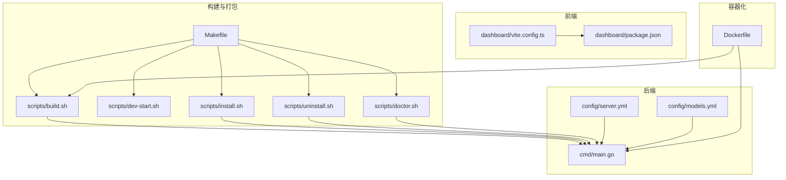
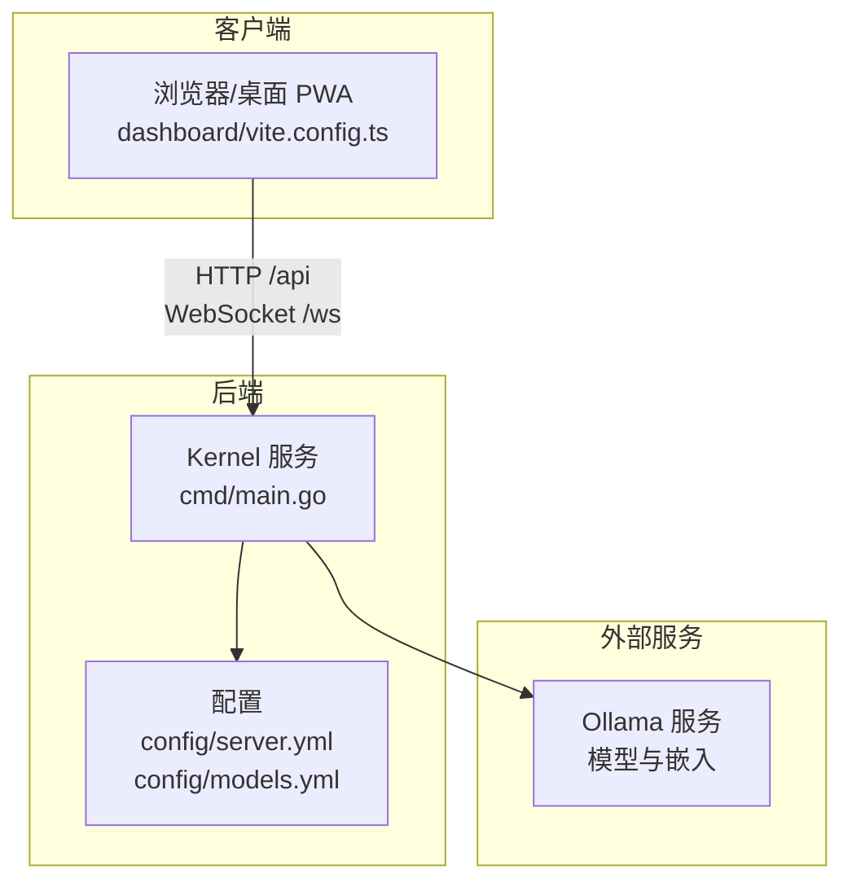
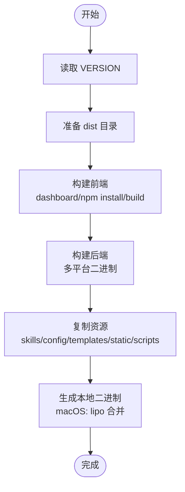
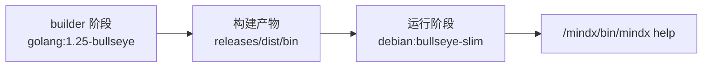
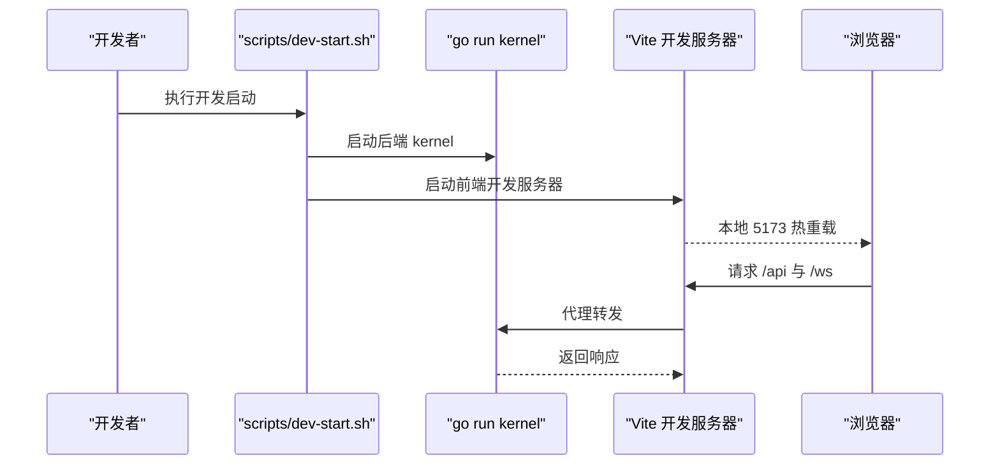
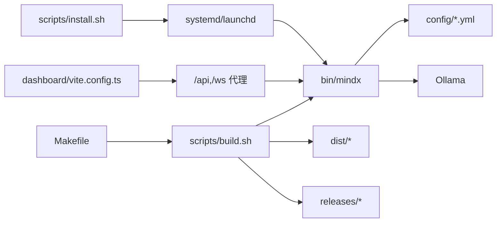

# 部署和运维

<cite>
**本文引用的文件**   
- [Makefile](file://Makefile)
- [Dockerfile](file://Dockerfile)
- [scripts/build.sh](file://scripts/build.sh)
- [scripts/dev-start.sh](file://scripts/dev-start.sh)
- [scripts/install.sh](file://scripts/install.sh)
- [scripts/uninstall.sh](file://scripts/uninstall.sh)
- [scripts/doctor.sh](file://scripts/doctor.sh)
- [.github/workflows/ci.yml](file://.github/workflows/ci.yml)
- [cmd/main.go](file://cmd/main.go)
- [go.mod](file://go.mod)
- [config/server.yml](file://config/server.yml)
- [config/models.yml](file://config/models.yml)
- [dashboard/vite.config.ts](file://dashboard/vite.config.ts)
- [dashboard/package.json](file://dashboard/package.json)
- [VERSION](file://VERSION)
</cite>

## 目录
1. [简介](#简介)
2. [项目结构](#项目结构)
3. [核心组件](#核心组件)
4. [架构总览](#架构总览)
5. [详细组件分析](#详细组件分析)
6. [依赖关系分析](#依赖关系分析)
7. [性能考量](#性能考量)
8. [故障排查指南](#故障排查指南)
9. [结论](#结论)
10. [附录](#附录)

## 简介
本文件面向 DevOps 工程师与系统管理员，提供 MindX 的部署与运维完整参考。内容覆盖多平台构建系统（Makefile 与脚本）、Docker 容器化部署、发布与版本管理、开发环境搭建与热重载、生产部署最佳实践与安全建议、性能调优与容量规划、监控与维护策略等。

## 项目结构
MindX 采用前后端分离与统一可执行程序的组织方式：
- 后端：Go 语言实现，入口位于 cmd/main.go，通过 CLI 子命令提供 dashboard、kernel、tui、train、skill 等功能。
- 前端：React/Vite 构建的仪表盘，通过代理转发 /api 与 /ws 到后端。
- 构建与打包：Makefile 调用 scripts 下的构建脚本，生成多平台二进制与发布包；Dockerfile 提供容器化镜像。
- 配置：config 目录下包含 server.yml、models.yml 等运行时配置模板。
- 测试与 CI：GitHub Actions 在 Ubuntu 上分别对后端与前端进行校验、测试与类型检查。

图表来源
- [Makefile](file://Makefile#L1-L299)
- [scripts/build.sh](file://scripts/build.sh#L1-L145)
- [scripts/dev-start.sh](file://scripts/dev-start.sh#L1-L285)
- [scripts/install.sh](file://scripts/install.sh#L1-L324)
- [scripts/uninstall.sh](file://scripts/uninstall.sh#L1-L263)
- [scripts/doctor.sh](file://scripts/doctor.sh#L1-L328)
- [cmd/main.go](file://cmd/main.go#L1-L21)
- [config/server.yml](file://config/server.yml#L1-L21)
- [config/models.yml](file://config/models.yml#L1-L92)
- [dashboard/vite.config.ts](file://dashboard/vite.config.ts#L1-L106)
- [dashboard/package.json](file://dashboard/package.json#L1-L58)
- [Dockerfile](file://Dockerfile#L1-L27)

章节来源
- [Makefile](file://Makefile#L1-L299)
- [scripts/build.sh](file://scripts/build.sh#L1-L145)
- [scripts/dev-start.sh](file://scripts/dev-start.sh#L1-L285)
- [scripts/install.sh](file://scripts/install.sh#L1-L324)
- [scripts/uninstall.sh](file://scripts/uninstall.sh#L1-L263)
- [scripts/doctor.sh](file://scripts/doctor.sh#L1-L328)
- [cmd/main.go](file://cmd/main.go#L1-L21)
- [config/server.yml](file://config/server.yml#L1-L21)
- [config/models.yml](file://config/models.yml#L1-L92)
- [dashboard/vite.config.ts](file://dashboard/vite.config.ts#L1-L106)
- [dashboard/package.json](file://dashboard/package.json#L1-L58)
- [Dockerfile](file://Dockerfile#L1-L27)

## 核心组件
- 构建系统
  - Makefile：统一入口，提供 build、install、uninstall、run、dev、test、doctor、build-all、build-linux-release、build-windows-release 等目标。
  - scripts/build.sh：负责前端构建、多平台二进制生成、复制静态资源与脚本、打包发布目录。
- 运行与开发
  - cmd/main.go：设置版本信息并启动 CLI。
  - scripts/dev-start.sh：开发模式自动启动后端 kernel 与前端 Vite，并支持热重载。
  - scripts/install.sh / uninstall.sh：安装/卸载系统服务（macOS launchd 或 Linux systemd）与工作空间。
  - scripts/doctor.sh：环境健康检查，验证 Go、Node、Ollama、端口、安装与工作空间状态。
- 配置与前端
  - config/server.yml、config/models.yml：服务端口、向量存储、Token 预算、模型列表等。
  - dashboard/vite.config.ts：开发服务器、代理、PWA、CSS 变量与测试配置。
- 容器化
  - Dockerfile：分阶段构建，拷贝 releases 与 dist/bin 到运行镜像，暴露 CMD 入口。

章节来源
- [Makefile](file://Makefile#L26-L299)
- [scripts/build.sh](file://scripts/build.sh#L1-L145)
- [cmd/main.go](file://cmd/main.go#L1-L21)
- [scripts/dev-start.sh](file://scripts/dev-start.sh#L1-L285)
- [scripts/install.sh](file://scripts/install.sh#L1-L324)
- [scripts/uninstall.sh](file://scripts/uninstall.sh#L1-L263)
- [scripts/doctor.sh](file://scripts/doctor.sh#L1-L328)
- [config/server.yml](file://config/server.yml#L1-L21)
- [config/models.yml](file://config/models.yml#L1-L92)
- [dashboard/vite.config.ts](file://dashboard/vite.config.ts#L1-L106)
- [Dockerfile](file://Dockerfile#L1-L27)

## 架构总览
MindX 的运行时由后端内核服务与前端仪表盘组成，二者通过本地代理通信；后端依赖 Ollama 提供模型推理与嵌入服务。

图表来源
- [cmd/main.go](file://cmd/main.go#L1-L21)
- [config/server.yml](file://config/server.yml#L1-L21)
- [config/models.yml](file://config/models.yml#L1-L92)
- [dashboard/vite.config.ts](file://dashboard/vite.config.ts#L69-L88)

## 详细组件分析

### 多平台构建系统（Makefile 与脚本）
- Makefile 目标
  - build：调用 scripts/build.sh 执行前端与后端构建。
  - install/uninstall：安装/卸载系统服务与符号链接。
  - run-*：启动 dashboard、TUI、kernel、train、model test、skill list。
  - build-frontend/build-backend/build-all：前端/后端/全平台构建。
  - build-linux-release/build-windows-release/build-all-releases：生成发布包。
  - dev：开发模式启动。
  - test/doctor/version/help：测试、环境检查、版本信息、帮助。
- scripts/build.sh
  - 读取 VERSION 作为版本号，清理 dist 并创建构建目录。
  - 前端：进入 dashboard 执行 npm install 与 npm run build。
  - 后端：按平台生成二进制（darwin/amd64/arm64、linux/amd64/arm64、windows/amd64/arm64），并复制 skills、config 模板、dashboard/dist、安装脚本等。
  - 本地二进制：在 macOS 下生成 Universal Binary（lipo 合并 amd64/arm64）。
- 版本注入
  - 通过 ldflags 注入 Version，cmd/main.go 初始化配置并导出版本信息。

图表来源
- [scripts/build.sh](file://scripts/build.sh#L23-L126)
- [cmd/main.go](file://cmd/main.go#L8-L16)
- [VERSION](file://VERSION#L1-L2)

章节来源
- [Makefile](file://Makefile#L26-L161)
- [scripts/build.sh](file://scripts/build.sh#L1-L145)
- [cmd/main.go](file://cmd/main.go#L1-L21)
- [VERSION](file://VERSION#L1-L2)

### Docker 支持与容器化部署
- 分阶段构建
  - builder 阶段：安装 Node、npm、zip，下载 Go 依赖，执行 make build。
  - 运行阶段：基于 slim 镜像，复制 releases 与 dist/bin 到 /mindx，并以 /mindx/bin/mindx help 作为默认 CMD。
- 使用建议
  - 优先使用预构建 releases 产物，减少镜像层大小与构建时间。
  - 在生产中挂载持久卷至工作空间目录，避免容器重启丢失数据。
  - 通过环境变量或卷挂载注入 .env 与 config，确保端口、模型与向量存储配置正确。

图表来源
- [Dockerfile](file://Dockerfile#L1-L27)

章节来源
- [Dockerfile](file://Dockerfile#L1-L27)

### 发布流程与版本管理
- 版本来源
  - VERSION 文件提供语义化版本号，scripts/build.sh 读取并注入二进制。
  - Makefile 的 version 目标显示 Go、Node、NPM 版本与当前版本。
- 发布包
  - scripts/build-linux.sh / build-windows.sh：生成 Linux/Windows 发行包（tar.gz/zip）。
  - dist/ 下生成 mindx-{VERSION}-{os}-{arch} 目录，包含二进制、静态资源、脚本与模板。
- CI 发布
  - 当前 CI 仅覆盖后端与前端测试，未包含发布步骤。可在 CI 中扩展：构建多平台二进制、上传制品、生成标签与 Release。

章节来源
- [VERSION](file://VERSION#L1-L2)
- [scripts/build.sh](file://scripts/build.sh#L23-L101)
- [Makefile](file://Makefile#L246-L252)
- [.github/workflows/ci.yml](file://.github/workflows/ci.yml#L1-L49)

### 开发环境搭建与热重载
- 开发启动
  - scripts/dev-start.sh：设置 MINDX_WORKSPACE=.dev，启动后端 kernel 与前端 Vite。
  - 后端：go run ./cmd/main.go kernel run，等待端口 911 就绪。
  - 前端：Vite 开发服务器监听 5173，通过代理将 /api 与 /ws 转发至后端。
- 热重载
  - 前端代码修改自动热更新；后端代码修改需手动重启。
- 环境检查
  - scripts/doctor.sh：检查 Go、Node、Ollama、端口占用、安装与工作空间完整性。

图表来源
- [scripts/dev-start.sh](file://scripts/dev-start.sh#L70-L143)
- [dashboard/vite.config.ts](file://dashboard/vite.config.ts#L69-L88)

章节来源
- [scripts/dev-start.sh](file://scripts/dev-start.sh#L1-L285)
- [dashboard/vite.config.ts](file://dashboard/vite.config.ts#L1-L106)

### 生产环境部署最佳实践与安全考虑
- 部署方式
  - 使用 scripts/install.sh 安装系统服务（macOS launchd 或 Linux systemd），自动设置日志路径与环境变量。
  - 通过 MINDX_PATH 与 MINDX_WORKSPACE 控制安装与数据目录。
- 安全建议
  - 限制系统服务权限，使用非 root 用户运行（systemd User=）。
  - 严格控制端口访问，仅开放必要端口（911、1314），并在防火墙中放行。
  - 将敏感配置（如 API Key）放入受控的 .env 或密钥管理服务，避免硬编码。
  - 对外暴露的 API 与 WebSocket 接口启用鉴权与速率限制。
- 可靠性
  - 启用服务自启与自动重启（systemd Restart=on-failure）。
  - 使用日志切割与轮转，避免磁盘占满。
  - 定期备份工作空间中的 config、memory、sessions、vectors、logs。

章节来源
- [scripts/install.sh](file://scripts/install.sh#L208-L301)
- [scripts/uninstall.sh](file://scripts/uninstall.sh#L126-L166)
- [config/server.yml](file://config/server.yml#L1-L21)

### 性能调优与容量规划
- 模型与嵌入
  - 根据业务负载选择合适模型（如 qwen3:0.6b 与 qwen3:1.7b），合理设置 temperature 与 max_tokens。
  - 嵌入模型建议使用本地 Ollama，降低网络延迟。
- Token 预算与历史轮数
  - server.yml 中的 token_budget 参数用于估算内存与上下文长度，结合 avg_tokens_per_round 与 min_history_rounds 进行容量规划。
- 向量存储
  - vector_store 使用 badger，注意磁盘 IO 与锁文件管理；生产中建议使用高性能磁盘与足够内存缓存。
- 前端性能
  - PWA 与 Workbox 缓存策略减少重复请求；合理拆分 CSS/JS，避免单文件过大。
- 端口与并发
  - 911 为 HTTP 端口，1314 为 WebSocket 端口；根据并发连接数调整系统 ulimit 与内核参数。

章节来源
- [config/models.yml](file://config/models.yml#L1-L92)
- [config/server.yml](file://config/server.yml#L8-L18)
- [dashboard/vite.config.ts](file://dashboard/vite.config.ts#L48-L62)

### 监控与维护策略
- 健康检查
  - 使用 scripts/doctor.sh 定期巡检：Go/Node/Ollama 安装、端口占用、安装与工作空间状态。
- 日志与审计
  - 系统服务标准输出/错误重定向至工作空间 logs；结合系统日志查看器（journalctl/system.log）定位问题。
- 升级与回滚
  - 使用 make update 或重新执行安装脚本；保留工作空间，避免数据丢失。
- 备份与恢复
  - 定期备份 MINDX_WORKSPACE 下的 config、data、logs；发布包可用于快速回滚。

章节来源
- [scripts/doctor.sh](file://scripts/doctor.sh#L1-L328)
- [scripts/install.sh](file://scripts/install.sh#L208-L301)
- [scripts/uninstall.sh](file://scripts/uninstall.sh#L1-L263)

## 依赖关系分析
- 构建链路
  - Makefile -> scripts/build.sh -> cmd/main.go（后端）、dashboard（前端）。
- 运行链路
  - scripts/install.sh -> systemd/launchd -> /mindx/bin/mindx kernel run -> config/server.yml + config/models.yml -> Ollama。
- 外部依赖
  - go.mod 声明了 Gin、Prometheus、Badger、OpenAI SDK、Bubble Tea、Viper 等依赖。

图表来源
- [Makefile](file://Makefile#L26-L161)
- [scripts/build.sh](file://scripts/build.sh#L1-L145)
- [scripts/install.sh](file://scripts/install.sh#L208-L301)
- [dashboard/vite.config.ts](file://dashboard/vite.config.ts#L69-L88)
- [go.mod](file://go.mod#L1-L113)

章节来源
- [Makefile](file://Makefile#L26-L161)
- [scripts/build.sh](file://scripts/build.sh#L1-L145)
- [scripts/install.sh](file://scripts/install.sh#L1-L324)
- [dashboard/vite.config.ts](file://dashboard/vite.config.ts#L1-L106)
- [go.mod](file://go.mod#L1-L113)

## 性能考量
- 构建性能
  - 使用 CGO_ENABLED=0 生成静态二进制，减小体积与链接复杂度；macOS 下使用 lipo 合并 Universal Binary。
- 运行性能
  - 选择合适的模型与温度参数，避免过高的 max_tokens 导致内存压力。
  - 向量存储使用本地 Ollama，减少网络抖动；定期维护向量索引。
- 前端性能
  - PWA 与 Workbox 缓存策略提升首屏与离线体验；CSS 变量集中管理主题一致性。

[本节为通用指导，无需特定文件来源]

## 故障排查指南
- 环境检查
  - 运行 make doctor 或直接执行 scripts/doctor.sh，按提示修复缺失的 Go、Node、Ollama 或端口冲突。
- 端口占用
  - 若 911/1314 被占用，修改 config/server.yml 中的端口或释放对应进程。
- 权限问题
  - 安装目录与工作空间需具备写权限；systemd 服务需在有写权限的目录创建服务文件。
- 卸载与重装
  - 使用 scripts/uninstall.sh 完整卸载后，重新执行 scripts/install.sh 或 make install。

章节来源
- [scripts/doctor.sh](file://scripts/doctor.sh#L1-L328)
- [config/server.yml](file://config/server.yml#L3-L5)
- [scripts/uninstall.sh](file://scripts/uninstall.sh#L1-L263)
- [scripts/install.sh](file://scripts/install.sh#L1-L324)

## 结论
MindX 提供了完善的多平台构建与容器化能力，配合系统服务与健康检查脚本，能够快速完成从开发到生产的部署闭环。建议在生产环境中遵循最小权限、可观测性与备份策略，结合模型与向量存储的容量规划，持续优化性能与稳定性。

[本节为总结，无需特定文件来源]

## 附录
- 常用命令
  - 构建与安装：make build && make install
  - 开发：make dev
  - 运行：make run（dashboard）、make run-kernel（内核服务）
  - 环境检查：make doctor
  - 更新：make update
  - 卸载：make uninstall
- 关键配置
  - 服务端口与向量存储：config/server.yml
  - 模型列表与参数：config/models.yml
  - 前端开发与代理：dashboard/vite.config.ts

[本节为概览，无需特定文件来源]