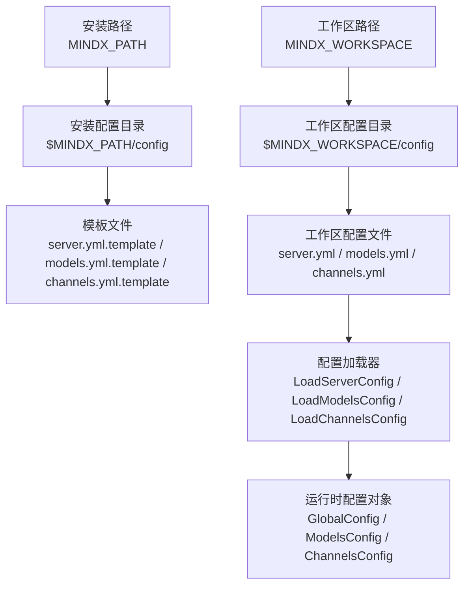
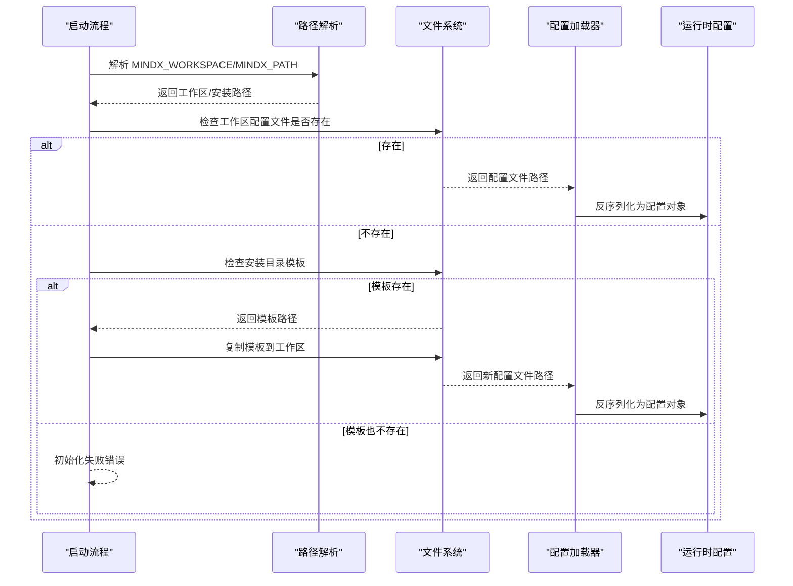
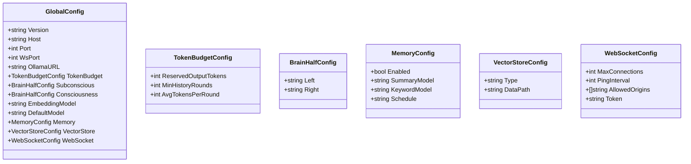
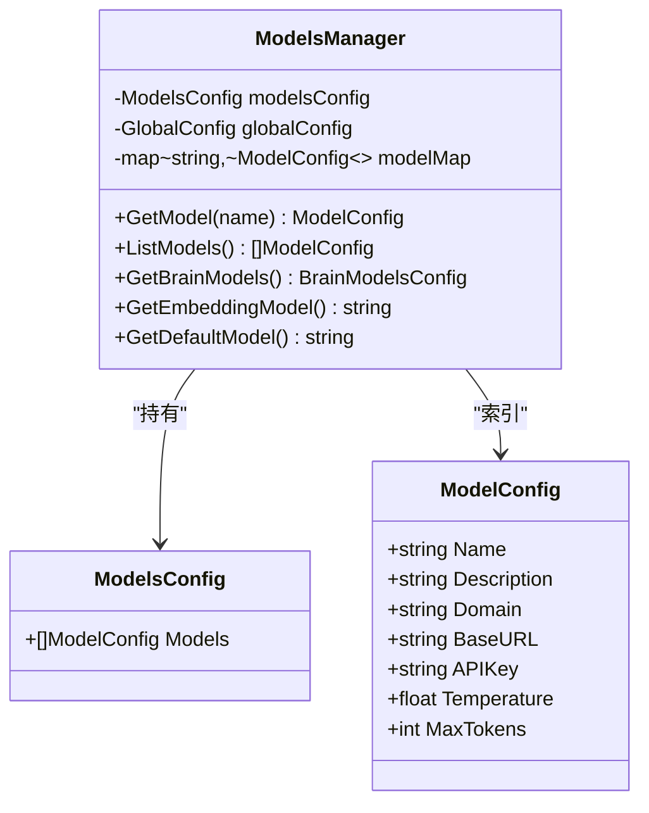
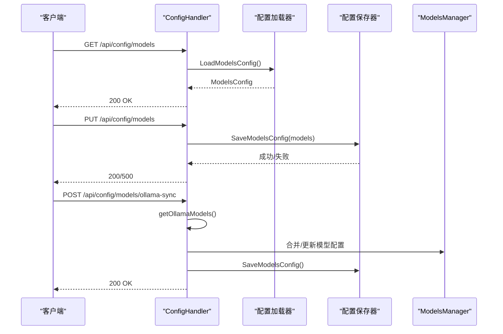
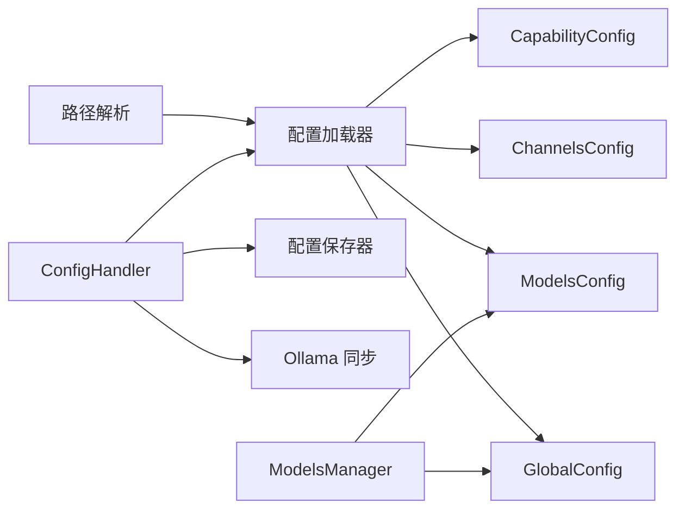

# 配置管理系统

<cite>
**本文引用的文件**
- [config/server.yml](file://config/server.yml)
- [config/models.yml](file://config/models.yml)
- [config/channels.yml](file://config/channels.yml)
- [internal/config/config.go](file://internal/config/config.go)
- [internal/config/global.go](file://internal/config/global.go)
- [internal/config/model.go](file://internal/config/model.go)
- [internal/config/channels.go](file://internal/config/channels.go)
- [internal/config/capability.go](file://internal/config/capability.go)
- [internal/config/manager.go](file://internal/config/manager.go)
- [internal/config/paths.go](file://internal/config/paths.go)
- [internal/config/logging.go](file://internal/config/logging.go)
- [internal/adapters/http/handlers/config.go](file://internal/adapters/http/handlers/config.go)
- [internal/adapters/http/handlers/settings.go](file://internal/adapters/http/handlers/settings.go)
- [internal/usecase/skills/skill_env.go](file://internal/usecase/skills/skill_env.go)
- [config/mcp_servers.json.template](file://config/mcp_servers.json.template)
</cite>

## 目录
1. [简介](#简介)
2. [项目结构](#项目结构)
3. [核心组件](#核心组件)
4. [架构总览](#架构总览)
5. [详细组件分析](#详细组件分析)
6. [依赖关系分析](#依赖关系分析)
7. [性能考量](#性能考量)
8. [故障排查指南](#故障排查指南)
9. [结论](#结论)
10. [附录](#附录)

## 简介
本文件为 MindX 配置管理系统的技术文档，面向系统管理员与开发者，全面阐述配置文件的结构与层次、加载顺序与优先级机制、动态配置管理（热更新与验证）、安全管理（敏感信息处理与加密存储），并提供最佳实践与常见配置示例。MindX 的配置体系以 YAML/JSON 文件为核心，结合运行时路径解析与 HTTP 接口实现动态写回与同步。

## 项目结构
MindX 的配置文件位于仓库根目录的 config 目录下，主要包含以下文件：
- server.yml：服务器运行参数、内存与向量存储、思维模型与默认模型等全局配置
- models.yml：模型列表与参数（如温度、最大令牌数、基础 URL 等）
- channels.yml：各消息渠道（如钉钉、飞书、Telegram 等）的启用与参数
- capabilities.yml：能力配置（模型、工具、系统提示词等）
- mcp_servers.json.template：MCP 服务器目录模板

运行时配置路径由环境变量 MINDX_WORKSPACE 决定，默认指向用户家目录下的 .mindx；安装路径由 MINDX_PATH 或可执行文件所在目录决定。系统启动时会确保工作区目录结构完整，并在首次运行时从安装目录复制模板文件到工作区。



图表来源
- [internal/config/paths.go](file://internal/config/paths.go#L60-L106)
- [internal/config/config.go](file://internal/config/config.go#L39-L82)
- [internal/config/config.go](file://internal/config/config.go#L164-L203)

章节来源
- [internal/config/paths.go](file://internal/config/paths.go#L60-L106)
- [internal/config/config.go](file://internal/config/config.go#L39-L82)
- [internal/config/config.go](file://internal/config/config.go#L164-L203)

## 核心组件
- 全局配置 GlobalConfig：定义服务器主机、端口、WebSocket、向量存储、记忆与思维模型、默认模型等
- 模型配置 ModelsConfig/ModelConfig：维护可用模型列表及其参数
- 渠道配置 ChannelsConfig/Channel：维护各消息渠道的启用状态与参数
- 能力配置 CapabilityConfig/Capability：维护能力维度的模型、工具、系统提示词等
- 配置管理器 ModelsManager：提供模型查询、默认模型与思维模型读取
- 路径管理器：解析安装路径、工作区路径、配置文件路径
- HTTP 配置处理器：提供配置读取、保存与同步接口

章节来源
- [internal/config/global.go](file://internal/config/global.go#L3-L17)
- [internal/config/model.go](file://internal/config/model.go#L3-L28)
- [internal/config/channels.go](file://internal/config/channels.go#L11-L21)
- [internal/config/capability.go](file://internal/config/capability.go#L3-L9)
- [internal/config/manager.go](file://internal/config/manager.go#L13-L82)
- [internal/config/paths.go](file://internal/config/paths.go#L60-L106)
- [internal/adapters/http/handlers/config.go](file://internal/adapters/http/handlers/config.go#L19-L155)

## 架构总览
配置系统采用“模板驱动 + 工作区覆盖”的加载策略：系统启动时优先检查工作区配置目录是否存在目标配置文件；若不存在，则从安装目录复制对应模板至工作区后加载；若模板也不存在，则初始化失败。运行时通过 HTTP 接口对配置进行读取与保存，部分配置（如模型）支持与外部服务（如 Ollama）同步。



图表来源
- [internal/config/paths.go](file://internal/config/paths.go#L60-L106)
- [internal/config/config.go](file://internal/config/config.go#L39-L82)
- [internal/config/config.go](file://internal/config/config.go#L84-L122)
- [internal/config/config.go](file://internal/config/config.go#L124-L162)
- [internal/config/config.go](file://internal/config/config.go#L164-L203)

## 详细组件分析

### 全局配置 GlobalConfig
- 字段说明
  - 版本号：配置文件版本
  - 主机与端口：HTTP 与 WebSocket 监听地址
  - 向量存储：类型与数据路径
  - 令牌预算：预留输出令牌、最小历史轮次、单轮平均令牌数
  - 思维模型：左右半脑分别使用的模型
  - 嵌入模型与默认模型：用于向量化与对话的默认选择
  - WebSocket 扩展：最大连接数、心跳间隔、允许的源、访问令牌
  - 记忆：启用开关、摘要/关键词模型、调度表达式
- 加载与保存
  - 通过 LoadServerConfig 读取 server.yml 并反序列化
  - 通过 SaveServerConfig 将配置对象写回 server.yml
- 优先级
  - 工作区配置优先于安装目录模板
  - 运行时可通过 HTTP 接口覆盖保存



图表来源
- [internal/config/global.go](file://internal/config/global.go#L3-L17)
- [internal/config/global.go](file://internal/config/global.go#L19-L24)
- [internal/config/global.go](file://internal/config/global.go#L26-L36)
- [internal/config/global.go](file://internal/config/global.go#L38-L41)

章节来源
- [internal/config/global.go](file://internal/config/global.go#L3-L17)
- [internal/config/config.go](file://internal/config/config.go#L39-L82)
- [internal/config/config.go](file://internal/config/config.go#L215-L231)
- [config/server.yml](file://config/server.yml#L1-L21)

### 模型配置 ModelsConfig 与 ModelConfig
- 字段说明
  - 模型列表：包含名称、描述、域名、基础 URL、API 密钥、温度、最大令牌数
  - 运行时模型管理：ModelsManager 提供按名称查找、默认模型与思维模型读取
- 加载与保存
  - 通过 LoadModelsConfig 读取 models.yml
  - 通过 SaveModelsConfig 写回 models.yml
- 动态同步
  - HTTP 接口支持从 Ollama 同步模型列表并合并到本地配置



图表来源
- [internal/config/model.go](file://internal/config/model.go#L3-L28)
- [internal/config/manager.go](file://internal/config/manager.go#L13-L82)

章节来源
- [internal/config/model.go](file://internal/config/model.go#L3-L28)
- [internal/config/manager.go](file://internal/config/manager.go#L13-L82)
- [internal/config/config.go](file://internal/config/config.go#L164-L203)
- [internal/config/config.go](file://internal/config/config.go#L233-L249)
- [config/models.yml](file://config/models.yml#L1-L92)

### 渠道配置 ChannelsConfig 与 Channel
- 字段说明
  - 启用列表：记录当前启用的渠道 ID
  - 渠道字典：键为渠道 ID，值为 Channel 结构，包含启用标志、名称、图标与任意配置对象
- 加载与保存
  - 支持 YAML/JSON 自动识别加载
  - 保存时根据文件扩展名选择 YAML 或 JSON 格式
- 运行时操作
  - 启用/禁用指定渠道
  - 更新渠道配置对象
  - 查询所有渠道与启用状态

```mermaid
classDiagram
class ChannelsConfig {
+[]string EnabledChannels
+map~string, Channel~ Channels
+Load(path) error
+Save(path) error
+EnableChannel(id) error
+DisableChannel(id) error
+UpdateChannelConfig(id, cfg) error
+GetAllChannels() map
+IsChannelEnabled(id) bool
}
class Channel {
+bool Enabled
+string Name
+string Icon
+map~string, interface{}~ Config
}
ChannelsConfig --> Channel : "包含"
```

图表来源
- [internal/config/channels.go](file://internal/config/channels.go#L11-L21)
- [internal/config/channels.go](file://internal/config/channels.go#L23-L59)
- [internal/config/channels.go](file://internal/config/channels.go#L61-L115)

章节来源
- [internal/config/channels.go](file://internal/config/channels.go#L11-L21)
- [internal/config/channels.go](file://internal/config/channels.go#L23-L59)
- [internal/config/channels.go](file://internal/config/channels.go#L61-L115)
- [internal/config/config.go](file://internal/config/config.go#L84-L122)
- [internal/config/config.go](file://internal/config/config.go#L205-L213)
- [config/channels.yml](file://config/channels.yml#L1-L96)

### 能力配置 CapabilityConfig 与 Capability
- 字段说明
  - 能力列表：包含名称、标题、图标、描述、模型、基础 URL、API 密钥、系统提示词、工具列表、温度、最大令牌数、模态、启用开关与向量
  - 默认能力、回退策略、描述
- 加载与保存
  - 通过 LoadCapabilitiesConfig 与 SaveCapabilitiesConfig 实现读取与写回

章节来源
- [internal/config/capability.go](file://internal/config/capability.go#L3-L9)
- [internal/config/capability.go](file://internal/config/capability.go#L11-L28)
- [internal/config/config.go](file://internal/config/config.go#L124-L162)
- [internal/config/config.go](file://internal/config/config.go#L252-L272)

### 路径与模板机制
- 环境变量
  - MINDX_PATH：安装路径（未设置时尝试可执行文件所在目录或当前工作目录）
  - MINDX_WORKSPACE：工作区路径（未设置时默认用户家目录下的 .mindx）
- 目录与文件
  - 安装配置目录：$MINDX_PATH/config
  - 工作区配置目录：$MINDX_WORKSPACE/config
  - 首次运行时，系统会将安装目录中的模板复制到工作区（若工作区不存在对应文件）
- 版本与构建信息
  - 通过版本文件与构建信息函数提供版本号、时间与提交号

章节来源
- [internal/config/paths.go](file://internal/config/paths.go#L60-L106)
- [internal/config/paths.go](file://internal/config/paths.go#L204-L265)
- [internal/config/paths.go](file://internal/config/paths.go#L267-L284)

### HTTP 配置接口
- 服务器配置
  - GET /api/config/server：读取 server.yml
  - PUT /api/config/server：保存 server.yml
- 模型配置
  - GET /api/config/models：读取 models.yml
  - PUT /api/config/models：保存 models.yml
  - POST /api/config/models/ollama-sync：从 Ollama 同步模型并合并到本地配置
- 能力配置
  - GET /api/config/capabilities：读取 capabilities.yml 与模型列表
  - PUT /api/config/capabilities：保存 capabilities.yml
- 通用配置
  - GET /api/config/general：读取工作区与服务器地址/端口
  - PUT /api/config/general：保存工作区与服务器地址/端口



图表来源
- [internal/adapters/http/handlers/config.go](file://internal/adapters/http/handlers/config.go#L19-L155)
- [internal/adapters/http/handlers/config.go](file://internal/adapters/http/handlers/config.go#L157-L255)

章节来源
- [internal/adapters/http/handlers/config.go](file://internal/adapters/http/handlers/config.go#L19-L155)
- [internal/adapters/http/handlers/config.go](file://internal/adapters/http/handlers/config.go#L157-L255)

### 日志配置 LoggingConfig
- 系统日志：级别、输出路径、文件大小限制、历史文件数量、保留天数、是否压缩
- 对话日志：是否启用数据库持久化、输出路径（文件备选）

章节来源
- [internal/config/logging.go](file://internal/config/logging.go#L14-L44)

### 敏感信息与安全
- 敏感字段
  - API 密钥：模型与渠道配置中的 APIKey 字段
  - 渠道密钥：如钉钉 app_secret、飞书 app_secret、微信 encoding_aes_key 等
- 处理建议
  - 使用环境变量注入：通过环境变量在运行时注入密钥，避免将明文写入配置文件
  - 文件权限控制：确保配置文件权限为 0600（仅所有者可读写），避免泄露
  - 外部密管集成：建议对接系统密管（如 KMS、Vault）在运行时拉取密钥
  - 最小暴露面：仅在必要时将密钥写入渠道配置，且定期轮换
- 技能环境变量
  - 通过技能环境管理器将敏感变量以 SKILL_* 前缀注入执行环境，避免硬编码

章节来源
- [internal/config/model.go](file://internal/config/model.go#L18-L19)
- [internal/config/channels.go](file://internal/config/channels.go#L16-L21)
- [internal/usecase/skills/skill_env.go](file://internal/usecase/skills/skill_env.go#L100-L135)

### 动态配置管理与热更新
- 热更新机制
  - HTTP 接口直接写回配置文件，重启服务后生效
  - 某些配置（如模型列表）支持在线同步（Ollama 同步）
- 验证机制
  - 加载时通过 Viper 反序列化并校验结构
  - 保存前由处理器绑定 JSON 请求体，失败返回 400
- 建议
  - 在高可用场景下，先备份配置再更新
  - 对关键配置变更进行灰度发布与回滚预案

章节来源
- [internal/config/config.go](file://internal/config/config.go#L39-L82)
- [internal/config/config.go](file://internal/config/config.go#L84-L122)
- [internal/config/config.go](file://internal/config/config.go#L124-L162)
- [internal/config/config.go](file://internal/config/config.go#L164-L203)
- [internal/adapters/http/handlers/config.go](file://internal/adapters/http/handlers/config.go#L28-L43)
- [internal/adapters/http/handlers/config.go](file://internal/adapters/http/handlers/config.go#L54-L69)
- [internal/adapters/http/handlers/config.go](file://internal/adapters/http/handlers/config.go#L89-L104)

## 依赖关系分析
- 配置加载链路
  - 路径解析 → 检查工作区配置 → 若无则复制安装模板 → Viper 反序列化 → 构建运行时配置对象
- HTTP 处理器依赖
  - ConfigHandler 依赖配置加载/保存函数与 ModelsManager
- 模块耦合
  - 配置模块与适配器层松耦合，通过接口与函数调用交互
  - 路径模块集中管理路径解析，降低重复逻辑



图表来源
- [internal/config/paths.go](file://internal/config/paths.go#L60-L106)
- [internal/config/config.go](file://internal/config/config.go#L39-L82)
- [internal/config/config.go](file://internal/config/config.go#L164-L203)
- [internal/adapters/http/handlers/config.go](file://internal/adapters/http/handlers/config.go#L19-L155)
- [internal/config/manager.go](file://internal/config/manager.go#L13-L82)

章节来源
- [internal/config/paths.go](file://internal/config/paths.go#L60-L106)
- [internal/config/config.go](file://internal/config/config.go#L39-L82)
- [internal/config/config.go](file://internal/config/config.go#L164-L203)
- [internal/adapters/http/handlers/config.go](file://internal/adapters/http/handlers/config.go#L19-L155)
- [internal/config/manager.go](file://internal/config/manager.go#L13-L82)

## 性能考量
- 配置文件规模
  - 模型列表较大时，建议分组管理与按需加载
- I/O 开销
  - 频繁保存配置会带来磁盘写入开销，建议批量更新或限流
- 反序列化成本
  - 使用 Viper 反序列化时，注意字段映射一致性，避免不必要的转换

## 故障排查指南
- 配置文件缺失
  - 症状：初始化失败或找不到配置
  - 处理：确认 MINDX_WORKSPACE 与 MINDX_PATH 设置正确；检查安装目录模板是否存在；首次运行会自动复制模板
- 权限问题
  - 症状：无法读取/写入配置文件
  - 处理：确保工作区配置目录与文件权限正确（建议 0600/0644）
- HTTP 接口错误
  - 症状：保存接口返回 400/500
  - 处理：检查请求体结构与字段映射；查看服务日志定位具体错误
- 渠道配置异常
  - 症状：渠道无法启用或参数无效
  - 处理：核对 enabled_channels 与 channels 下的配置对象；使用启用/禁用接口修正

章节来源
- [internal/config/config_test.go](file://internal/config/config_test.go#L12-L55)
- [internal/config/channels.go](file://internal/config/channels.go#L61-L115)
- [internal/adapters/http/handlers/config.go](file://internal/adapters/http/handlers/config.go#L28-L43)
- [internal/adapters/http/handlers/config.go](file://internal/adapters/http/handlers/config.go#L54-L69)

## 结论
MindX 的配置系统以清晰的文件结构与严格的加载/保存流程为基础，结合运行时路径解析与 HTTP 接口实现了灵活的动态配置管理。通过环境变量注入敏感信息、严格的文件权限控制与最小暴露面原则，可在保证安全性的同时提升运维效率。建议在生产环境中配合密管系统与自动化巡检，持续优化配置的可靠性与可观测性。

## 附录

### 配置文件格式与字段说明
- server.yml
  - server.version：配置版本
  - server.host/server.port/server.ws_port：监听地址与端口
  - server.vector_store.type：向量存储类型
  - server.token_budget.reserved_output_tokens/min_history_rounds/avg_tokens_per_round：令牌预算策略
  - server.subconscious.left/right 与 server.consciousness.left/right：左右半脑模型
  - server.embedding_model/default_model：嵌入与默认模型
  - server.websocket.*：WebSocket 扩展配置
  - server.memory.*：记忆相关配置
- models.yml
  - models[*].name/description/domain/base_url/api_key/temperature/max_tokens：模型参数
- channels.yml
  - enabled_channels：启用渠道列表
  - channels.<id>.enabled/name/icon/config：渠道启用状态、显示名、图标与参数
- capabilities.yml
  - capabilities[*].name/title/icon/description/model/base_url/api_key/system_prompt/tools/temperature/max_tokens/modality/enabled/vector：能力参数
- mcp_servers.json.template
  - mcpServers：MCP 服务器目录模板

章节来源
- [config/server.yml](file://config/server.yml#L1-L21)
- [config/models.yml](file://config/models.yml#L1-L92)
- [config/channels.yml](file://config/channels.yml#L1-L96)
- [internal/config/capability.go](file://internal/config/capability.go#L3-L9)
- [config/mcp_servers.json.template](file://config/mcp_servers.json.template#L1-L4)

### 加载顺序与优先级
- 优先级：工作区配置 > 安装目录模板 > 运行时接口保存
- 首次运行：若工作区无配置，系统复制安装目录模板到工作区后加载
- 运行时：通过 HTTP 接口保存后，重启服务生效

章节来源
- [internal/config/config.go](file://internal/config/config.go#L39-L82)
- [internal/config/config.go](file://internal/config/config.go#L84-L122)
- [internal/config/config.go](file://internal/config/config.go#L124-L162)
- [internal/config/config.go](file://internal/config/config.go#L164-L203)
- [internal/config/paths.go](file://internal/config/paths.go#L204-L265)

### 最佳实践
- 使用环境变量注入敏感信息，避免明文写入配置
- 为配置文件设置严格权限（0600/0644）
- 对关键配置变更进行备份与回滚预案
- 利用 Ollama 同步功能保持模型配置与本地一致
- 分离开发/测试/生产环境配置，避免交叉污染