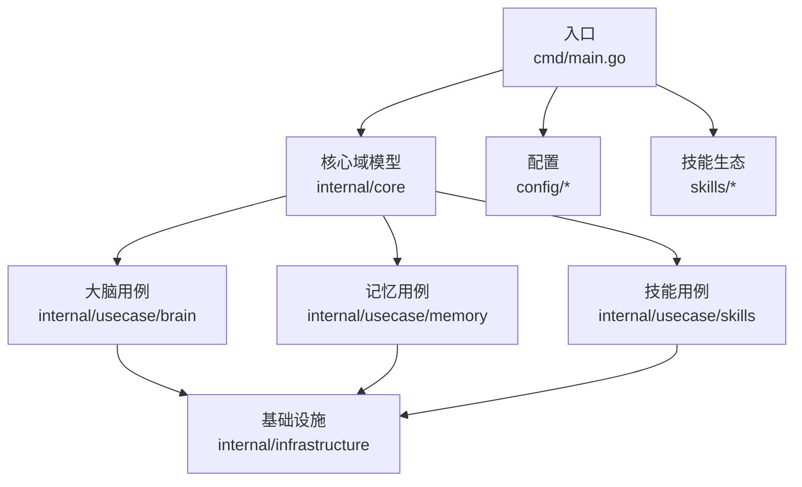
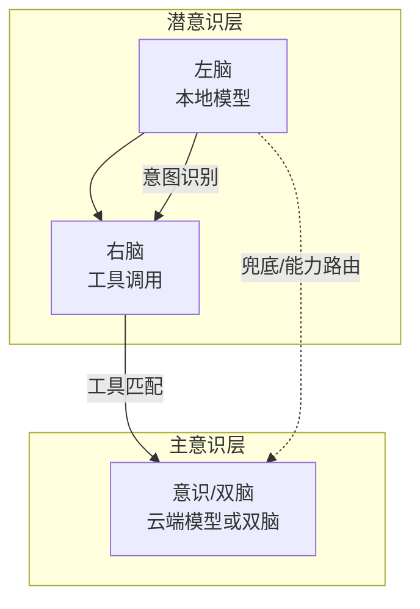
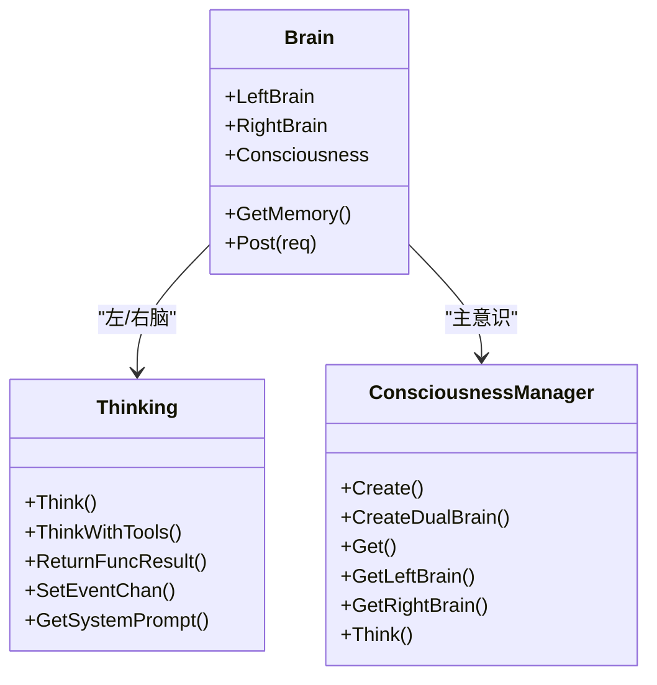
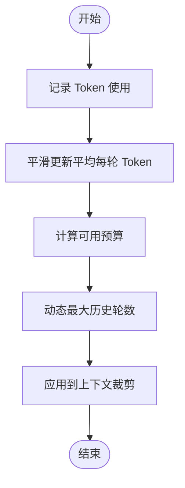
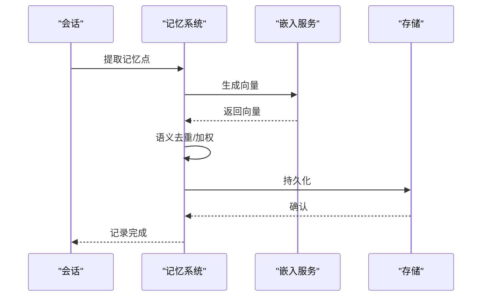
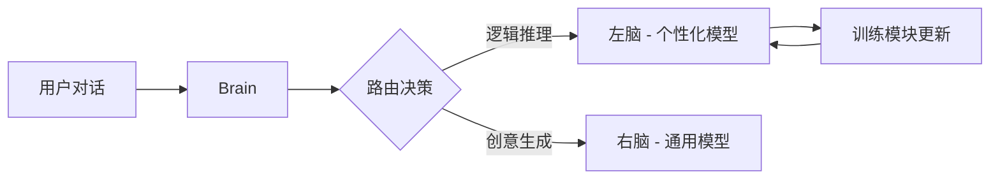
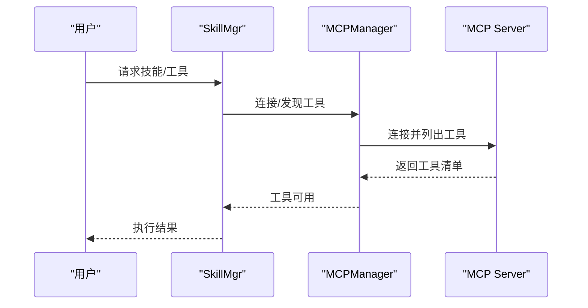
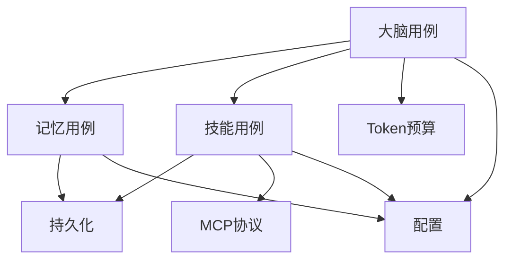

# 核心优势

<cite>
**本文引用的文件**
- [cmd/main.go](file://cmd/main.go)
- [internal/core/brain.go](file://internal/core/brain.go)
- [internal/usecase/brain/brain.go](file://internal/usecase/brain/brain.go)
- [internal/usecase/brain/consciousness_manager.go](file://internal/usecase/brain/consciousness_manager.go)
- [internal/usecase/brain/token_budget.go](file://internal/usecase/brain/token_budget.go)
- [internal/core/memory.go](file://internal/core/memory.go)
- [internal/usecase/memory/memory.go](file://internal/usecase/memory/memory.go)
- [internal/usecase/skills/mcp_manager.go](file://internal/usecase/skills/mcp_manager.go)
- [internal/usecase/skills/skill_mgr.go](file://internal/usecase/skills/skill_mgr.go)
- [internal/infrastructure/persistence/store.go](file://internal/infrastructure/persistence/store.go)
- [config/server.yml](file://config/server.yml)
- [config/models.yml](file://config/models.yml)
- [config/channels.yml](file://config/channels.yml)
- [README.md](file://README.md)
</cite>

## 目录
1. [引言](#引言)
2. [项目结构](#项目结构)
3. [核心组件](#核心组件)
4. [架构总览](#架构总览)
5. [详细组件分析](#详细组件分析)
6. [依赖关系分析](#依赖关系分析)
7. [性能考量](#性能考量)
8. [故障排查指南](#故障排查指南)
9. [结论](#结论)
10. [附录](#附录)

## 引言
本文件围绕 MindX 项目的“核心优势”展开，系统阐述其仿生大脑架构、多元成本控制策略、长效记忆系统、自我演化能力、全场景社交兼容、灵活技能生态与 MCP 协议支持，以及轻量级与自主可控特性。内容基于仓库源码与配置文件进行提炼与可视化，帮助读者快速理解 MindX 的技术优势与落地价值。

## 项目结构
MindX 采用分层清晰的 Go 项目组织方式，核心模块包括：
- 入口与启动：cmd/main.go
- 核心域模型：internal/core（大脑、记忆、工具、会话等抽象）
- 业务用例：internal/usecase（大脑思考、记忆、技能、训练等）
- 基础设施：internal/infrastructure（持久化、嵌入、llama 等）
- 配置：config（服务器、模型、渠道等）
- 技能生态：skills/（内置技能）与 internal/usecase/skills（MCP 管理）

图表来源
- [cmd/main.go](file://cmd/main.go#L1-L21)
- [internal/core/brain.go](file://internal/core/brain.go#L116-L140)
- [internal/usecase/brain/brain.go](file://internal/usecase/brain/brain.go#L56-L131)
- [internal/usecase/memory/memory.go](file://internal/usecase/memory/memory.go#L28-L60)
- [internal/usecase/skills/skill_mgr.go](file://internal/usecase/skills/skill_mgr.go#L36-L85)

章节来源
- [cmd/main.go](file://cmd/main.go#L1-L21)
- [README.md](file://README.md#L1-L25)

## 核心组件
- 仿生大脑（BionicBrain）：由潜意识层（左/右脑）与主意识层（单脑/双脑）构成，内嵌长时记忆，支持工具调用与能力路由。
- 长效记忆系统：自动沉淀、去重、聚类与本地持久化，提供检索增强与权重排序。
- 技能与 MCP 生态：统一技能加载、索引、搜索、执行与安装；支持 MCP 协议连接外部工具服务器。
- 成本控制：基于 Token 预算的动态历史轮数管理，结合本地/云端模型选择，实现算力利用率与成本优化。
- 社交兼容：多渠道接入配置（钉钉、飞书、微信、Telegram、WhatsApp 等），便于全场景部署。
- 自主可控：本地运行、数据不出境、可插拔模型与存储后端。

章节来源
- [internal/core/brain.go](file://internal/core/brain.go#L116-L140)
- [internal/usecase/brain/brain.go](file://internal/usecase/brain/brain.go#L56-L131)
- [internal/core/memory.go](file://internal/core/memory.go#L24-L39)
- [internal/usecase/memory/memory.go](file://internal/usecase/memory/memory.go#L28-L60)
- [internal/usecase/skills/skill_mgr.go](file://internal/usecase/skills/skill_mgr.go#L36-L85)
- [internal/usecase/skills/mcp_manager.go](file://internal/usecase/skills/mcp_manager.go#L49-L141)
- [internal/usecase/brain/token_budget.go](file://internal/usecase/brain/token_budget.go#L10-L42)
- [config/channels.yml](file://config/channels.yml#L1-L96)

## 架构总览
MindX 的“仿生大脑”通过三层思考链路实现高效决策与成本控制：
- 潜意识层（左脑）：本地模型驱动，快速意图识别与简单工具调用。
- 右脑（工具调用）：根据关键词检索匹配工具，生成 Function Call Schema 并执行。
- 主意识层（意识）：当潜意识无法回答时，按能力或双脑模式切换至云端模型或双脑协同。

图表来源
- [internal/core/brain.go](file://internal/core/brain.go#L116-L140)
- [internal/usecase/brain/brain.go](file://internal/usecase/brain/brain.go#L133-L237)
- [internal/usecase/brain/consciousness_manager.go](file://internal/usecase/brain/consciousness_manager.go#L40-L99)

章节来源
- [internal/core/brain.go](file://internal/core/brain.go#L116-L140)
- [internal/usecase/brain/brain.go](file://internal/usecase/brain/brain.go#L133-L237)
- [internal/usecase/brain/consciousness_manager.go](file://internal/usecase/brain/consciousness_manager.go#L40-L99)

## 详细组件分析

### 仿生大脑架构：潜意识层与主意识层
- 潜意识层职责：快速意图识别、关键词抽取、简单任务执行；本地模型驱动，低延迟、低算力。
- 右脑职责：基于关键词检索工具集合，生成 Function Call Schema 并执行，提升复杂任务的确定性与可解释性。
- 主意识层职责：当潜意识无法回答或需要高质量输出时，按能力或双脑模式切换；支持系统提示词与人设注入，保障一致性与个性化。

图表来源
- [internal/core/brain.go](file://internal/core/brain.go#L116-L140)
- [internal/usecase/brain/consciousness_manager.go](file://internal/usecase/brain/consciousness_manager.go#L13-L38)

章节来源
- [internal/core/brain.go](file://internal/core/brain.go#L116-L140)
- [internal/usecase/brain/consciousness_manager.go](file://internal/usecase/brain/consciousness_manager.go#L40-L99)

### 多元成本控制策略与算力利用率提升
- Token 预算动态管理：基于实际使用统计平滑更新平均每轮 Token 消耗，动态计算最大历史轮数，避免静态估算误差导致的上下文溢出或浪费。
- 本地优先与按需调用：潜意识层本地模型承担大多数简单任务；仅在必要时激活主意识层或能力路由，显著降低云端调用频率与成本。
- 模型配置灵活：支持多模型组合（左脑/右脑/意识/默认），可在不同场景选择合适模型以平衡性能与成本。

图表来源
- [internal/usecase/brain/token_budget.go](file://internal/usecase/brain/token_budget.go#L51-L130)
- [config/server.yml](file://config/server.yml#L8-L11)
- [config/models.yml](file://config/models.yml#L1-L92)

章节来源
- [internal/usecase/brain/token_budget.go](file://internal/usecase/brain/token_budget.go#L10-L130)
- [config/server.yml](file://config/server.yml#L8-L11)
- [config/models.yml](file://config/models.yml#L1-L92)

### 长效记忆系统：自动沉淀、智能整理与本地存储
- 自动沉淀与去重：对会话进行记忆提取，自动向量化并进行语义去重，合并相似记忆，减少冗余。
- 智能整理与聚类：支持对话聚类与摘要生成，提升检索效率与相关性。
- 本地存储与向量索引：支持 Badger/内存等存储后端，提供向量相似度计算与持久化，确保隐私与性能。

图表来源
- [internal/usecase/memory/memory.go](file://internal/usecase/memory/memory.go#L62-L107)
- [internal/infrastructure/persistence/store.go](file://internal/infrastructure/persistence/store.go#L25-L43)
- [internal/core/memory.go](file://internal/core/memory.go#L24-L39)

章节来源
- [internal/core/memory.go](file://internal/core/memory.go#L24-L39)
- [internal/usecase/memory/memory.go](file://internal/usecase/memory/memory.go#L28-L60)
- [internal/infrastructure/persistence/store.go](file://internal/infrastructure/persistence/store.go#L25-L43)

### 自我演化能力：基于对话数据的模型训练与适配
- 训练闭环：对话数据经记忆与向量索引处理后，反馈到训练模块，更新左脑个性化模型，实现“越用越懂你”的自我演化。
- 与大脑协作：训练模块更新左脑模型，右脑模型保持稳定，二者协同工作，兼顾个性化与通用性。

图表来源
- [README.md](file://README.md#L19-L25)
- [internal/usecase/training/README.md](file://internal/usecase/training/README.md#L384-L401)

章节来源
- [README.md](file://README.md#L19-L25)
- [internal/usecase/training/README.md](file://internal/usecase/training/README.md#L384-L401)

### 全场景社交兼容：多渠道接入与部署灵活性
- 渠道配置：提供钉钉、飞书、微信、Telegram、WhatsApp、iMessage 等多渠道接入配置，支持 Webhook/端口/密钥等参数。
- 部署弹性：支持本地/云端模型切换，结合 Token 预算与成本控制策略，满足不同网络与资源条件下的部署需求。

章节来源
- [config/channels.yml](file://config/channels.yml#L1-L96)

### 灵活技能生态与 MCP 协议支持
- 技能管理：统一加载、索引、搜索、执行与安装流程，支持标签关键词同步与向量化检索。
- MCP 协议：支持 stdio 与 SSE 两种传输方式，动态连接外部工具服务器，发现并调用工具，实现跨平台能力扩展。

图表来源
- [internal/usecase/skills/skill_mgr.go](file://internal/usecase/skills/skill_mgr.go#L36-L85)
- [internal/usecase/skills/mcp_manager.go](file://internal/usecase/skills/mcp_manager.go#L49-L141)

章节来源
- [internal/usecase/skills/skill_mgr.go](file://internal/usecase/skills/skill_mgr.go#L36-L85)
- [internal/usecase/skills/mcp_manager.go](file://internal/usecase/skills/mcp_manager.go#L49-L141)

### 轻量级架构与自主可控
- 轻量入口：命令行入口简洁，构建信息注入，便于容器化与边缘侧部署。
- 自主可控：本地运行、数据不出境、可插拔模型与存储后端，满足隐私与合规要求。

章节来源
- [cmd/main.go](file://cmd/main.go#L1-L21)
- [README.md](file://README.md#L16-L18)

## 依赖关系分析
- 组件耦合：大脑用例依赖记忆、技能、能力与 Token 预算；记忆用例依赖嵌入与存储；技能用例依赖嵌入、存储与 MCP 管理。
- 外部集成：MCP 协议通过 SDK 连接外部工具服务器；嵌入服务支持本地/云端模型；存储支持 Badger/内存。
- 配置驱动：模型、向量存储、Token 预算与渠道配置集中于 config 目录，便于按环境切换。

图表来源
- [internal/usecase/brain/brain.go](file://internal/usecase/brain/brain.go#L56-L131)
- [internal/usecase/memory/memory.go](file://internal/usecase/memory/memory.go#L28-L60)
- [internal/usecase/skills/skill_mgr.go](file://internal/usecase/skills/skill_mgr.go#L36-L85)
- [internal/usecase/skills/mcp_manager.go](file://internal/usecase/skills/mcp_manager.go#L49-L141)
- [config/server.yml](file://config/server.yml#L1-L21)

章节来源
- [internal/usecase/brain/brain.go](file://internal/usecase/brain/brain.go#L56-L131)
- [internal/usecase/memory/memory.go](file://internal/usecase/memory/memory.go#L28-L60)
- [internal/usecase/skills/skill_mgr.go](file://internal/usecase/skills/skill_mgr.go#L36-L85)
- [internal/usecase/skills/mcp_manager.go](file://internal/usecase/skills/mcp_manager.go#L49-L141)
- [config/server.yml](file://config/server.yml#L1-L21)

## 性能考量
- Token 预算动态调整：通过平滑更新平均每轮 Token 消耗，避免静态估算带来的资源浪费或溢出。
- 本地优先策略：简单任务本地完成，复杂任务按需调用云端模型，显著降低延迟与成本。
- 向量缓存与去重：嵌入缓存与语义去重减少重复计算与存储压力。
- 存储后端选择：Badger 适合本地持久化，内存模式适合临时或测试场景。

章节来源
- [internal/usecase/brain/token_budget.go](file://internal/usecase/brain/token_budget.go#L75-L93)
- [internal/usecase/memory/memory.go](file://internal/usecase/memory/memory.go#L84-L88)
- [internal/infrastructure/persistence/store.go](file://internal/infrastructure/persistence/store.go#L25-L43)

## 故障排查指南
- MCP 连接失败：检查传输类型（stdio/SSE）、命令参数、环境变量与认证头；查看状态与错误信息。
- 记忆记录失败：确认嵌入服务可用、向量维度正确、存储目录权限与磁盘空间。
- Token 预算异常：核对模型最大 Token、预留输出 Token、系统提示词 Token 与平均消耗统计。
- 渠道接入异常：核对 Webhook 路径、端口、校验令牌与平台配置。

章节来源
- [internal/usecase/skills/mcp_manager.go](file://internal/usecase/skills/mcp_manager.go#L105-L141)
- [internal/usecase/memory/memory.go](file://internal/usecase/memory/memory.go#L90-L104)
- [internal/usecase/brain/token_budget.go](file://internal/usecase/brain/token_budget.go#L105-L130)
- [config/channels.yml](file://config/channels.yml#L1-L96)

## 结论
MindX 通过仿生大脑架构实现了“快慢结合”的思考范式，配合 Token 预算动态管理、本地优先策略与灵活的模型配置，在不同场景下显著提升算力利用率与成本控制能力。长效记忆系统与自我演化机制让系统越用越贴合用户习惯；全场景社交兼容与 MCP 协议支持拓展了能力边界；轻量级与自主可控的设计使其适用于多种部署环境与隐私敏感场景。

## 附录
- 模型与配置参考：server.yml、models.yml
- 渠道接入参考：channels.yml
- 项目定位与优势概述：README.md

章节来源
- [config/server.yml](file://config/server.yml#L1-L21)
- [config/models.yml](file://config/models.yml#L1-L92)
- [config/channels.yml](file://config/channels.yml#L1-L96)
- [README.md](file://README.md#L1-L25)