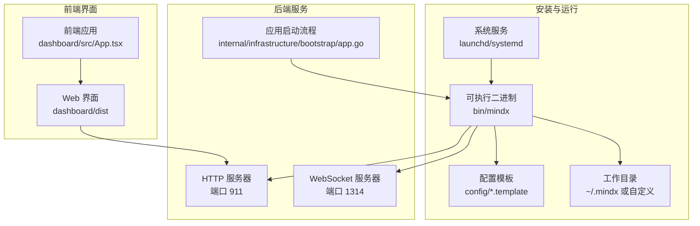
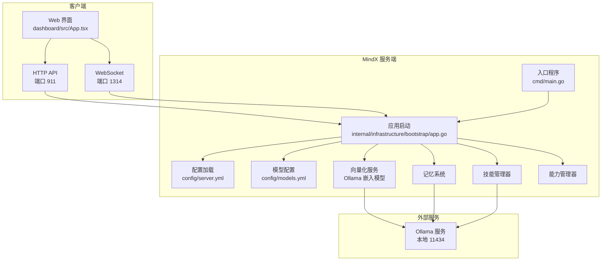
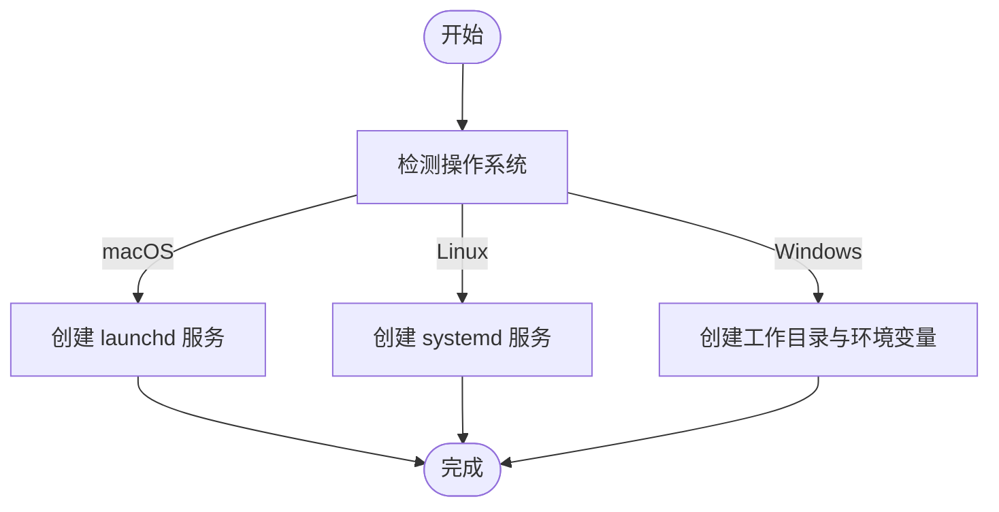
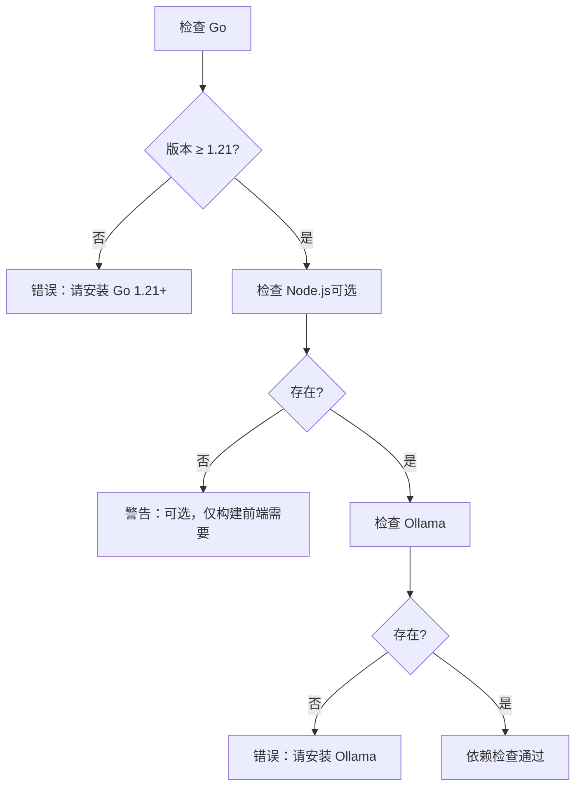
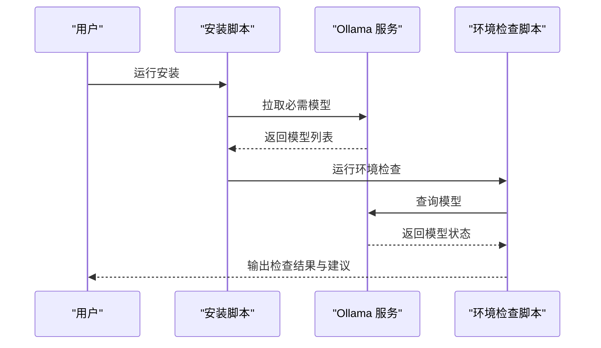
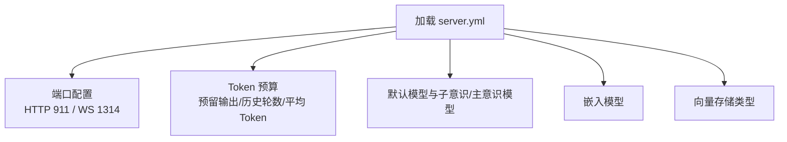
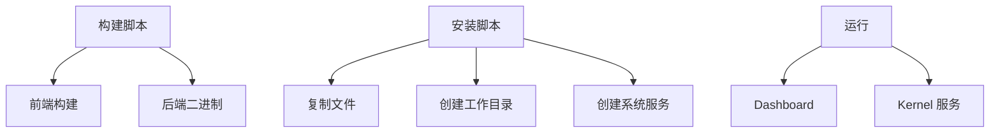
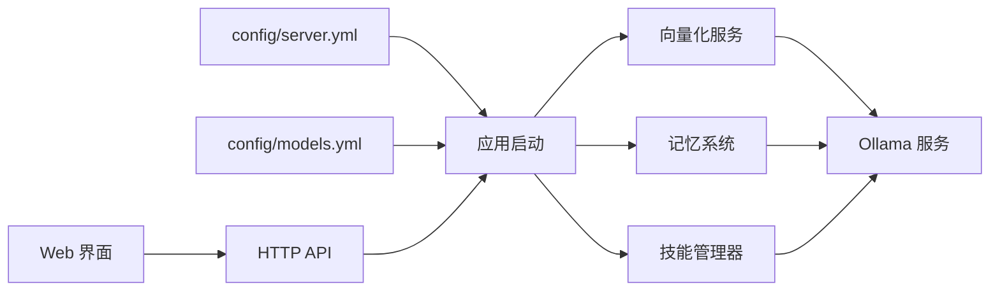
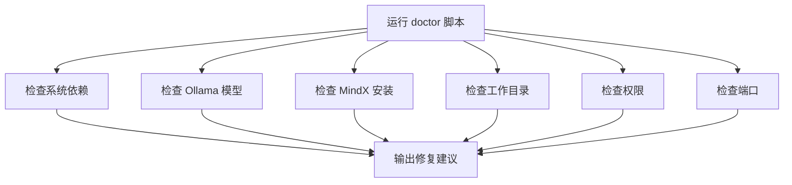

# 系统要求

<cite>
**本文引用的文件**
- [README.md](file://README.md)
- [INSTALL.md](file://INSTALL.md)
- [go.mod](file://go.mod)
- [config/server.yml](file://config/server.yml)
- [config/models.yml](file://config/models.yml)
- [scripts/install.sh](file://scripts/install.sh)
- [scripts/install.bat](file://scripts/install.bat)
- [scripts/doctor.sh](file://scripts/doctor.sh)
- [scripts/build.sh](file://scripts/build.sh)
- [Makefile](file://Makefile)
- [cmd/main.go](file://cmd/main.go)
- [internal/infrastructure/bootstrap/app.go](file://internal/infrastructure/bootstrap/app.go)
- [dashboard/src/App.tsx](file://dashboard/src/App.tsx)
</cite>

## 目录
1. [简介](#简介)
2. [项目结构](#项目结构)
3. [核心组件](#核心组件)
4. [架构总览](#架构总览)
5. [详细组件分析](#详细组件分析)
6. [依赖关系分析](#依赖关系分析)
7. [性能考量](#性能考量)
8. [故障排查指南](#故障排查指南)
9. [结论](#结论)
10. [附录](#附录)

## 简介
本文件面向 MindX 项目的使用者与运维人员，提供系统要求与资源建议，涵盖操作系统平台、硬件配置、网络环境、软件依赖、不同使用场景的资源配置建议，以及性能基准与资源占用参考。内容基于仓库中的安装文档、配置文件与脚本进行归纳总结，并辅以可视化图示帮助理解。

## 项目结构
MindX 采用前后端一体化的单可执行文件架构，支持 macOS、Linux 与 Windows 平台。安装与运行涉及以下关键要素：
- 安装脚本负责复制二进制、静态资源、配置模板与工作目录初始化
- 服务端通过 HTTP 提供 Web 界面与 API，WebSocket 提供实时消息通道
- 配置文件定义模型、向量存储、Token 预算与默认模型等参数
- 环境检查脚本用于验证依赖、模型、端口与工作区状态

**图表来源**
- [scripts/install.sh](file://scripts/install.sh#L100-L145)
- [config/server.yml](file://config/server.yml#L1-L21)
- [internal/infrastructure/bootstrap/app.go](file://internal/infrastructure/bootstrap/app.go#L401-L434)
- [dashboard/src/App.tsx](file://dashboard/src/App.tsx#L19-L66)

**章节来源**
- [scripts/install.sh](file://scripts/install.sh#L100-L145)
- [config/server.yml](file://config/server.yml#L1-L21)
- [internal/infrastructure/bootstrap/app.go](file://internal/infrastructure/bootstrap/app.go#L401-L434)
- [dashboard/src/App.tsx](file://dashboard/src/App.tsx#L19-L66)

## 核心组件
- 操作系统与平台
  - 支持 macOS、Linux、Windows；提供多架构二进制（amd64/arm64）
  - 安装脚本区分平台并创建相应系统服务
- 软件依赖
  - Go 1.21+（构建与运行）
  - Node.js 18+（仅构建前端时需要）
  - Ollama（本地模型推理服务，必须）
- 网络与模型
  - 首次安装需联网拉取模型；后续可离线使用
  - 默认模型与嵌入模型来自本地 Ollama 服务
- 硬件与资源
  - 推荐内存 8GB+，建议 20GB+ 硬盘空间
  - 轻量场景可在普通 CPU 上运行，复杂任务建议更强硬件

**章节来源**
- [README.md](file://README.md#L66-L71)
- [INSTALL.md](file://INSTALL.md#L3-L8)
- [scripts/install.sh](file://scripts/install.sh#L212-L301)
- [scripts/install.bat](file://scripts/install.bat#L10-L78)
- [config/server.yml](file://config/server.yml#L12-L19)
- [config/models.yml](file://config/models.yml#L1-L92)

## 架构总览
MindX 的运行时架构围绕本地 Ollama 服务展开，后端通过 HTTP/WebSocket 提供能力，前端 Web 界面提供交互入口。应用启动时会初始化向量化服务、会话管理、记忆系统、能力与技能管理器，并注册路由与通道。

**图表来源**
- [cmd/main.go](file://cmd/main.go#L18-L21)
- [internal/infrastructure/bootstrap/app.go](file://internal/infrastructure/bootstrap/app.go#L119-L136)
- [config/server.yml](file://config/server.yml#L1-L21)
- [config/models.yml](file://config/models.yml#L1-L92)

**章节来源**
- [cmd/main.go](file://cmd/main.go#L18-L21)
- [internal/infrastructure/bootstrap/app.go](file://internal/infrastructure/bootstrap/app.go#L119-L136)
- [config/server.yml](file://config/server.yml#L1-L21)
- [config/models.yml](file://config/models.yml#L1-L92)

## 详细组件分析

### 操作系统与平台支持
- macOS：支持 amd64 与 arm64，安装脚本创建 launchd 服务
- Linux：支持 amd64 与 arm64，安装脚本创建 systemd 服务
- Windows：支持 amd64（含 arm64 发布包），安装脚本创建工作目录与环境变量

**图表来源**
- [scripts/install.sh](file://scripts/install.sh#L212-L301)
- [scripts/install.bat](file://scripts/install.bat#L10-L78)

**章节来源**
- [scripts/install.sh](file://scripts/install.sh#L212-L301)
- [scripts/install.bat](file://scripts/install.bat#L10-L78)

### 软件依赖与版本要求
- Go：1.21 或更高版本（构建与运行）
- Node.js：18 或更高版本（仅构建前端时需要）
- Ollama：必须，用于本地模型推理
- 操作系统：Linux / macOS / Windows

**图表来源**
- [scripts/doctor.sh](file://scripts/doctor.sh#L36-L67)
- [INSTALL.md](file://INSTALL.md#L5-L8)

**章节来源**
- [scripts/doctor.sh](file://scripts/doctor.sh#L36-L67)
- [INSTALL.md](file://INSTALL.md#L5-L8)

### 网络与模型配置
- 首次安装需联网拉取模型，后续可离线使用
- 默认模型与嵌入模型来自本地 Ollama 服务（端口 11434）
- 环境检查脚本会验证必需模型是否已拉取

**图表来源**
- [scripts/doctor.sh](file://scripts/doctor.sh#L77-L92)
- [config/models.yml](file://config/models.yml#L86-L92)

**章节来源**
- [scripts/doctor.sh](file://scripts/doctor.sh#L77-L92)
- [config/models.yml](file://config/models.yml#L86-L92)

### 硬件配置与资源建议
- 内存：建议 8GB 以上
- 硬盘空间：建议 20GB 以上
- 处理器：普通 CPU 可满足轻量场景；复杂任务建议更强硬件
- 不同场景建议
  - 轻量场景（查天气、记备忘等）：本地完成，零 Token 消耗
  - 专业场景（编程、绘图等）：绑定专属最优模型，低成本匹配强能力
  - 自主进化：夜间后台自动训练，不占用白天使用时间

**章节来源**
- [README.md](file://README.md#L66-L71)
- [README.md](file://README.md#L38-L42)

### 配置文件与运行参数
- 服务器端口：HTTP 911，WebSocket 1314
- 向量存储：Badger
- Token 预算：预留输出 Token、最小历史轮数、单轮平均 Token 数
- 默认模型与子意识/主意识模型：默认 qwen3:0.6b，嵌入模型 bge-small-zh

**图表来源**
- [config/server.yml](file://config/server.yml#L1-L21)

**章节来源**
- [config/server.yml](file://config/server.yml#L1-L21)

### 构建与安装流程
- 构建：前端构建与后端二进制生成，支持多平台交叉编译
- 安装：复制二进制、静态资源、配置模板，创建工作目录与系统服务
- 运行：启动 Dashboard 或 Kernel 服务

**图表来源**
- [scripts/build.sh](file://scripts/build.sh#L40-L101)
- [scripts/install.sh](file://scripts/install.sh#L100-L145)
- [Makefile](file://Makefile#L26-L92)

**章节来源**
- [scripts/build.sh](file://scripts/build.sh#L40-L101)
- [scripts/install.sh](file://scripts/install.sh#L100-L145)
- [Makefile](file://Makefile#L26-L92)

## 依赖关系分析
- 应用启动依赖配置与模型配置
- 向量化服务依赖 Ollama 嵌入模型
- 记忆系统与技能管理器依赖向量化服务与模型
- 前端界面依赖后端 HTTP/WebSocket 服务

**图表来源**
- [internal/infrastructure/bootstrap/app.go](file://internal/infrastructure/bootstrap/app.go#L119-L136)
- [config/server.yml](file://config/server.yml#L1-L21)
- [config/models.yml](file://config/models.yml#L1-L92)

**章节来源**
- [internal/infrastructure/bootstrap/app.go](file://internal/infrastructure/bootstrap/app.go#L119-L136)
- [config/server.yml](file://config/server.yml#L1-L21)
- [config/models.yml](file://config/models.yml#L1-L92)

## 性能考量
- 轻量场景：本地完成，零 Token 消耗，响应速度快
- 专业场景：绑定专属模型，平衡速度与质量
- 自主进化：夜间自动训练，逐步适配个人风格
- 资源占用：Go 原生开发，资源占用远低于同类产品；向量存储采用嵌入式 KV 数据库，支持亿级数据处理

说明：本节为通用性能讨论，不直接分析具体文件。

## 故障排查指南
- 端口占用：HTTP 911、WebSocket 1314
- 权限问题：确保工作目录可读写
- 模型连接失败：检查 API 密钥、网络连接与 base_url
- 环境检查：使用 doctor 脚本检查系统依赖、模型、安装状态、工作区状态、权限与端口

**图表来源**
- [scripts/doctor.sh](file://scripts/doctor.sh#L33-L243)

**章节来源**
- [scripts/doctor.sh](file://scripts/doctor.sh#L33-L243)
- [INSTALL.md](file://INSTALL.md#L413-L431)

## 结论
MindX 在保证隐私与本地化的同时，提供了跨平台、低资源占用的个人智能助理解决方案。通过合理的硬件配置与模型选择，用户可以在不同场景下获得流畅体验。首次安装需联网拉取模型，后续可完全离线使用。

## 附录
- 快速开始与安装步骤详见安装文档
- 环境检查与故障排查可使用 doctor 脚本
- Makefile 提供统一构建、安装、运行入口

**章节来源**
- [INSTALL.md](file://INSTALL.md#L10-L51)
- [scripts/doctor.sh](file://scripts/doctor.sh#L360-L384)
- [Makefile](file://Makefile#L253-L299)