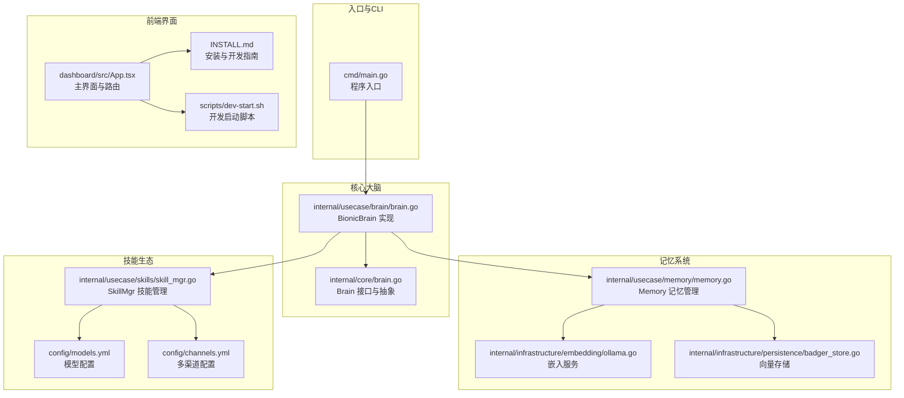
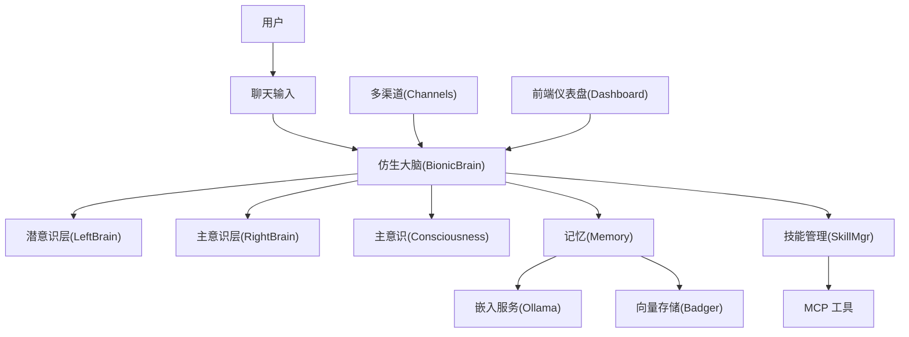
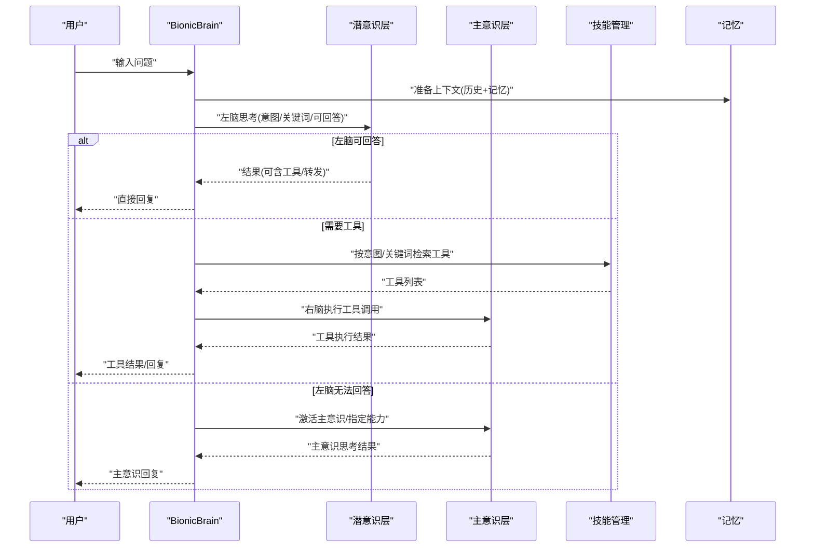
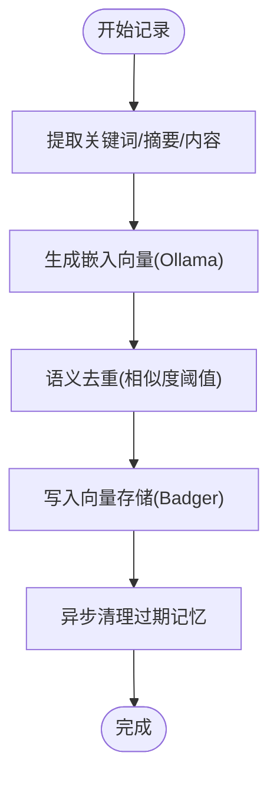
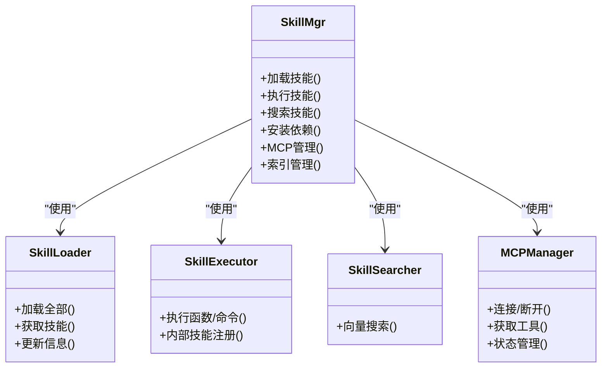
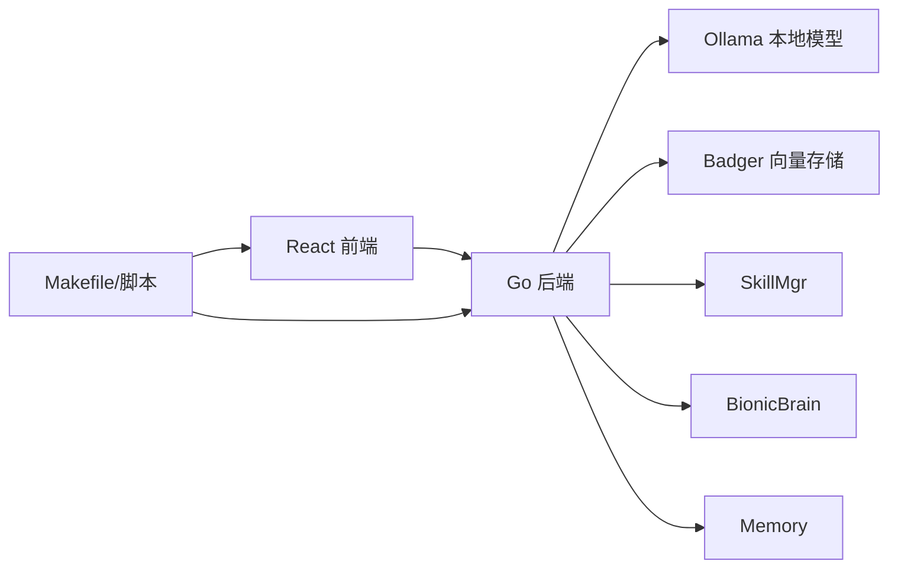

# 项目概述

<cite>
**本文档引用的文件**
- [README.md](file://README.md)
- [cmd/main.go](file://cmd/main.go)
- [internal/core/brain.go](file://internal/core/brain.go)
- [internal/usecase/brain/brain.go](file://internal/usecase/brain/brain.go)
- [config/channels.yml](file://config/channels.yml)
- [internal/usecase/memory/memory.go](file://internal/usecase/memory/memory.go)
- [internal/usecase/skills/skill_mgr.go](file://internal/usecase/skills/skill_mgr.go)
- [INSTALL.md](file://INSTALL.md)
- [scripts/dev-start.sh](file://scripts/dev-start.sh)
- [dashboard/src/App.tsx](file://dashboard/src/App.tsx)
- [config/models.yml](file://config/models.yml)
- [skills/calculator/SKILL.md](file://skills/calculator/SKILL.md)
- [internal/infrastructure/embedding/ollama.go](file://internal/infrastructure/embedding/ollama.go)
- [internal/infrastructure/persistence/badger_store.go](file://internal/infrastructure/persistence/badger_store.go)
</cite>

## 目录
1. [简介](#简介)
2. [项目结构](#项目结构)
3. [核心组件](#核心组件)
4. [架构总览](#架构总览)
5. [详细组件分析](#详细组件分析)
6. [依赖关系分析](#依赖关系分析)
7. [性能考量](#性能考量)
8. [故障排查指南](#故障排查指南)
9. [结论](#结论)
10. [附录](#附录)

## 简介
MindX 是一款轻量级、具备思考能力且可自主进化的 AI 个人助理。项目采用创新的仿生大脑架构，将“潜意识层”和“主意识层”结合，最大化发挥本地大模型能力，仅在必要时调用云端模型，从而显著降低 Token 消耗与算力成本。其核心价值主张包括：
- 分层思考：潜意识层快速响应简单任务，主意识层处理复杂任务，兼顾速度与深度
- 长效记忆：自动沉淀与整理记忆，越用越贴合用户习惯
- 灵活扩展：兼容 OpenClaw 技能生态，支持 MCP 协议，能力边界无限延伸
- 自主进化：基于对话数据训练专属模型，夜间自动训练，持续适配个人风格
- 隐私安全：100% 本地运行，数据不上传云端

## 项目结构
MindX 采用分层清晰的 Go 语言后端与 React 前端组合，配合本地嵌入模型与向量存储，实现高效、可扩展的数字分身系统。

**图表来源**
- [cmd/main.go](file://cmd/main.go#L1-L21)
- [internal/core/brain.go](file://internal/core/brain.go#L116-L140)
- [internal/usecase/brain/brain.go](file://internal/usecase/brain/brain.go#L56-L131)
- [internal/usecase/memory/memory.go](file://internal/usecase/memory/memory.go#L18-L60)
- [internal/infrastructure/embedding/ollama.go](file://internal/infrastructure/embedding/ollama.go#L24-L55)
- [internal/infrastructure/persistence/badger_store.go](file://internal/infrastructure/persistence/badger_store.go#L16-L45)
- [internal/usecase/skills/skill_mgr.go](file://internal/usecase/skills/skill_mgr.go#L36-L85)
- [config/models.yml](file://config/models.yml#L1-L92)
- [config/channels.yml](file://config/channels.yml#L1-L96)
- [dashboard/src/App.tsx](file://dashboard/src/App.tsx#L19-L63)
- [INSTALL.md](file://INSTALL.md#L1-L491)
- [scripts/dev-start.sh](file://scripts/dev-start.sh#L70-L109)

**章节来源**
- [README.md](file://README.md#L8-L63)
- [INSTALL.md](file://INSTALL.md#L55-L78)

## 核心组件
- 仿生大脑（Brain）
  - 潜意识层（LeftBrain）：使用本地小模型进行快速思考与简单工具调用
  - 主意识层（RightBrain/Consciousness）：在复杂任务或工具调用失败时启用，支持远程模型与能力
  - 记忆集成：在思考前从长效记忆中提取上下文，提升个性化与连贯性
- 记忆系统（Memory）
  - 基于嵌入向量的语义去重与索引，支持关键词、摘要与内容的向量化
  - 本地嵌入模型与 Badger 向量存储，保障隐私与性能
- 技能生态（SkillMgr）
  - 支持内置 CLI 技能、MCP 工具、向量索引与批量安装
  - 提供工具搜索、执行、转换与运行时 MCP 管理
- 多渠道通信（Channels）
  - 钉钉、微信、QQ、飞书、WhatsApp、Facebook、Telegram 等
  - 支持 Webhook、Token 校验与端口配置
- 前端仪表盘（Dashboard）
  - 聊天、历史、模型、技能、能力、监控、通道、用量、定时任务、MCP 管理等模块

**章节来源**
- [internal/core/brain.go](file://internal/core/brain.go#L116-L140)
- [internal/usecase/brain/brain.go](file://internal/usecase/brain/brain.go#L56-L131)
- [internal/usecase/memory/memory.go](file://internal/usecase/memory/memory.go#L18-L60)
- [internal/infrastructure/embedding/ollama.go](file://internal/infrastructure/embedding/ollama.go#L24-L55)
- [internal/infrastructure/persistence/badger_store.go](file://internal/infrastructure/persistence/badger_store.go#L16-L45)
- [internal/usecase/skills/skill_mgr.go](file://internal/usecase/skills/skill_mgr.go#L36-L85)
- [config/channels.yml](file://config/channels.yml#L1-L96)
- [dashboard/src/App.tsx](file://dashboard/src/App.tsx#L19-L63)

## 架构总览
MindX 的整体架构围绕“仿生大脑”展开：潜意识层负责快速响应与简单工具调用；主意识层在需要时接管复杂任务与远程能力；记忆系统贯穿始终，提供个性化上下文；技能生态与多渠道通信确保能力扩展与用户触达。

**图表来源**
- [internal/usecase/brain/brain.go](file://internal/usecase/brain/brain.go#L133-L237)
- [internal/core/brain.go](file://internal/core/brain.go#L116-L140)
- [internal/usecase/memory/memory.go](file://internal/usecase/memory/memory.go#L18-L60)
- [internal/infrastructure/embedding/ollama.go](file://internal/infrastructure/embedding/ollama.go#L24-L55)
- [internal/infrastructure/persistence/badger_store.go](file://internal/infrastructure/persistence/badger_store.go#L16-L45)
- [internal/usecase/skills/skill_mgr.go](file://internal/usecase/skills/skill_mgr.go#L36-L85)
- [config/channels.yml](file://config/channels.yml#L1-L96)
- [dashboard/src/App.tsx](file://dashboard/src/App.tsx#L19-L63)

## 详细组件分析

### 仿生大脑：潜意识与主意识协作
- 设计理念
  - 潜意识层：面向高频、低复杂度任务，使用本地小模型，快速响应
  - 主意识层：面向复杂推理、远程能力与工具调用失败兜底，按需激活
- 关键流程
  - 上下文准备：从记忆与会话历史中提取参考信息
  - 左脑思考：意图识别、关键词抽取、是否可回答判断
  - 右脑工具匹配：根据意图与关键词检索可用技能
  - 主意识接管：当左脑无法回答或工具调用失败时，激活主意识或指定能力
  - 响应构建：根据思考结果构建最终回答与可选转发目标

**图表来源**
- [internal/usecase/brain/brain.go](file://internal/usecase/brain/brain.go#L133-L237)
- [internal/core/brain.go](file://internal/core/brain.go#L116-L140)

**章节来源**
- [internal/core/brain.go](file://internal/core/brain.go#L116-L140)
- [internal/usecase/brain/brain.go](file://internal/usecase/brain/brain.go#L133-L237)

### 记忆系统：长效记忆与向量索引
- 自动沉淀与整理
  - 从对话中提取关键词、摘要与内容，生成向量
  - 语义去重：避免重复记忆，提升检索效率
- 存储与检索
  - 嵌入服务：基于本地 Ollama 模型生成向量
  - 向量存储：Badger KV 存储，支持 Cosine 相似度检索
- 隐私与性能
  - 100% 本地运行，向量索引与核心记忆均保存在本地工作目录

**图表来源**
- [internal/usecase/memory/memory.go](file://internal/usecase/memory/memory.go#L62-L107)
- [internal/infrastructure/embedding/ollama.go](file://internal/infrastructure/embedding/ollama.go#L57-L111)
- [internal/infrastructure/persistence/badger_store.go](file://internal/infrastructure/persistence/badger_store.go#L130-L198)

**章节来源**
- [internal/usecase/memory/memory.go](file://internal/usecase/memory/memory.go#L18-L60)
- [internal/infrastructure/embedding/ollama.go](file://internal/infrastructure/embedding/ollama.go#L24-L55)
- [internal/infrastructure/persistence/badger_store.go](file://internal/infrastructure/persistence/badger_store.go#L16-L45)

### 技能生态：OpenClaw 兼容与 MCP 支持
- 内置技能
  - 多语言 CLI 技能，如计算器、天气、文件操作等
  - 支持参数校验、超时控制与批量安装
- MCP 工具
  - 运行时连接外部 MCP 服务器，自动注册工具并建立向量索引
  - 支持并发初始化、带重试的连接策略
- 向量索引与搜索
  - 技能定义与描述向量化，提升意图识别与工具匹配准确率

**图表来源**
- [internal/usecase/skills/skill_mgr.go](file://internal/usecase/skills/skill_mgr.go#L20-L85)

**章节来源**
- [internal/usecase/skills/skill_mgr.go](file://internal/usecase/skills/skill_mgr.go#L36-L85)
- [config/models.yml](file://config/models.yml#L1-L92)
- [skills/calculator/SKILL.md](file://skills/calculator/SKILL.md#L1-L37)

### 多渠道通信：全场景覆盖
- 支持平台
  - 钉钉、微信、QQ、飞书、WhatsApp、Facebook、Telegram 等
- 配置要点
  - Webhook 路径、端口、Token/密钥等参数
  - 按需启用与禁用渠道

**章节来源**
- [config/channels.yml](file://config/channels.yml#L1-L96)

### 前端仪表盘：模块化界面
- 功能模块
  - 聊天、历史、模型、技能、能力、监控、通道、用量、定时任务、MCP 管理
- 开发与运行
  - 支持开发模式热重载，端口 5173；生产通过 Dashboard 启动

**章节来源**
- [dashboard/src/App.tsx](file://dashboard/src/App.tsx#L19-L63)
- [INSTALL.md](file://INSTALL.md#L193-L215)

## 依赖关系分析
- 后端依赖
  - Go 核心库与第三方库（如嵌入与向量存储）
  - Ollama 本地模型服务
  - Badger 向量存储
- 前端依赖
  - React 生态与 Tailwind 样式
- 配置与脚本
  - Makefile、安装脚本与开发启动脚本

**图表来源**
- [internal/infrastructure/embedding/ollama.go](file://internal/infrastructure/embedding/ollama.go#L24-L55)
- [internal/infrastructure/persistence/badger_store.go](file://internal/infrastructure/persistence/badger_store.go#L16-L45)
- [internal/usecase/skills/skill_mgr.go](file://internal/usecase/skills/skill_mgr.go#L36-L85)
- [INSTALL.md](file://INSTALL.md#L218-L258)

**章节来源**
- [INSTALL.md](file://INSTALL.md#L1-L491)

## 性能考量
- 本地优先：潜意识层与本地嵌入模型显著降低 Token 与延迟
- 向量检索：Badger KV 存储与 Cosine 相似度计算，支持高并发检索
- 异步与批处理：记忆清理、技能索引与 MCP 初始化采用异步与批处理，减少主线程阻塞
- 资源占用：Go 原生开发与嵌入式存储，整体资源占用低于同类产品

## 故障排查指南
- 环境检查
  - 使用环境检查命令定位依赖缺失与端口占用问题
- 常见问题
  - 端口被占用：调整 server.yml 中端口配置
  - 权限问题：确保工作目录可读写
  - 模型连接失败：检查 API 密钥、base_url 与网络
- 日志位置
  - 系统日志与对话日志分别位于工作目录下的 logs 目录

**章节来源**
- [INSTALL.md](file://INSTALL.md#L360-L437)

## 结论
MindX 通过仿生大脑架构实现了“快速响应 + 深度思考”的双轨机制，结合长效记忆、灵活技能生态与多渠道通信，为用户提供更懂自己的数字分身。其本地优先的设计在保障隐私的同时，显著降低了成本与延迟，适合个人与企业级场景的长期演进。

## 附录

### 系统要求与安装
- 系统要求
  - 操作系统：macOS / Linux / Windows
  - 内存：建议 8GB 以上
  - 硬盘空间：建议 20GB 以上
  - 网络：首次安装需下载模型，后续可离线使用
- 环境准备
  - 安装 Ollama 并启动本地服务
- 安装方式
  - 预编译包安装（推荐）
  - 源码编译安装
- 快速开始
  - 启动服务与 Dashboard，或使用 TUI 终端界面

**章节来源**
- [README.md](file://README.md#L64-L124)
- [INSTALL.md](file://INSTALL.md#L3-L51)

### 开发与扩展
- 开发模式
  - make dev 启动后端与前端热重载
- 技能开发
  - 兼容 OpenClaw 生态，支持任意编程语言 CLI 开发
- MCP 协议
  - 原生支持 MCP，统一体验，本地/外部技能无感切换

**章节来源**
- [README.md](file://README.md#L140-L143)
- [scripts/dev-start.sh](file://scripts/dev-start.sh#L111-L143)
- [internal/usecase/skills/skill_mgr.go](file://internal/usecase/skills/skill_mgr.go#L373-L393)