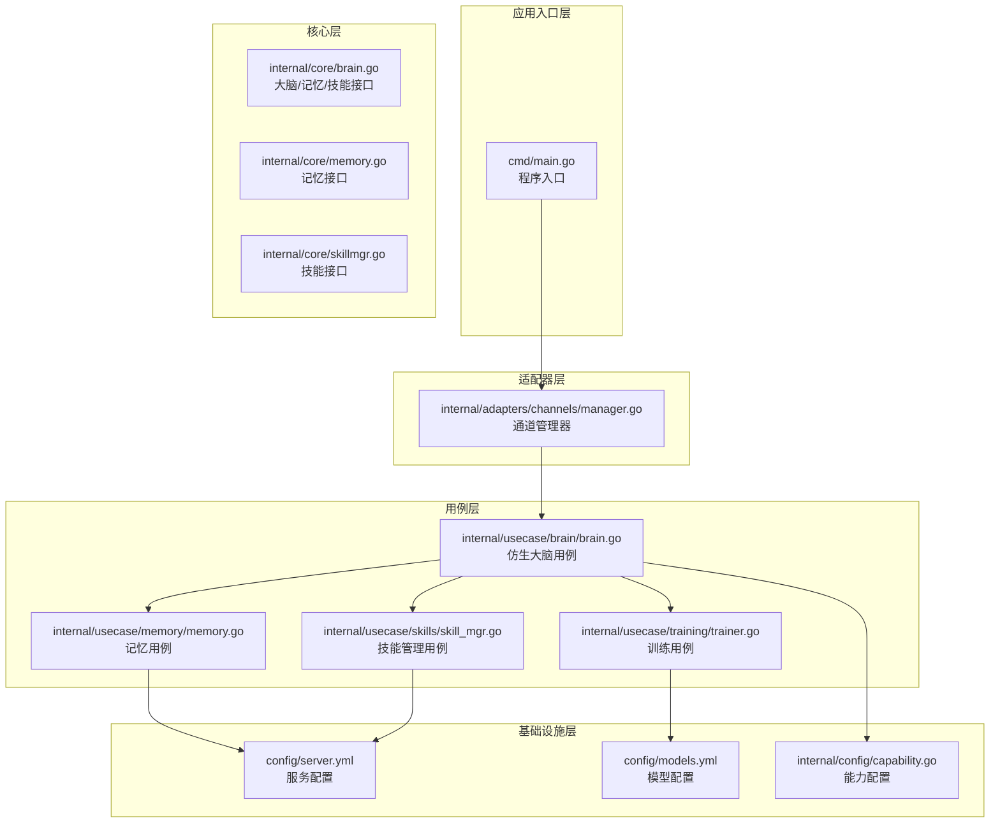
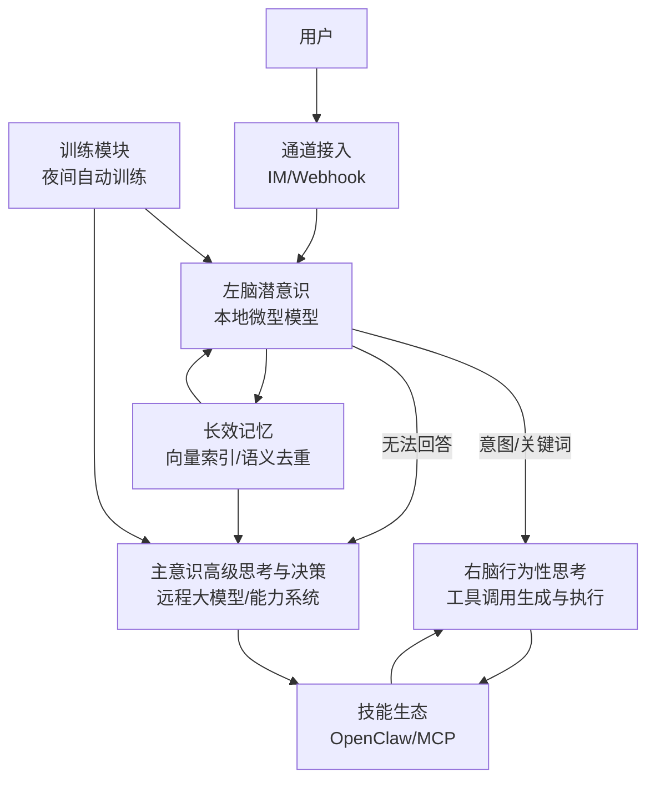
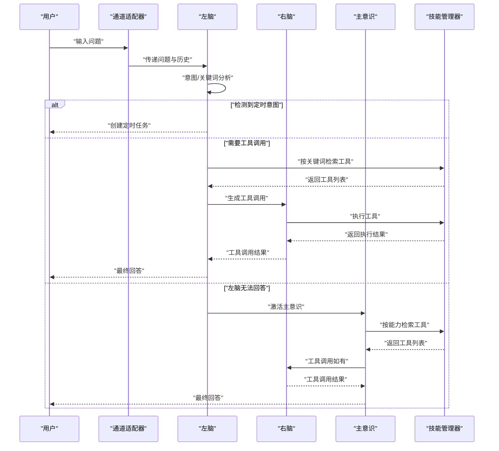
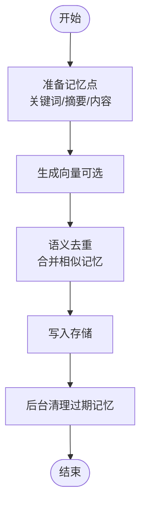
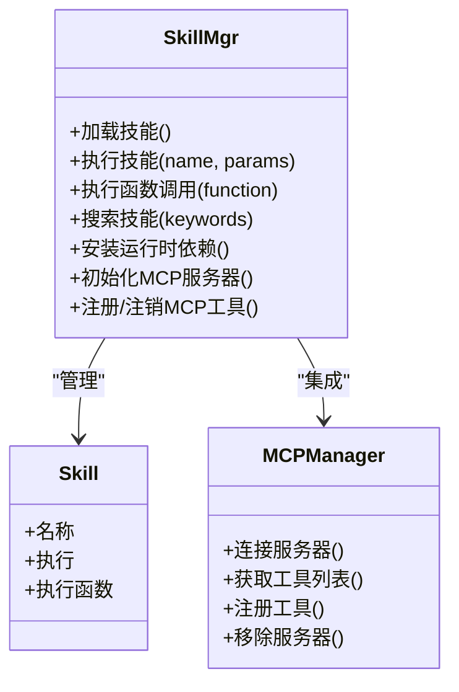
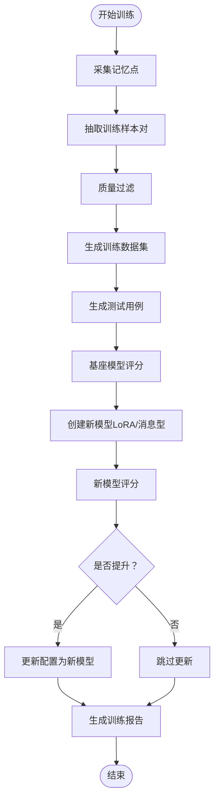
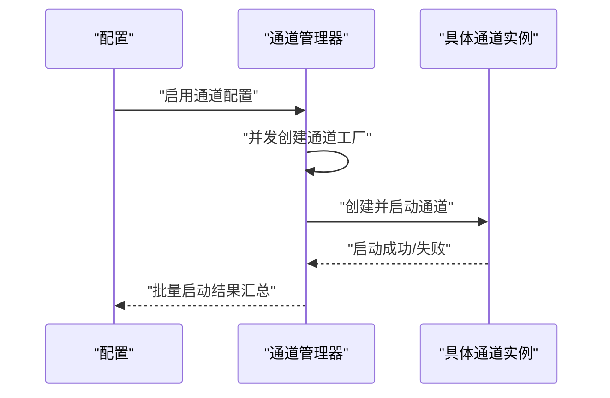
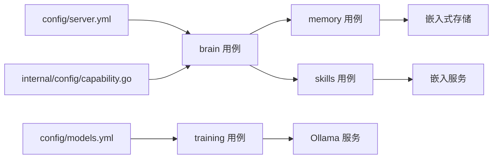

# 项目简介

<cite>
**本文引用的文件**
- [README.md](file://README.md)
- [cmd/main.go](file://cmd/main.go)
- [internal/core/brain.go](file://internal/core/brain.go)
- [internal/core/memory.go](file://internal/core/memory.go)
- [internal/core/skillmgr.go](file://internal/core/skillmgr.go)
- [internal/usecase/brain/brain.go](file://internal/usecase/brain/brain.go)
- [internal/usecase/memory/memory.go](file://internal/usecase/memory/memory.go)
- [internal/usecase/skills/skill_mgr.go](file://internal/usecase/skills/skill_mgr.go)
- [internal/config/capability.go](file://internal/config/capability.go)
- [config/server.yml](file://config/server.yml)
- [config/models.yml](file://config/models.yml)
- [internal/usecase/training/trainer.go](file://internal/usecase/training/trainer.go)
- [internal/adapters/channels/manager.go](file://internal/adapters/channels/manager.go)
</cite>

## 目录
1. [简介](#简介)
2. [项目结构](#项目结构)
3. [核心组件](#核心组件)
4. [架构总览](#架构总览)
5. [详细组件分析](#详细组件分析)
6. [依赖关系分析](#依赖关系分析)
7. [性能考量](#性能考量)
8. [故障排查指南](#故障排查指南)
9. [结论](#结论)
10. [附录](#附录)

## 简介
MindX 是一款轻量级、具备思考能力且可自主进化的 AI 个人助理。项目采用创新的“仿生大脑架构”，在本地大模型能力范围内最大化思考与执行效率，仅在必要时调用云端大模型，从而显著降低 Token 消耗与算力成本。MindX 不是简单的问答系统，而是具备“思考、记忆、执行、进化”完整能力的智能体，面向个人与企业用户提供可本地化、可扩展、可隐私保护的数字分身解决方案。

- 分层思考：仿人类大脑的潜意识/主意识分层架构，兼顾响应速度与思考深度
- 长效记忆：自动沉淀、整理记忆，越用越贴合你的使用习惯
- 灵活技能生态：兼容 OpenClaw 技能生态，支持 MCP 协议，能力边界无限延伸
- 自主进化：基于对话数据训练专属模型，无需复杂操作即可持续适配个人风格
- 隐私安全：100% 本地运行，数据不上传云端，自主可控更安心

与传统 AI 助手相比，MindX 的优势体现在：
- 成本控制：轻量场景本地完成，专业场景绑定专属最优模型，低成本匹配强能力
- 性能优化：仿生大脑自动适配任务复杂度，算力利用率提升 80%+；嵌入式 KV 数据库存储亿级数据，响应毫秒级
- 用户体验：长效记忆系统越用越懂你；全场景社交渠道统一接入；技能即插即用，生态无限延伸

## 项目结构
MindX 采用分层清晰的 Go 语言架构，核心分为以下层次：
- 应用入口层：命令行入口负责初始化构建信息并启动 CLI
- 适配器层：通道适配器负责多渠道接入（IM、Webhook 等）
- 用例层：大脑思考、记忆、技能、训练、定时任务等业务用例
- 核心层：抽象接口与领域模型（大脑、记忆、技能、工具 Schema 等）
- 基础设施层：嵌入式存储、向量索引、Ollama/LLM 服务、日志与国际化

图表来源
- [cmd/main.go](file://cmd/main.go#L1-L21)
- [internal/adapters/channels/manager.go](file://internal/adapters/channels/manager.go#L1-L230)
- [internal/usecase/brain/brain.go](file://internal/usecase/brain/brain.go#L1-L674)
- [internal/usecase/memory/memory.go](file://internal/usecase/memory/memory.go#L1-L112)
- [internal/usecase/skills/skill_mgr.go](file://internal/usecase/skills/skill_mgr.go#L1-L558)
- [internal/usecase/training/trainer.go](file://internal/usecase/training/trainer.go#L1-L430)
- [internal/core/brain.go](file://internal/core/brain.go#L1-L205)
- [internal/core/memory.go](file://internal/core/memory.go#L1-L40)
- [internal/core/skillmgr.go](file://internal/core/skillmgr.go#L1-L18)
- [config/server.yml](file://config/server.yml#L1-L21)
- [config/models.yml](file://config/models.yml#L1-L92)
- [internal/config/capability.go](file://internal/config/capability.go#L1-L29)

章节来源
- [README.md](file://README.md#L1-L215)
- [cmd/main.go](file://cmd/main.go#L1-L21)
- [config/server.yml](file://config/server.yml#L1-L21)
- [config/models.yml](file://config/models.yml#L1-L92)

## 核心组件
- 仿生大脑（Brain）
  - 左脑（潜意识）：本地微型模型，快速处理简单交互，低功耗、高响应
  - 右脑（行为性思考）：工具调用生成与执行，匹配技能/工具 Schema
  - 主意识（高级思考与决策）：按需激活，结合远程大模型与能力系统
  - 内置长时记忆：从记忆中获取用户历史对话，提升个性化与上下文贴合度
- 长效记忆（Memory）
  - 自动沉淀与语义去重，智能整理与检索，本地向量索引存储
- 技能生态（Skill）
  - 兼容 OpenClaw 生态，支持任意编程语言 CLI 开发，MCP 协议原生支持
  - 向量索引与关键词增强，实现自然语言意图识别与技能匹配
- 自主进化（Training）
  - 基于对话数据的夜间自动训练，支持 LoRA 微调与消息型模型创建
  - 评估对比基座模型与新模型，自动更新配置并持续优化
- 隐私安全（Channels）
  - 100% 本地运行，通道接入统一管理，数据不出域

章节来源
- [internal/core/brain.go](file://internal/core/brain.go#L116-L140)
- [internal/core/memory.go](file://internal/core/memory.go#L24-L40)
- [internal/core/skillmgr.go](file://internal/core/skillmgr.go#L9-L18)
- [internal/usecase/brain/brain.go](file://internal/usecase/brain/brain.go#L36-L131)
- [internal/usecase/memory/memory.go](file://internal/usecase/memory/memory.go#L18-L60)
- [internal/usecase/skills/skill_mgr.go](file://internal/usecase/skills/skill_mgr.go#L20-L85)
- [internal/usecase/training/trainer.go](file://internal/usecase/training/trainer.go#L25-L77)
- [internal/adapters/channels/manager.go](file://internal/adapters/channels/manager.go#L15-L30)

## 架构总览
MindX 的整体架构围绕“仿生大脑”展开：左脑负责简单思考与本地技能执行，右脑负责工具调用与技能执行，主意识在复杂任务或远程能力需求时激活。记忆系统贯穿全流程，为思考与技能匹配提供个性化上下文。技能生态通过向量索引与关键词增强，实现高精度意图识别与工具选择。训练模块在夜间自动运行，持续优化模型与技能匹配效果。

图表来源
- [internal/usecase/brain/brain.go](file://internal/usecase/brain/brain.go#L133-L237)
- [internal/usecase/memory/memory.go](file://internal/usecase/memory/memory.go#L62-L107)
- [internal/usecase/skills/skill_mgr.go](file://internal/usecase/skills/skill_mgr.go#L189-L230)
- [internal/usecase/training/trainer.go](file://internal/usecase/training/trainer.go#L93-L248)
- [internal/adapters/channels/manager.go](file://internal/adapters/channels/manager.go#L149-L229)

## 详细组件分析

### 仿生大脑（Brain）与思考流程
- 左脑思考：生成意图、关键词与回答，若检测到定时任务意图则直接创建计划任务
- 右脑工具调用：根据关键词检索技能/工具，生成工具调用 Schema 并执行
- 主意识激活：当左脑无法回答时，按能力匹配远程思考或双脑协同
- 思考事件流：支持实时推送思考进度与工具调用结果，便于前端可视化

图表来源
- [internal/usecase/brain/brain.go](file://internal/usecase/brain/brain.go#L133-L237)
- [internal/usecase/brain/brain.go](file://internal/usecase/brain/brain.go#L239-L305)
- [internal/usecase/brain/brain.go](file://internal/usecase/brain/brain.go#L307-L451)
- [internal/usecase/brain/brain.go](file://internal/usecase/brain/brain.go#L519-L532)

章节来源
- [internal/core/brain.go](file://internal/core/brain.go#L70-L87)
- [internal/core/brain.go](file://internal/core/brain.go#L116-L140)
- [internal/usecase/brain/brain.go](file://internal/usecase/brain/brain.go#L133-L237)

### 长效记忆系统（Memory）
- 记忆记录：自动生成向量，进行语义去重，合并相似记忆
- 智能检索：先关键字相似度过滤，再摘要相似度排序，返回高相关度片段
- 存储优化：定期清理过期与无效记忆，保持检索效率
- 本地持久化：嵌入式 Badger 存储，支持亿级数据与毫秒级响应

图表来源
- [internal/usecase/memory/memory.go](file://internal/usecase/memory/memory.go#L62-L107)
- [internal/core/memory.go](file://internal/core/memory.go#L24-L40)

章节来源
- [internal/core/memory.go](file://internal/core/memory.go#L8-L22)
- [internal/core/memory.go](file://internal/core/memory.go#L24-L40)
- [internal/usecase/memory/memory.go](file://internal/usecase/memory/memory.go#L18-L60)

### 技能生态与 MCP 协议支持
- 技能加载：支持本地 CLI 技能与 MCP 工具，向量索引与关键词增强
- 工具检索：基于关键词与向量相似度，快速匹配最合适的技能/工具
- MCP 管理：并发初始化 MCP 服务器，带重试与超时控制，动态注册/注销工具
- 环境管理：运行时安装依赖、环境变量注入，保障技能执行稳定性

图表来源
- [internal/usecase/skills/skill_mgr.go](file://internal/usecase/skills/skill_mgr.go#L20-L85)
- [internal/usecase/skills/skill_mgr.go](file://internal/usecase/skills/skill_mgr.go#L189-L230)
- [internal/usecase/skills/skill_mgr.go](file://internal/usecase/skills/skill_mgr.go#L374-L402)
- [internal/usecase/skills/skill_mgr.go](file://internal/usecase/skills/skill_mgr.go#L471-L506)

章节来源
- [internal/core/skillmgr.go](file://internal/core/skillmgr.go#L3-L7)
- [internal/core/skillmgr.go](file://internal/core/skillmgr.go#L9-L18)
- [internal/usecase/skills/skill_mgr.go](file://internal/usecase/skills/skill_mgr.go#L20-L85)

### 自主进化（训练）流程
- 数据采集：从记忆系统收集记忆点，抽取训练样本对
- 质量过滤：过滤低质量样本，保留有效对话对
- 数据生成：生成 JSONL 训练集与测试用例
- 模型创建：支持 LoRA 微调或消息型模型创建
- 效果评估：对比基座模型与新模型，自动更新配置
- 报告生成：保存训练报告，记录改进状态

图表来源
- [internal/usecase/training/trainer.go](file://internal/usecase/training/trainer.go#L93-L248)
- [internal/usecase/training/trainer.go](file://internal/usecase/training/trainer.go#L295-L374)

章节来源
- [internal/usecase/training/trainer.go](file://internal/usecase/training/trainer.go#L25-L77)
- [internal/usecase/training/trainer.go](file://internal/usecase/training/trainer.go#L93-L248)

### 通道接入与多渠道支持
- 通道管理：集中管理各 IM/Webhook 通道，支持并发创建与启动
- 生命周期：统一的启动、停止、查询与批量关闭流程
- 配置驱动：通过配置文件启用/禁用通道，避免硬编码

图表来源
- [internal/adapters/channels/manager.go](file://internal/adapters/channels/manager.go#L149-L229)

章节来源
- [internal/adapters/channels/manager.go](file://internal/adapters/channels/manager.go#L15-L30)
- [internal/adapters/channels/manager.go](file://internal/adapters/channels/manager.go#L149-L229)

## 依赖关系分析
- 配置驱动
  - 服务配置（host/port/vector_store/token_budget/大脑模型）集中于 server.yml
  - 模型配置（本地/云端模型列表）集中于 models.yml
  - 能力配置（系统提示、工具集合、启用状态）集中于 capability.go 与配置文件
- 组件耦合
  - 仿生大脑用例依赖记忆、技能、能力与令牌预算配置
  - 记忆用例依赖嵌入服务与存储后端
  - 技能用例依赖嵌入服务、Ollama 服务与存储后端
  - 训练用例依赖 Ollama 服务与训练脚本
- 外部依赖
  - Ollama 本地推理服务
  - 向量嵌入模型（用于记忆与技能向量索引）
  - 各种社交渠道 Webhook/SDK

图表来源
- [config/server.yml](file://config/server.yml#L1-L21)
- [config/models.yml](file://config/models.yml#L1-L92)
- [internal/config/capability.go](file://internal/config/capability.go#L1-L29)
- [internal/usecase/brain/brain.go](file://internal/usecase/brain/brain.go#L56-L131)
- [internal/usecase/memory/memory.go](file://internal/usecase/memory/memory.go#L18-L60)
- [internal/usecase/skills/skill_mgr.go](file://internal/usecase/skills/skill_mgr.go#L36-L85)
- [internal/usecase/training/trainer.go](file://internal/usecase/training/trainer.go#L40-L77)

章节来源
- [config/server.yml](file://config/server.yml#L1-L21)
- [config/models.yml](file://config/models.yml#L1-L92)
- [internal/config/capability.go](file://internal/config/capability.go#L1-L29)

## 性能考量
- 仿生大脑自动适配任务复杂度，算力利用率提升 80%+，避免不必要的云端调用
- 嵌入式 KV 存储支撑亿级数据，响应毫秒级，降低延迟
- 训练在夜间自动进行，不占用白天使用时间
- 技能向量索引与关键词增强，减少检索与匹配成本
- 通道并发初始化与重试机制，提升接入稳定性

## 故障排查指南
- 安装与环境
  - 确认 Ollama 已正确安装并启动服务
  - 首次安装需下载模型，后续可离线使用
- 通道接入
  - 检查通道配置是否启用，确认端口与 Webhook 地址
  - 查看通道管理器日志，定位启动失败原因
- 训练与模型
  - 确认 Ollama 健康状态，检查训练数据集与测试用例生成
  - 若模型未更新，查看评估分数与配置更新日志
- 记忆与检索
  - 检查向量生成是否成功，确认存储路径与权限
  - 观察记忆去重与清理策略是否正常

章节来源
- [README.md](file://README.md#L145-L158)
- [internal/adapters/channels/manager.go](file://internal/adapters/channels/manager.go#L149-L229)
- [internal/usecase/training/trainer.go](file://internal/usecase/training/trainer.go#L79-L91)
- [internal/usecase/memory/memory.go](file://internal/usecase/memory/memory.go#L62-L107)

## 结论
MindX 通过“仿生大脑架构”实现了思考、记忆、执行、进化的闭环，兼顾成本控制、性能优化与用户体验。其本地化、可扩展、可隐私的设计使其在个人助理与企业级场景中具备显著优势。依托长效记忆、灵活技能生态与自主进化能力，MindX 能够持续适配用户偏好，成为真正“更懂你的智能数字分身”。

## 附录
- 快速开始与安装步骤详见项目自述文件
- 开发与扩展指南：支持 OpenClaw 生态与 MCP 协议
- 常见问题与排障：通道、模型、训练与数据存储相关

章节来源
- [README.md](file://README.md#L64-L143)