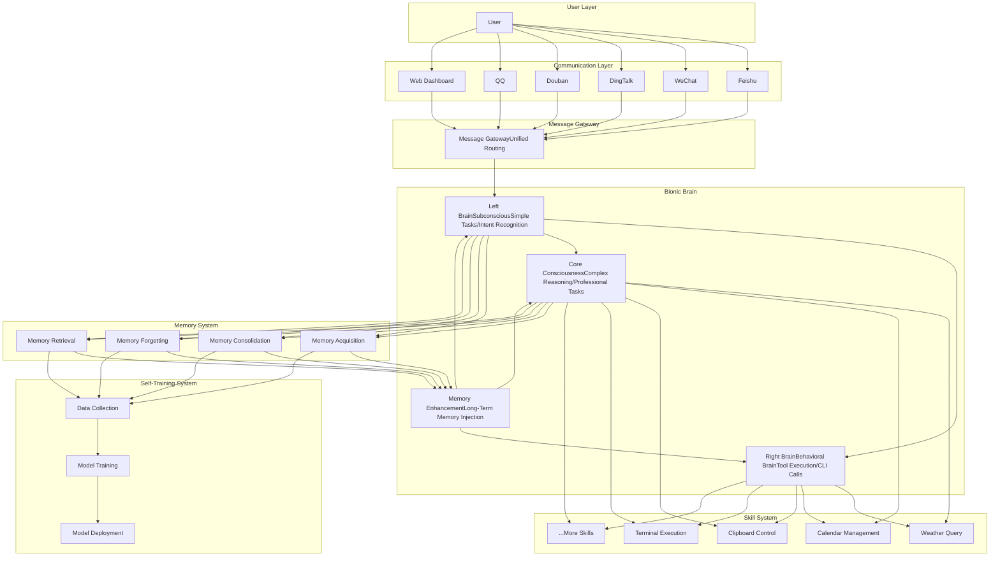

# MindX: Self-Evolving AI Digital Twin with Bionic Brain

[简体中文](README_zh.md) | English

<img src="dashboardsrc/assets/logo.png" alt="MindX Logo" /

*An intelligent, self-evolving digital twin with a bionic brain—lightweight, privacy-focused, and optimized for real-world use.*

---

## Project Overview

MindX is a lightweight, self-evolving AI personal assistant built entirely with Go. It adopts an innovative **bionic brain architecture** that maximizes efficiency by leveraging local large language models (LLMs) for most daily tasks, and cloud LLMs only when necessary. This design drastically reduces token consumption while ensuring full functionality.

Unlike simple Q&A tools, MindX is a complete intelligent agent with four core capabilities: **Thinking, Memory, Execution, and Evolution**. It supports local model deployment to protect user privacy, and can be customized with various skills to adapt to different scenarios—perfect for both personal and light enterprise use.

## Core Problems We Solve

Current AI agents often fall short in practical use. MindX addresses four key pain points:

1. **Excessive Token Consumption**: Most agents over-rely on cloud LLMs for trivial tasks, leading to high costs. MindX reduces token usage to **less than 10%** of traditional solutions.

2. **Privacy Risks**: All user data runs locally—no sensitive information is uploaded to the cloud, keeping your personal and work data secure.

3. **Poor Localization for Chinese Users**: Full support for China’s mainstream software ecosystem (Feishu, WeChat, DingTalk, Douban, QQ) out of the box.

4. **Lack of Personalization & Persistence**: A built-in long-term memory system and incremental training let MindX evolve with you, eliminating the "amnesia" problem of most AI tools.

## Key Features

### 1. Bionic Brain Architecture (Core Highlight)

Inspired by human brain function, MindX’s architecture splits tasks to optimize resource usage:

- **Left Brain (Subconscious)**: Handles simple tasks, intent recognition, and quick responses using lightweight local models (e.g., Qwen3:0.6b). Fast, low-resource, and no token consumption for trivial work.

- **Right Brain (Behavioral Brain)**: Executes tools, functions, and CLI commands. Fully compatible with OpenClaw skills—just copy and use, no modifications needed.

- **Core Consciousness**: Triggers cloud LLMs only for complex reasoning, deep analysis, or professional tasks. Saves tokens while maintaining high intelligence for tough jobs.

- **Memory Enhancement**: Integrates with the long-term memory system to retrieve relevant information during conversations, ensuring contextual continuity.

### 2. Privacy-First, Local-First Design

- 100% local execution with Ollama integration—no network dependency for basic functions.

- All data (conversations, memories, settings) is stored locally using SQLite and BadgerDB.

- No cloud uploads, no data sharing—total control over your privacy.

### 3. Long-Term Memory System (No More AI Amnesia)

Modeled after human memory mechanisms, MindX’s memory system has three layers:

- **Permanent Memory**: Core capabilities of the AI, never fades.

- **Long-Term Memory**: Frequently mentioned or emphasized information, automatically sorted by weight.

- **Short-Term Memory**: Less relevant information that fades over time (configurable).

Key advantages:

- Automatic memory summarization, deduplication, and organization.

- Vector-based semantic search for fast retrieval (powered by BadgerDB).

- Gets faster with more usage (unlike tools that slow down as data grows).

### 4. Self-Training System (Evolves With You)

MindX gets smarter and more personalized the more you use it, thanks to incremental LoRA training:

- Uses your conversation history and memory as training data.

- Lightweight base models (≈500M parameters)—trains on CPU, no GPU required.

- Automatic nightly training—evolves while you sleep, no manual intervention.

- Evolves to match your language style, work habits, and preferences over time (see timeline below).

*Evolution Timeline*: Week 1 (understands basic preferences) → Month 1 (familiar with your habits) → Month 3 (predicts your needs) → Month 6 (becomes your digital twin).

### 5. Lightweight & Easy to Deploy

- Single binary file after compilation—no complex dependencies.

- Low resource requirements: Works on 8GB RAM machines (no dedicated GPU needed for basic use).

- Cross-platform: Supports macOS and Linux (Windows support coming soon).

### 6. Full Compatibility & Extensibility

- Fully compatible with all OpenClaw skills—copy skills to the directory and use immediately.

- Skill system supports any programming language (CLI-based), easy to develop new skills.

- Customizable models: Choose local models based on your hardware (Qwen3:0.6b for low-end machines, Qwen3:4b for better performance).

## Comparison with Similar Tools

| Feature                   | MindX                                | Traditional AI Agents                 |
| ------------------------- | ------------------------------------ | ------------------------------------- |
| Architecture              | Bionic Brain (3-layer design)        | Single LLM dependency                 |
| Model Support             | Local-first (Ollama), cloud optional | Cloud LLM-dependent                   |
| Token Consumption         | ≤10% of traditional tools            | High (all tasks use cloud tokens)     |
| Privacy                   | 100% local data, no cloud uploads    | Partial/full data upload to cloud     |
| Memory System             | Self-organizing, evolves with use    | Basic context storage (amnesia-prone) |
| Chinese Ecosystem Support | Feishu, WeChat, DingTalk, etc.       | Limited/no support                    |
| Self-Training             | Yes (CPU-friendly LoRA training)     | No                                    |
## System Architecture



## Quick Start

### Prerequisites

- Operating System: macOS / Linux

- Go Version: 1.25 or higher

- Ollama: Installed and running (for local models)

- Python: 3.8 or higher (optional, for skill training)

### Installation Steps

#### 1. Clone the Repository

```bash
git clone https://github.com/yourusername/mindx.git
cd mindx
```

#### 2. Install Dependencies

```bash
# Install Go dependencies
go mod download

# Install Python dependencies (optional)
pip install -r requirements.txt
```

#### 3. Configure Ollama

```bash
# Pull recommended local models
ollama pull qwen3:0.6b
ollama pull qwen3:1.7b
ollama pull functiongemma:270m

# Verify installation
ollama list
```

#### 4. Configure MindX

Edit `config/server.yml` to set your model parameters (default values work for most users):

```yaml
server:
  ollama_url: "http://localhost:11434/v1"
  brain:
    leftbrain:
      name: "qwen3:0.6b"
      base_url: "http://localhost:11434/v1"
      temperature: 0.7
      max_tokens: 40960
    rightbrain:
      name: "qwen3:0.6b"
      base_url: "http://localhost:11434/v1"
      temperature: 0.7
      max_tokens: 40960
    token_budget:
      reserved_output_tokens: 8192
      min_history_rounds: 5
      avg_tokens_per_round: 200
```

#### 5. Start the Service

```bash
# Start main service
./start.sh

# Or use Makefile
make start
```

#### 6. Access the Dashboard

Open your browser and visit `http://localhost:911` to start using MindX.

### Configure Communication Channels (Optional)

MindX supports Feishu, WeChat, DingTalk, QQ, and Douban. To configure a channel, edit `config/channels.json` with your app credentials (see the Chinese README for detailed steps).

### Install Skills

```bash
# Copy OpenClaw skills (or custom skills) to the skills directory
cp -r /path/to/your/skills skills/

# Restart the service to load new skills
./start.sh
```

## Tech Stack

### Core Technologies

- Backend: Go 1.25+ (high concurrency, low resource usage, native performance)

- Frontend: React 18 + TypeScript + Vite

- Storage: SQLite (main data), BadgerDB (vector storage for memory)

- LLM Runtime: Ollama

- Communication: WebSocket

- UI: TDesign React + Tailwind CSS

### Why Go?

MindX is built entirely with Go for these key advantages:

- High performance: Native compilation, close to C/C++ speed.

- Low resource usage: Efficient memory management, ideal for personal computers.

- Easy deployment: Single binary file, no dependencies.

- High concurrency: Goroutines handle multiple users/tasks seamlessly.

- Cross-platform: Compile once, run on macOS/Linux (Windows coming soon).

## Join Us: Recruit Core Contributors

I started MindX not for fame or profit, but out of a simple desire — to build an AI assistant that truly belongs to us, that doesn’t drain our wallets with excessive token fees, that keeps our privacy safe, and that grows with us like a real companion.

As a solo developer, I’ve poured countless hours into polishing every detail of the bionic brain architecture, optimizing the memory system, and adapting it to the Chinese ecosystem. But I know deeply: a great open-source project can never be accomplished by one person alone. Its true power comes from the collective passion and wisdom of a group of like-minded people.

If you, like me, are tired of AI agents that prioritize vendor interests over user needs; if you believe that personal AI should be private, affordable, and customizable; if you want to be part of building something meaningful — something that will change how we interact with AI in daily life — then **we sincerely invite you to become a core contributor of MindX**.

You don’t need to be a top expert, and you don’t need to spend all your time. Whether you’re good at Go development, front-end design, skill development, documentation writing, or even just passionate about testing and sharing, your every effort will make MindX better:

- For developers: Collaborate on optimizing the bionic brain, expanding the skill system, or supporting more platforms (like Windows).

- For designers: Help polish the Web Dashboard, make the interaction more user-friendly, and let technology have temperature.

- For testers: Try out every feature, put forward suggestions, and help us find hidden problems to make MindX more stable.

- For writers: Help improve documents, write tutorials, or share your experience with MindX, so more people can know and use it.

This is not just a project, but a gathering of people with the same vision. We will grow together, solve problems together, and witness MindX evolve from a personal idea into a mature tool that benefits thousands of users. Your name will be permanently recorded in the project’s contributor list, and we will build this "digital twin" that belongs to us hand in hand.

If you’re interested, feel free to submit an issue, send a pull request, or just leave a message — let’s start this journey together.

## Contributing

MindX is an open-source project dedicated to building a privacy-first, cost-effective, and user-centric AI assistant. We believe in the power of community collaboration—whether you’re a developer, designer, or user, your contributions are welcome!

Feel free to submit issues, pull requests, or share your ideas to help MindX evolve.

MindX is an open-source project dedicated to building a privacy-first, cost-effective, and user-centric AI assistant. We believe in the power of community collaboration—whether you’re a developer, designer, or user, your contributions are welcome!

Feel free to submit issues, pull requests, or share your ideas to help MindX evolve.

## License

MIT License

---

**MindX — Your Self-Evolving Digital Twin**

Built with ❤️ for privacy, efficiency, and the Chinese developer ecosystem.