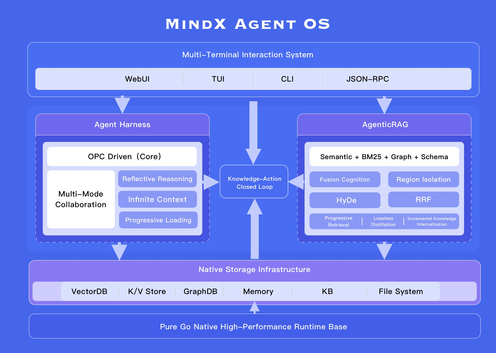
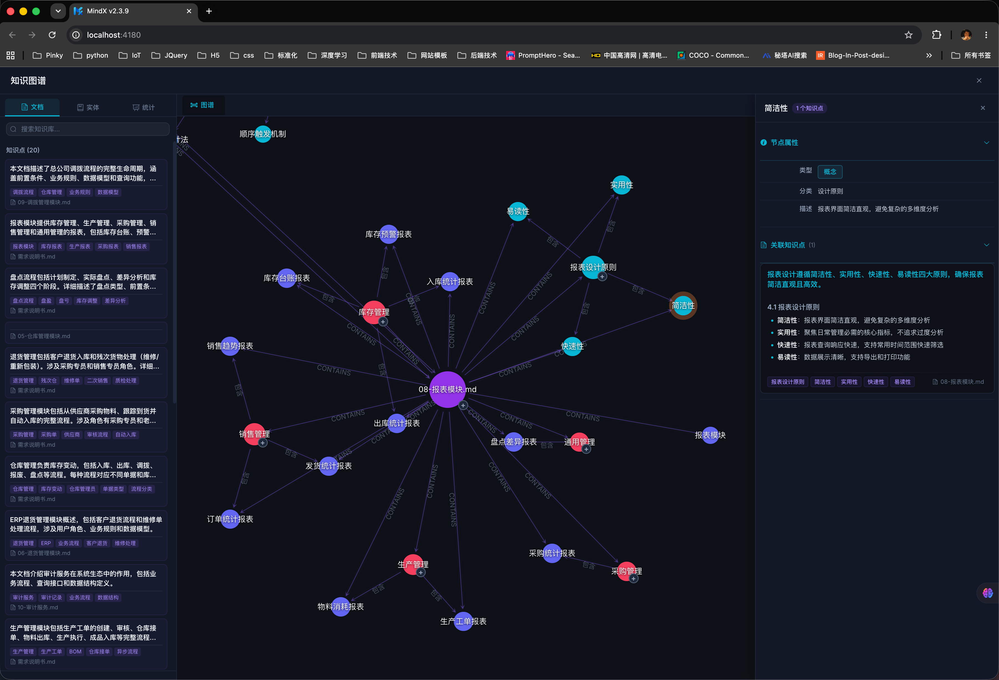
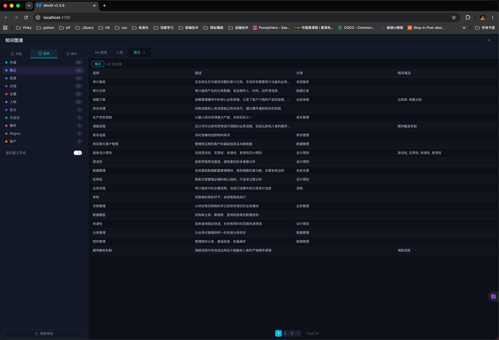

# MindX — Production-Grade Agent Operating System

[](https://github.com/DotNetAge/mindx/releases)
[](LICENSE)
[](https://go.dev/)
[](https://github.com/DotNetAge/homebrew-mindx)
[](https://hub.docker.com/r/dotnetage/mindx)

<p>
  <a href="README.md">English</a> | <a href="README_zh.md">简体中文</a>
</p>

**Production-Grade Agent Operating System | Native Dual-Core: Agent Harness + Enhanced AgenticRAG**

MindX is a modern AgentOS designed for long-running, stateful, and multi-agent collaborative scenarios. It provides full-stack infrastructure including agent orchestration, hierarchical persistent memory, multi-dimensional knowledge cognition, multi-terminal interaction, and native storage primitives, supporting enterprise automation, knowledge platforms, and private agent clusters.

---

## Overview

Most mainstream agent frameworks adopt stateless single-turn execution, requiring frequent manual instructions. They lack persistent memory, standardized team collaboration, and structured knowledge understanding, resulting in common industry pain points: memory decay, context overflow, rigid execution, and disconnection between knowledge and action.

MindX introduces a dual-core architecture. The **Agent Harness** enables stateful, reflective, and collaborative agent scheduling. The **self-developed AgenticRAG** delivers high-precision, low-cost, incrementally evolvable cognitive capabilities, upgrading traditional disposable tool agents into long-term, self-growing digital workforce clusters.

---

## Why MindX?

> **Most agent frameworks are either stateless toolchains or rigid workflow orchestrators — none are true Agent Operating Systems. MindX is the only AgentOS with a fully self-developed stack spanning scheduling, memory, cognition, storage, and interaction.**

| Dimension          | MindX                                               | LangChain         | AutoGen (Microsoft) | CrewAI                  | Dify            |
| ------------------ | --------------------------------------------------- | ----------------- | ------------------- | ----------------------- | --------------- |
| Runtime            | **Go native, single binary**                        | Python            | Python              | Python                  | Python          |
| Persistent Memory  | **3-tier (session/task/global)**                    | ❌ None            | ❌ None              | ❌ None                  | Session only    |
| RAG Engine         | **4-dim fusion** (vector+BM25+graph+schema)         | Basic vector      | ❌ None              | ❌ None                  | Basic vector    |
| Knowledge Graph    | **Embedded GoGraph + Cypher**                       | Needs Neo4j       | ❌ None              | ❌ None                  | Needs external  |
| Multi-Agent        | **OPC paradigm + 4 modes**                          | ❌ None            | Fixed linear        | Sequential/hierarchical | Workflow DAG    |
| Pre-built Agents   | **12** (PM/architect/engineer...)                   | ❌ None            | ❌ None              | ❌ None                  | ❌ None          |
| Pre-built Skills   | **45+** (design/writing/coding/browser...)          | ❌ None            | ❌ None              | ❌ None                  | ❌ None          |
| Native Tools       | **24+**                                             | ✅ Yes             | ✅ Yes               | Limited                 | Limited         |
| Offline Deployment | **Single binary, zero deps**                        | ❌ Python env      | ❌ Python env        | ❌ Python env            | Docker required |
| Interaction        | **WebUI + TUI + CLI + JSON-RPC**                    | CLI only          | CLI only            | CLI only                | Web only        |
| Self-developed MW  | **6 full-stack**                                    | 0 (all assembled) | 0                   | 0                       | 0               |
| Install Experience | **`docker pull` → run / `npx skills` → add skills** | pip install       | pip install         | pip install             | docker compose  |

---

## Core Architecture

MindX decouples task scheduling from knowledge cognition, ensuring engineering stability and continuous intelligent iteration.

- **Agent Harness Scheduling Core**: Enterprise-grade multi-agent runtime for task decomposition, reflective reasoning, role collaboration, workflow orchestration, and persistent task management

- **AgenticRAG Cognitive Core**: 4-dimensional enhanced cognitive engine for semantic understanding, structured parsing, multi-path retrieval fusion, and incremental knowledge iteration



---

## Agent Harness｜Stateful Multi-Agent Orchestration Runtime

Unlike traditional stateless single-run schedulers, MindX Harness natively supports state persistence, multi-turn reflection, organizational collaboration, and time-driven unattended execution, suitable for complex and long-term business iteration.

### Reflective Reasoning Mechanism

Extended from the ReAct paradigm, the system supports multi-turn self-review loops. Agents can autonomously verify outputs, correct decision deviations, and iterate steps, improving robustness in complex scenarios.

### Multi-Mode Organizational Collaboration

- **Moderator Mode**: Multi-agent roundtable discussion, cross-verification, and joint decision-making for complex tasks

- **Expert Dispatch Mode**: Dynamically assemble specialized agent teams for vertical scenario tackling

- **Agent Talk Mode**: Direct autonomous dialogue, task handover, and progress synchronization between agents without human intervention

- **Agent Calendar Mode**: Time-driven scheduled and periodic tasks for unattended continuous operation

### Hierarchical Persistent Infinite Context

A three-level memory system (immediate session, short-term task, long-term global) eliminates context explosion, information decay, and historical forgetting, enabling stable long-sequence multi-round iteration.

### Tool Ecosystem & Multi-Model Management

Compatible with standard Skill specifications, with **24+ built-in native tools** and **45+ pre-built Skills**, covering file management, system operations, task orchestration, browser automation, frontend design, document collaboration, data analysis, project management, and more. **12 professional Agents pre-installed** (Project Manager, Architect, Frontend Engineer, Backend Engineer, DevOps, Market Analyst, Product Manager, Code Reviewer, Content Creator, Financial Advisor, Executive Assistant, SysOps) — your digital team out of the box.

Supports multi-vendor LLM scheduling with fine-grained cost and consumption statistics.

> **Installing a Skill is like installing an npm package**: search with `npx skills find <keyword>` → install with `npx skills add <package>` → hot-reload in MindX with `mindx skill reload`.

<!-- TODO: 插入截图 - CLI demo of installing a Skill -->

---

## Self-Developed AgenticRAG｜4-Dimensional Enhanced Cognitive Engine

Traditional RAG and GraphRAG rely on single-path vector similarity matching, causing semantic drift, false recall, excessive token consumption, weak structured parsing, and high long-term iteration costs.

MindX AgenticRAG adopts a **4-dimensional fusion engine: semantic vector recall first, graph topology enhancement, BM25 lexical calibration, and schema structure constraint**. Four heterogeneous retrieval paths are fused via unbiased RRF, solving inaccuracy, redundancy, hallucination, and poor iteration at the architectural level.

### 4-Dimensional Unified Cognitive System

- **Semantic Vector Layer**: Captures fuzzy user intent for unstructured language understanding

- **BM25 Lexical Layer**: Precise term matching to suppress semantic generalization and false positives

- **Graph Topology Layer**: Mines entity relations and implicit business logic beyond plain text

- **Structured Schema Layer**: Native parsing of document structures, data fields, and business constraints for rule-based accurate filtering

### Key Enhanced Capabilities

- **Graph-Enhanced Precision Addressing & Drastic Token Reduction**: Instead of full text injection, the system performs semantic vector recall first, then applies graph topology and schema constraints for secondary filtering, reducing token consumption by **1–2 orders of magnitude** in long-term multi-round scenarios, lowering costs and latency.

- **Full-Link Noise Reduction & Higher Accuracy**: Multi-layer filtering through vector semantic screening, lexical calibration, graph topology filtering, and structure constraints eliminates redundant noise, fundamentally reducing semantic drift and hallucinations for superior factual consistency.

- **HyDE Hypothetical Reverse Retrieval**: Generates hypothetical standard answers based on user intent, then matches real knowledge against the semantic anchor, solving sparse-query failure in short, ambiguous, or professional questions.

- **RRF Reciprocal Rank Fusion**: Unbiased fusion of vector, lexical, graph, and structured retrieval results. Requires no manual weight tuning or score normalization, improving stability and generalization across scenarios.

- **Tree-Sharded Progressive Retrieval**: On-demand loading for massive knowledge bases, avoiding timeout and congestion while balancing accuracy and performance.





- **Adaptive Context Compression**: Long conversations and texts are intelligently summarized via LLM, preserving core decisions and key information, breaking model window limits.

- **Incremental Knowledge Internalization**: New documents trigger automatic incremental indexing via file monitoring, updating graphs and vector stores; conversation and task memories are accumulated into the knowledge base through the memory API for continuous self-improvement.

- **Pure Go High-Performance Runtime**: Eliminates Python overhead with low latency, low memory, and high concurrency for 7×24 production stability.

---

## Core Design: OPC Responsibility-Driven Architecture

Most agent systems are task-driven: requiring step-by-step human instructions. AI acts only as a passive tool without goal awareness, division of labor, or process governance.

MindX introduces **OPC (Objective & Responsibility Centered) Architecture**, simulating modern enterprise organizational operation. Each agent represents a distinct role with clear responsibilities. Users act as **global managers** who set goals and verify results, without managing execution details.

> OPC is not a hard-coded automation pipeline, but an emergent agent organizational paradigm built from MindX's **LLM reflective reasoning loop + platform infrastructure (SubAgent delegation, AgentTalk, team orchestration, calendar scheduling) + Skill system (multi-agent meeting, expert dispatch)**. The LLM autonomously orchestrates the collaboration flow at runtime based on goals, while the system provides the full suite of enabling capabilities.

### OPC Workflow Example

User sets a high-level goal: **"Drive product sales to the target value."**

The system completes full autonomous closed-loop operation:

1. A **coordinator agent** receives the goal, initiates cross-expert meetings, and organizes market, operation, and strategy agents to generate executable plans;

2. Only finalized plans and key decisions are submitted for user confirmation;

3. After confirmation, the coordinator delegates full execution authority to a **project manager agent**;

4. The project manager decomposes subtasks, assigns expert agents, and schedules the full-cycle roadmap via **agent calendar**;

5. During execution, role-based agents cooperate autonomously via **Agent Talk** for real-time handover and progress synchronization;

6. The project manager periodically summarizes progress, risks, and results; the coordinator delivers concise regular reports to the user.

Users focus purely on goals and outcomes. All decomposition, scheduling, collaboration, and review is completed autonomously by the agent team. **AI manages processes, users manage value.**

---

## Self-Developed Full Tech Stack

> **Six core middleware layers, all self-developed from scratch. No Pinecone, no Neo4j, no LangChain — this is MindX's deepest moat.**

<!-- TODO: 插入图片 - Full tech stack architecture diagram (GoHarness→GoChat→GoRAG→GoVector→GoGraph→GoRT stacked layers) -->

| Middleware    | Role                        | Description                                                                     |
| ------------- | --------------------------- | ------------------------------------------------------------------------------- |
| **GoHarness** | Agent Scheduling Framework  | Multi-agent runtime, state management, Skill loading, ReAct reasoning loop      |
| **GoChat**    | LLM Unified Gateway         | Multi-vendor adapters (OpenAI/Claude/Gemini/local), usage stats, load balancing |
| **GoRAG**     | High-Performance RAG Engine | 4-dim fusion (vector+BM25+graph+schema), HyDE, RRF, progressive retrieval       |
| **GoVector**  | Embedded Vector Database    | HNSW index, efficient similarity search, direct-to-disk persistence             |
| **GoGraph**   | Embedded Graph Database     | Cypher queries, property graph model, entity/relation persistence               |
| **GoRT**      | Real-Time Gateway           | WebSocket JSON-RPC protocol, bidirectional notifications, session management    |

> **Compilation produces a single executable binary. No Python runtime, no Node.js, no external databases. `scp mindx` to any Linux server and run.**

___

## Full-Stack Interaction

- **WebUI**: Integrated workspace with dialogue terminal, file browser, knowledge graph visualization, and agent calendar

- **TUI**: Lightweight high-performance terminal interface

- **CLI**: Full-capability command-line tool for automation and batch operations

- **JSON-RPC**: Standard interface for third-party integration and secondary development


---

## Native Storage Infrastructure

Complete built-in storage primitives without third-party dependencies, supporting persistent memory and knowledge iteration:

- KV Store: High-speed cache and state storage

- Graph Store: Structured entity and relation topology storage

- Memory Pool: Hierarchical persistent memory management

- Knowledge Base: Enterprise global knowledge carrier

- File System: Native file parsing and resource management

---

## Application Scenarios

- **Enterprise Digital Employees**: Long-term automation, business review, and experience iteration

- **Enterprise Knowledge Platform**: Global document structuring, multi-dimensional Q&A, and relational analysis

- **Private Offline AI Platform**: Stable deployment for intranet and isolated confidential environments

- **Multi-Agent Cluster System**: Intelligent collaboration for R&D, operation, and office workflows

---

## Quick Start

MindX is available through multiple distribution channels covering all major operating systems. Choose the one that fits your environment:

### 🐳 Docker (Recommended)

Docker is the fastest way to start MindX on any platform:

```bash
# Pull the image
docker pull dotnetage/mindx:latest

# Start the service
docker run -d --name mindx \
  -p 1313:1313 `# WebUI & API port` \
  -p 1314:1314 `# WebSocket real-time port` \
  -v ./workspaces:/home/mindx/workspaces `# Persist workspace data` \
  dotnetage/mindx:latest

# View logs
docker logs -f mindx

# Use CLI inside the container
docker exec -it mindx mindx skill list
docker exec -it mindx mindx agent list
```

Open **http://127.0.0.1:1313** in your browser to access the WebUI.

> The Docker image is based on debian:bookworm-slim with ONNX Runtime included. Supports multi-architecture (linux/amd64, linux/arm64).

---

### 🍎 macOS

macOS users are recommended to install via Homebrew, which handles binary path, service registration, and updates automatically:

```bash
# Install
brew install DotNetAge/homebrew-mindx/mindx

# Start the background service
mindx start

# Open WebUI in browser
mindx web

# Or launch the TUI directly
mindx
```

Homebrew registers a launchd service, supporting `mindx start/stop/restart` for system-level service management.

> You can also run MindX via Docker on macOS — see the Docker section above.

---

### 🐧 Linux

**Snap (Recommended for Ubuntu/Debian)**

```bash
sudo snap install mindx
sudo snap start mindx        # Start the service
mindx                        # Enter TUI
```

Snap handles sandbox isolation, automatic updates, and service registration.

**Flatpak (Recommended for Desktop Environments)**

```bash
flatpak install flathub com.dotnetage.mindx
flatpak run com.dotnetage.mindx
```

**Debian/Ubuntu & Fedora/RHEL**

Download `.deb` or `.rpm` packages from GitHub Releases:

```bash
# Debian/Ubuntu
sudo dpkg -i mindx_*.deb

# Fedora/RHEL
sudo rpm -ivh mindx_*.rpm

# Start the daemon service
sudo systemctl start mindx-daemon
```

**AppImage (Portable)**

Download the `.AppImage` file from GitHub Releases, make it executable and run:

```bash
chmod +x Mindx-*.AppImage
./Mindx-*.AppImage
```

---

### 📦 Pre-built Binaries (All Platforms)

Download the archive for your platform and architecture from [GitHub Releases](https://github.com/DotNetAge/mindx/releases):

| Platform              | Architecture  | File                                  |
| --------------------- | ------------- | ------------------------------------- |
| Linux                 | amd64 / arm64 | `mindx-{version}-linux-{arch}.tar.gz` |
| macOS (Intel)         | amd64         | `mindx-{version}-darwin-amd64.tar.gz` |
| macOS (Apple Silicon) | arm64         | `mindx-{version}-darwin-arm64.tar.gz` |

```bash
# Example: macOS Apple Silicon
tar xzf mindx-*-darwin-arm64.tar.gz
sudo mv mindx /usr/local/bin/
mindx daemon &
```

---

### 🔧 Build from Source

> Building from source? See the Wiki: [Building from Source](https://github.com/DotNetAge/mindx/wiki/Building-from-Source)

---

## Installing Skills & Agents

MindX is not a library that needs secondary development — it's a complete Agent Operating System. Installing capabilities is as simple as installing apps:

```bash
# 1. Search for Skills (via skills.sh ecosystem)
npx skills find "frontend design"
npx skills find "project management"

# 2. Install a Skill
npx skills add frontend-design
npx skills add project-manager

# 3. Hot-reload in MindX
mindx skill reload

# 4. List installed Skills and Agents
mindx skill list
mindx agent list
```

> A Skill is a capability package for Agents. An Agent is a digital role configured with a specific combination of Skills. Both are plain Markdown files in `~/.mindx/skills/` and `~/.mindx/agents/` — directly editable, shareable, and version-controllable.

<!-- TODO: 插入截图 - Terminal output of `mindx skill list` and `mindx agent list` -->

---

## Architecture Overview

Pure Go Native Kernel | Agent Harness Organizational Scheduling | 4D AgenticRAG Cognition (HyDE+RRF Enhanced) | Multi-Terminal Interaction | Full-Scenario Private Deployment

---

## License

MindX is open-sourced under the MIT License, allowing free commercial use, secondary development, and enterprise private deployment. Community contributions and enterprise cooperation are welcome.

---

**MindX AgentOS｜Empower Agents with Collaborative Scheduling, Define Next-Gen Intelligence with Persistent Cognition**
