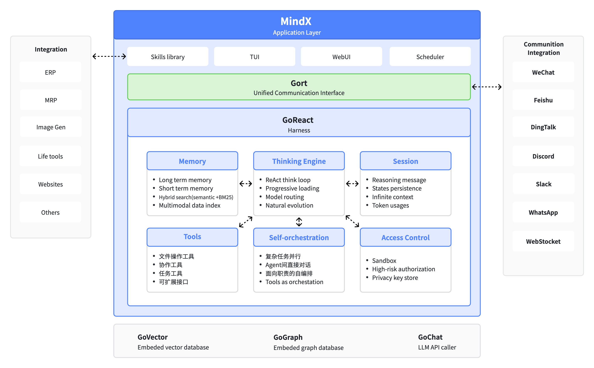
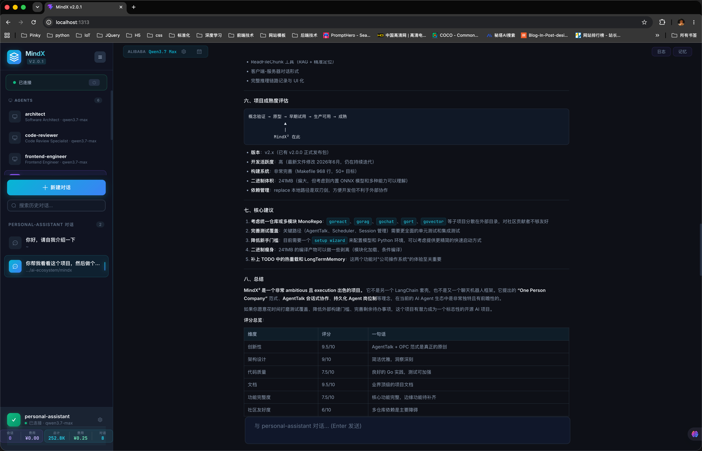
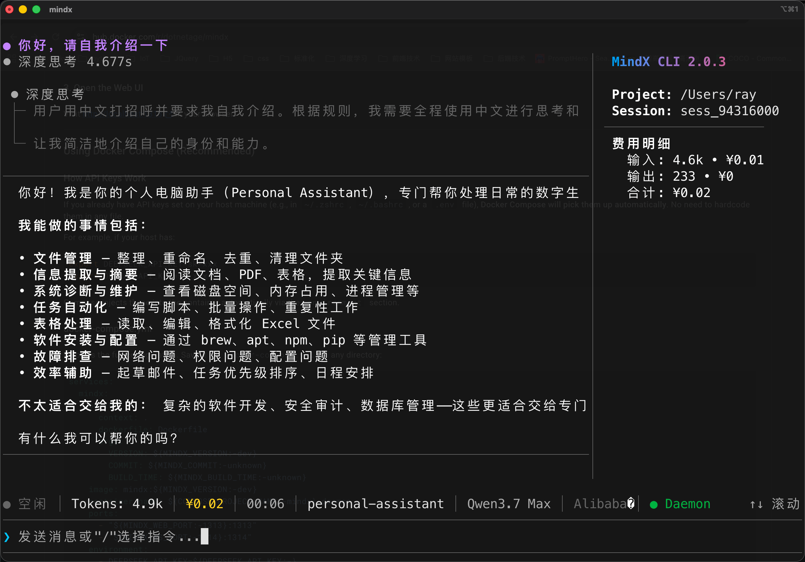

# MindX — Agent Harness

[](https://github.com/DotNetAge/mindx/releases)
[](LICENSE)
[](https://go.dev/)
[](https://formulae.brew.sh/formula/mindx)
[](https://hub.docker.com/r/dotnetage/mindx)

<p>
  <a href="README.md">English</a> | <a href="README_zh.md">简体中文</a>
</p>

> MindX is an open-source AI Agent orchestration platform (Agent Harness) that leverages hybrid orchestration modes, intelligent memory systems, and a proprietary tech stack to help you efficiently build, manage, and run AI Agent workflows. Whether for day-to-day coding assistance or complex multi-step task automation, MindX delivers professional-grade agent orchestration capabilities.

<p align="center">
  
  <br />
  <em>MindX Architecture</em>
  <br />
</p>

---

## Features

### Multi-Agent Orchestration

As a complete Agent Harness, MindX provides a hybrid orchestration mode to help you tackle problems and business scenarios of varying complexity:

| Mode                  | Type                  | Description                                                                                                     |
| --------------------- | --------------------- | --------------------------------------------------------------------------------------------------------------- |
| Single Agent Mode     | Basic                 | Handles simple tasks                                                                                            |
| ReAct Mode            | Chain-of-Thought      | Plan → Execute → Observe → Iterate full cycle (T-A-O ReAct engine), finding optimal solutions                   |
| Concurrent Mode       | Task-Driven           | For long-running complex tasks, agents automatically "clone" themselves to handle multiple tasks simultaneously |
| Planning Mode         | Plan-Driven           | Plans and dispatches role-specific agents for long-duration, periodic complex tasks                             |
| Delegation Mode       | Responsibility-Driven | Right person for the right job — consult experts when uncertain                                                 |
| Agentic RAG Mode      | Knowledge Retrieval   | Self-forming knowledge base from work and conversations, with human-like memory                                 |
| **Evaluation System** | Quality Assurance     | Every agent can assess and score quality, computing "performance" based on task completion                      |

### Context Engineering

Manages the lifecycle of LLM conversations — context window capacity control, session persistence, and relevant context injection.

- **True Context** — Seamlessly blends compression technology with memory stores so context is never lost, forgotten, or corrupted
- **Session Persistence & Cross-Restart Recovery** — Sessions stored as files on disk, automatically resumed after restart
- **Multi-Session Branching** — Multiple independent sessions within the same project; agents share and switch between sessions freely
- **Progressive Capability Disclosure** — Load capability descriptions on demand to conserve context

### Memory & Retrieval

Efficiently persists and retrieves information beyond the context window — forming short-term memory, long-term memory, and a global knowledge base.

- **RAG / Semantic Memory Search** — Hybrid vector + full-text retrieval, automatic transparent memory indexing
- **File Map / Code Map** — Global understanding of project structure; agents perceive file and code organization
- **Cross-Session Memory Sharing** — Persistent memory records (Immediately + LongTerm + Experience types)
- **Web Search & Page Fetching** — Built-in search engines with deep web scraping, supporting both domestic and international sources

You don't need to learn or even be aware of RAG's existence — just know that a fleet of Advanced RAG services faithfully provides semantic services for you.

### Execution Capabilities

MindX's design philosophy is "**skills over tools**" — tools serve as underlying capabilities rather than exposed interfaces. You need not concern yourself with any tools because MindX builds them for you. MindX won't dump a pile of MCP tools or thousands of skills you'll never know when to use.

- Assigns specialized agents to handle problems according to your needs
- Agents assemble skills based on their responsibilities — no manual configuration required
- Agents self-assess whether they are "competent" and adjust skills accordingly
- Agents reflect on and summarize "work experience," distilling it into exclusive skills serving you

> MindX frees you from anxiety about insufficient tools and skills, letting you focus on solving problems.

### Model Abstraction Layer

A unified interface across LLM providers — handling provider differences, structured output, usage statistics, and fallback strategies.

- **Multi-Provider & Model Support** — Unified access to all mainstream LLM providers
- **Usage & Cost Tracking** — Real-time monitoring and recording across all providers, with multi-dimensional queries of token consumption and costs
- **Precise Per-Conversation Token Usage Tracking**

### Safety & Governance

Controls over agent behavior — permissions, sandbox, audit, and output guardrails.

- **Layered Permission Model** — Commands execute in restricted environments (project/session directory isolation)
- **Human Approval Gate** — Sensitive operations require manual confirmation
- **Credential Management** — macOS Keychain integration + AES-GCM encrypted file fallback for API keys and personal keys
- **Security Vulnerability Detection** — Dependency scanning, secret detection
- **Full Audit Log** — All tool calls logged with instant viewing capability
- **Command Blacklist & Whitelist** — Fine-grained command control policies (Bash security mechanism, content pattern rules)

### State & Persistence

Tracking and recovering execution state — checkpoints, diffs, observability, and scheduled tasks.

- **Observability / Tracing** — End-to-end agent execution tracing (event bus, log observation points); daemon event stream with 30+ JSON-RPC methods
- **File Change Tracking** — Unified diff generated before and after every tool call
- **Checkpoint Mechanism** — Incremental rollback to any historical state
- **Scheduled / Periodic Agent Tasks** — Built-in scheduler (second precision, file persistence, hot-reload, 5-minute timeout)
- **Logging System** — Structured logging via zap + lumberjack rotation (ANSI console + file, max 100MB / 30-day retention)

### Platform & Delivery

How the harness is packaged, distributed, installed, and integrated into development environments.

- **Single Binary Distribution, Zero Runtime Dependencies** — Entire platform compiled into one Go binary
- **Multi-Platform Release** — Homebrew, Winget, Snap, Docker coverage across platforms
- **Terminal TUI** — Full-screen terminal UI with conversation sidebar, file change tracker, token counter, and slash commands
- **System Service Installation** — Register as system daemon with health checks (launchd/systemd/schtasks)
- **Setup Wizard** — 8-step interactive TUI wizard (API key input, model selection, path setup, daemon check, Python check)
- **CI/CD Integration** — GitHub Actions, Makefile, Snap, and Docker publishing pipelines
- **Environment Management** — Dockerfile (multi-stage build), docker-compose.yml with health checks and volume mounts
- **Themes / Personalization** — Customizable UI themes

---

## System Requirements

| Platform | Minimum Version           | Notes                     |
| -------- | ------------------------- | ------------------------- |
| macOS    | Monterey (12.0)           | Homebrew recommended      |
| Linux    | Ubuntu 20.04+ / CentOS 8+ | Snap recommended          |
| Windows  | Windows 10+               | WSL or Docker recommended |
| Docker   | Docker 20.10+             | Supports amd64/arm64      |

- **Memory**: 2GB+ available RAM recommended
- **Disk**: 500MB+ free space recommended (excluding workspace)

---

## Quick Start

<p align="center">
  
  <br />
  <em>MindX WebUI</em>
</p>

<p align="center">
  
  <br />
  <em>MindX TUI</em>
</p>

### macOS (Recommended)

Install via Homebrew, then run `mindx` directly:

```bash
brew install DotNetAge/homebrew-mindx/mindx
```

### Linux

Install via Snap, then run `mindx` directly:

```bash
sudo snap install mindx
```

### Docker

Install using the official image from [dotnetage/mindx](https://hub.docker.com/r/dotnetage/mindx):

Pull the image:

```bash
docker pull dotnetage/mindx
```

Run the container:

```bash
docker run -d \
  --name mindx \
  -p 1313:1313 \
  -p 1314:1314 \
  -v ./workspaces:/home/mindx/workspaces \
  dotnetage/mindx
```

The `./workspaces` directory can be any local path for storing MindX workspace files.

### Windows

```bash
winget install DotNetAge.Mindx
```

> Windows users are advised to use the built-in Ubuntu environment or Docker directly — Windows is not an ideal environment for running agents.

### Build from Source

Download pre-built binaries from [Releases](https://github.com/DotNetAge/mindx/releases), or build from source:

```bash
git clone https://github.com/DotNetAge/mindx.git
cd mindx
make run
```

First run launches an interactive setup wizard guiding you through API key configuration, model selection, and other initialization steps, then enters the TUI chat interface.

---

## Usage Guide

### Initial Configuration

When running `mindx` for the first time, the interactive setup wizard launches with these steps:

1. **API Key Configuration** — Enter your LLM provider's API key
2. **Default Model Selection** — Choose your primary conversation model
3. **Workspace Path Setup** — Configure storage location for project files
4. **Daemon Service Check** — Detect and configure the background service
5. **Python Environment Check** — Detect Python runtime (required by some skills)

### Basic Workflow

```bash
# Launch MindX TUI
mindx

# Start Daemon background service (for long-running tasks)
mindx start

# Check MindX status
mindx status

# Open Web UI (browser)
mindx web
```

### Advanced Features

| Feature                 | Command / Method                         | Description                                |
| ----------------------- | ---------------------------------------- | ------------------------------------------ |
| Long-Term Memory Search | `mindx query <keyword>`                  | Search knowledge from conversation history |
| Resource Management     | `mindx provider/model/agent list/rm/add` | Manage LLM providers, models, and agents   |
| Log Viewing             | `mindx logs`                             | View structured runtime logs               |
| System Diagnostics      | `mindx doctor`                           | Auto-diagnose and fix common issues        |

---

## CLI Reference

| Command                                   | Usage                   |
| ----------------------------------------- | ----------------------- |
| `mindx`                                   | Start wizard + TUI chat |
| `mindx start\|stop`                       | Start/stop Daemon       |
| `mindx status`                            | Check system status     |
| `mindx doctor`                            | Diagnostics and repair  |
| `mindx install`                           | Install to system       |
| `mindx logs`                              | View logs               |
| `mindx web`                               | Open WebUI              |
| `mindx query`                             | Search long-term memory |
| `mindx provider\|model\agent list/rm/add` | Manage resources        |

---

## Architecture Overview

MindX adopts a layered architecture design, top to bottom:

1. **Orchestration Layer** — Multi-mode agent orchestration engine (ReAct / Concurrent / Planning / Delegation)
2. **Capability Layer** — Context management, memory retrieval, skill assembly
3. **Abstraction Layer** — Unified LLM interface, model routing, usage statistics
4. **Infrastructure Layer** — Security governance, state persistence, observability

---

## Ecosystem Dependencies

MindX's core capabilities are built upon the following proprietary technical frameworks:

| Framework    | Purpose                             | Repository                                                             |
| ------------ | ----------------------------------- | ---------------------------------------------------------------------- |
| **GoReact**  | Agent Harness Framework             | [github.com/DotNetAge/goreact](https://github.com/DotNetAge/goreact)   |
| **GoChat**   | LLM Unified Calling Framework       | [github.com/DotNetAge/gochat](https://github.com/DotNetAge/gochat)     |
| **GoRAG**    | High-Performance RAG Framework      | [github.com/DotNetAge/gorag](https://github.com/DotNetAge/gorag)       |
| **GoRT**     | Real-Time Communication Gateway     | [github.com/DotNetAge/gort](https://github.com/DotNetAge/gort)         |
| **GoVector** | High-Performance Embedded Vector DB | [github.com/DotNetAge/govector](https://github.com/DotNetAge/govector) |
| **GoGraph**  | High-Performance Embedded Graph DB  | [github.com/DotNetAge/gograph](https://github.com/DotNetAge/gograph)   |

---

## Contributing

PRs are welcome! Let's drive MindX forward together. See [CONTRIBUTING.md](CONTRIBUTING.md) for contribution guidelines.

## License

MIT License. See the [LICENSE](LICENSE) file for details.
