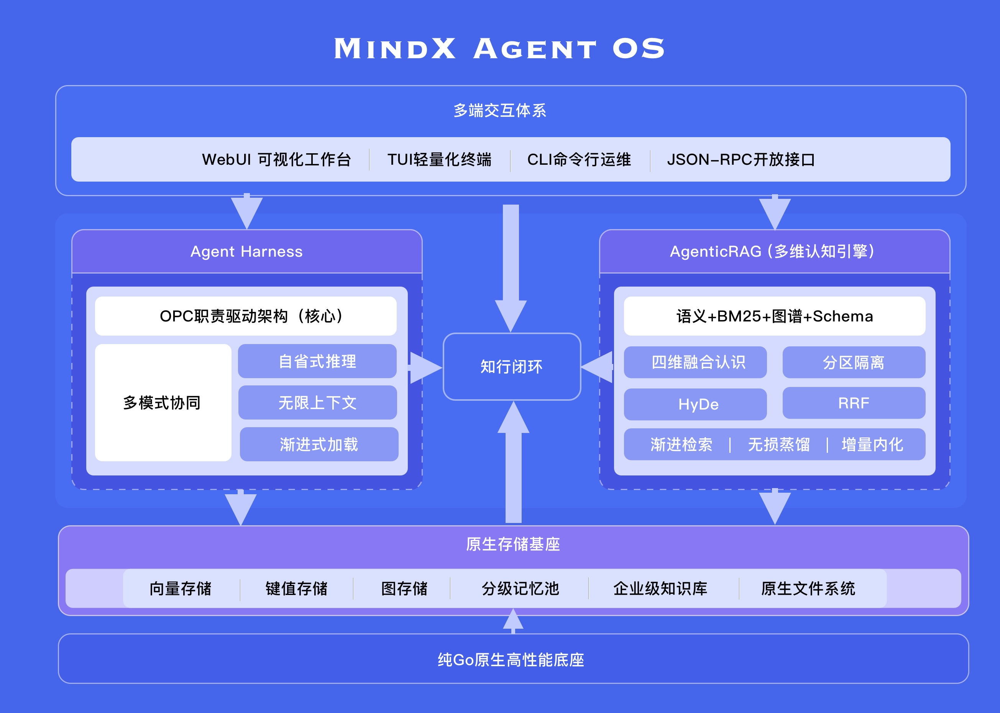

# MindX — 生产级智能体操作系统

[](https://github.com/DotNetAge/mindx/releases)
[](LICENSE)
[](https://go.dev/)
[](https://formulae.brew.sh/formula/mindx)
[](https://hub.docker.com/r/dotnetage/mindx)

<p>
  <a href="README.md">English</a> | <a href="README_zh.md">简体中文</a>
</p>

**生产级智能体操作系统｜原生双内核：智能体调度基座 + 四维增强认知引擎**

MindX 是面向**长期驻留、状态持久、多智能体集群协同**场景的现代 AgentOS。项目提供完整全栈基础设施，覆盖智能体编排调度、分级持久记忆、多维知识认知、多端交互与原生存储底座，可直接落地企业自动化、知识中台与私有化智能体集群。

---

## 项目概述

当前主流智能体框架普遍基于无状态单次调用设计，依赖人工分步指令，缺少持久化记忆、标准化团队协同与结构化知识理解能力。由此产生一系列行业共性问题：对话与任务记忆衰减、上下文超限错乱、执行流程固化、知识与任务执行脱节，无法支撑长期、复杂、可迭代的企业级智能作业。

MindX 采用双内核架构，通过 **Agent Harness**实现有状态、可反思、可协同的智能体调度体系，通过 **自研 AgenticRAG** 实现高精度、低损耗、可增量进化的长效认知体系，将工具式单次AI，升级为可长期在岗、可自主成长的数字化工作集群。

---

## 为何选择MindX？

> **市场上的 Agent 框架要么是无状态的工具链，要么是固定流程的编排器——没有一个是真正的智能体操作系统。MindX 是唯一一个从调度、记忆、认知、存储到交互全栈自研的 AgentOS。**

| 对比维度       | MindX                                              | LangChain     | AutoGen (Microsoft) | CrewAI        | Dify           |
| -------------- | -------------------------------------------------- | ------------- | ------------------- | ------------- | -------------- |
| 运行时语言     | **Go 原生，单二进制**                              | Python        | Python              | Python        | Python         |
| 有状态持久记忆 | **三级记忆（即时/短期/长期）**                     | ❌ 无          | ❌ 无                | ❌ 无          | 会话级         |
| RAG 引擎       | **四维融合**（向量+BM25+图谱+Schema）              | 基础向量      | ❌ 无                | ❌ 无          | 基础向量       |
| 知识图谱       | **自研嵌入式 GoGraph + Cypher**                    | 需外接 Neo4j  | ❌ 无                | ❌ 无          | 需外接         |
| 多 Agent 协作  | **OPC 组织范式 + 4 种协作模式**                    | ❌ 无          | 固定线性流程        | 顺序/层级     | 工作流 DAG     |
| 预置 Agent     | **12 个**（项目经理/架构师/工程师...）             | ❌ 无          | ❌ 无                | ❌ 无          | ❌ 无           |
| 预置 Skill     | **45+**（设计/写作/分析/编程/浏览器...）           | ❌ 无          | ❌ 无                | ❌ 无          | ❌ 无           |
| 原生内置工具   | **24+ 项**                                         | ✅ 有          | ✅ 有                | 有限          | 有限           |
| 离线私有部署   | **单二进制，零外部依赖**                           | ❌ Python 环境 | ❌ Python 环境       | ❌ Python 环境 | Docker 必须    |
| 交互端点       | **WebUI + TUI + CLI + JSON-RPC**                   | CLI 仅        | CLI 仅              | CLI 仅        | Web 仅         |
| 自研中间件数   | **6 个全栈自研**                                   | 0（全组装）   | 0                   | 0             | 0              |
| 安装体验       | **`docker pull` → 运行 / `npx skills` → 装 Skill** | pip install   | pip install         | pip install   | docker compose |

---

## 核心架构

系统采用调度与认知解耦的双层内核设计，兼顾工程稳定性与智能迭代能力，形成「执行可控、认知可持续」的完整Agent运行闭环。

- **Agent Harness 调度内核**：企业级多智能体运行时，负责任务拆解、自省推理、角色分工、流程编排与持久化任务管理

- **AgenticRAG 认知内核**：四维融合增强认知引擎，负责语义理解、结构化解析、多路检索融合与全域知识迭代



---

## Agent Harness｜有状态多智能体编排运行时

区别于传统框架无状态、单线程、一次性执行的调度模式，MindX Harness 原生支持**状态存续、多轮反思、组织化协同、时间驱动值守**，适配复杂业务与长期项目迭代。

### 自省推理机制

基于 ReAct 范式拓展多轮自我复盘推理循环，智能体在执行中可自主校验结果、修正决策偏差、迭代执行步骤，大幅提升复杂任务的严谨性与容错能力。

### 多模式组织化协同

原生内置多种团队协作范式，覆盖绝大多数多人/多智能体工作场景：

- **主持人模式**：多智能体圆桌合议、交叉论证、联合决策，用于高复杂度综合性任务

- **专家分派模式**：按需动态组建专项专家小组，形成临时任务团队，垂直攻坚细分场景

- **智能体自主对话模式（Agent Talk）**：智能体之间可直接对话、交接任务、同步进度、协商分歧，无需用户中转干预

- **智能日历值守模式**：基于时间驱动的周期任务、定时任务、预约任务体系，实现无人值守常态化作业

### 分级持久化无限上下文

构建「即时会话记忆、短期任务记忆、长期全域记忆」三级持久化体系，从工程层面解决上下文爆炸、信息衰减、历史遗忘等行业顽疾，实现真正可用的超长时序、多轮迭代记忆能力。

### 工具生态与多模型管理

兼容通用 Skill 标准，内置**24+项原生工具**和**45+个预置 Skill**，覆盖文件管理、系统运维、任务编排、浏览器自动化、前端设计、文档协作、数据分析、项目管理等绝大多数常规工作场景，支持按需渐进加载。**预装12个专业 Agent**（项目经理、技术架构师、前端工程师、后端工程师、DevOps、市场分析师、产品经理、代码审查员、内容创作者、财务顾问、执行助理、系统运维），开箱即组建数字团队。

全面适配多厂商大模型，提供精细化用量统计、成本分析与多模型负载均衡调度。

> **装 Skill 就和装 npm 包一样**：搜索 `npx skills find <keyword>` → 安装 `npx skills add <package>` → 在 MindX 中 `mindx skill reload` 热加载生效。

<!-- TODO: 插入截图 - 安装Skill的CLI演示 -->

---

## 自研 AgenticRAG｜四维融合增强认知引擎

传统 RAG、GraphRAG 依赖向量相似度匹配单路召回，存在语义漂移、误召回、Token冗余开销大、结构化数据识别弱、长期迭代成本高等问题。

MindX 自研 AgenticRAG **四维融合引擎：语义向量首发召回，图谱拓扑精准增强，BM25 词条校准，Schema 结构约束**。四路异构检索经 RRF 无偏融合，从架构层面同时解决「不准、冗余、易幻觉、难迭代」四大痛点。

### 四维统一认知体系

- **语义向量层**：捕捉模糊意图、自然语言语义，适配非结构化场景理解
- **BM25 精准词条层**：锁定专业术语、关键词条，抑制语义泛化误召
- **图谱拓扑层**：挖掘实体关联、业务链路、隐性逻辑，实现超越文本匹配的业务理解
- **结构化 Schema 层**：原生解析文档结构、数据表、字段范式、业务约束，支持结构化数据精准筛选与规则检索

### 核心增强能力

- **图谱增强精准寻址，大幅降低Token开销**
区别于传统全量文本灌入模式，系统在语义向量召回后，通过图谱拓扑关系与Schema约束二次筛选，仅推送精简高价值信息至大模型。在长期多轮任务、持续迭代场景下，可**降低一至两个量级的Token消耗**，显著降低推理成本与响应延迟。

- **全链路降噪，系统性提升回答精度**
通过向量语义初筛、词条精准校准、图拓扑过滤、结构约束多层筛选，逐级过滤冗余文本与噪声信息，从根源减少语义漂移与模型幻觉，答案事实一致性、逻辑完整性显著优于传统单路检索方案。

- **HyDE 假设性逆向检索**
针对短问句、口语化提问、隐性需求、专业冷门问题，系统先基于意图生成假设性标准答案，再以标准语义锚点反向匹配真实知识库，解决语义稀疏场景检索失效问题，大幅提升隐性问题识别能力。

- **RRF 多路排名融合算法**
对向量、词条、图谱、结构化四路异构检索结果进行无偏融合排序，无需人工权重调试、无需分数归一化，依靠排名位次自动择优多路共识结果，极大提升混合检索的稳定性与场景泛化能力。

- **树状分片渐进式检索**：海量知识库场景按需加载、渐进解析，避免全量检索卡顿与超时，兼顾精度与性能。


- **自适应上下文压缩**：超长对话与文本通过 LLM 智能摘要压缩，保留核心决策与关键信息，突破模型窗口物理限制。

- **增量知识自主内化**：新增文档经文件监控自动触发增量索引，更新图谱与向量库；对话与任务记忆通过记忆 API 沉淀至知识库，实现知识库越用越准、越迭代越完善。

- **纯Go原生高性能底座**：脱离Python生态冗余开销，低延迟、低内存、高并发，适配7×24小时企业生产级稳定运行。

---

## 核心设计理念：OPC 职责驱动架构

绝大多数智能体系统为**任务驱动型**：依赖用户逐条下发指令、步步干预执行，AI仅作为被动执行工具，缺乏目标意识、分工体系与过程管理，只能做"干活的工具"，无法做"成事的主体"。

MindX 独创 **OPC（目标与职责中心制）架构**，完全复刻现代企业组织运行逻辑，将系统构建为一座可自主运转的数字化团队。各智能体对应不同职能岗位，权责清晰、分工协作、自主闭环。用户从"操作工人"升级为**全局管理者**，只定目标、审结果，无需管理过程细节。

> OPC 并非一段预设的自动化流水线，而是 MindX **LLM 自省推理循环 + 平台基础设施（SubAgent 委派、AgentTalk、团队编排、日历调度）+ Skill 体系（多专家会议、专家分派）** 三者组合而成的智能体组织范式。LLM 在运行时根据目标自主编排协作流程，系统提供全套支撑能力使其可落地执行。

**OPC 典型业务实例**：

你仅需下达全局目标：**"将产品销量推进至指定目标值"**。

系统自动完成全流程自主闭环：

1. **秘书统筹Agent**接收目标，自主识别任务维度，发起多专家专题会议，召集市场、运营、策略等岗位Agent协同研讨，输出完整落地方案；
2. 方案成型后仅向你同步结论与规划，等待目标确认，无需你参与细节打磨；
3. 确认目标后，统筹Agent自动划分权责，移交**项目经理Agent**全权负责落地推进；
4. 项目经理自主拆解子任务、匹配对应专家Agent、划分工作边界，通过**智能体日历**排布全周期执行计划，建立定时推进与汇报机制；
5. 执行阶段，各岗位Agent通过**Agent Talk自主对话**实时交接工作、同步进度、解决协同分歧，全程无人工干预；
6. 项目周期内，项目经理定期汇总进度、风险与成果，由秘书Agent整理极简简报，向你同步全局状态。

全程用户只负责定目标、控结果，所有拆解、调度、协同、跟进、复盘均由智能体团队自主完成。这即是 MindX 的核心差异：**让AI负责事务执行，让用户专注价值决策**。

---

## 全自研技术栈

> **六层核心技术栈全部自研，从零构建。不依赖 Pinecone、不依赖 Neo4j、不依赖 LangChain——这是 MindX 最深层的护城河。**

<!-- TODO: 插入图片 - 全自研技术栈架构分层图（GoHarness→GoChat→GoRAG→GoVector→GoGraph→GoRT 六层堆叠） -->

| 中间件        | 定位             | 说明                                                            |
| ------------- | ---------------- | --------------------------------------------------------------- |
| **GoHarness** | Agent 调度框架   | 多智能体运行时、状态管理、Skill 加载、ReAct 推理循环            |
| **GoChat**    | LLM 统一调用层   | 多厂商模型适配（OpenAI/Claude/Gemini/本地）、用量统计、负载均衡 |
| **GoRAG**     | 高性能 RAG 引擎  | 四维融合检索（向量+BM25+图谱+Schema）、HyDE、RRF、渐进检索      |
| **GoVector**  | 嵌入式向量数据库 | HNSW 索引、高效相似度搜索，数据文件直写磁盘                     |
| **GoGraph**   | 嵌入式图数据库   | Cypher 查询、属性图模型、实体/关系持久化                        |
| **GoRT**      | 实时通信网关     | WebSocket JSON-RPC 协议、双向通知、会话管理                     |

> **编译结果 = 单一可执行文件。无需 Python 运行时、无需 Node.js、无需外挂数据库。`scp mindx` 到任意 Linux 服务器即可直接运行。**

___

## 全栈交互体系

提供四端一体完整交互能力，覆盖日常使用、开发运维、自动化脚本、第三方集成全场景：

- **WebUI**：集成对话工作台、在线终端、文件管理、知识图谱可视化、智能体日历管理一体化界面

- **TUI**：轻量化高性能终端交互，适配极简操作与服务器环境

- **CLI**：全覆盖系统能力的命令行工具，支持批量运维与自动化脚本串联

- **JSON-RPC**：标准化开放接口，支持第三方系统对接与深度二次开发


---

## 原生存储基座

内置全套底层存储原语，不依赖第三方中间件，为持久记忆与知识迭代提供原生数据支撑：

- 键值存储：高速状态缓存与临时数据读写

- 图谱存储：实体、关系、业务拓扑结构化持久化

- 记忆池：分级记忆统一管理与长效存续

- 知识库：企业级全域知识沉淀与迭代载体

- 文件系统：原生文件解析、管理与资源调度能力

---

## 应用场景

- **企业数字员工**：长期自动化值守、业务复盘、经验沉淀与迭代优化

- **企业知识中台**：全域文档结构化梳理、多维度智能问答与关联分析

- **私有化离线智能平台**：适配内网、涉密、无外网隔离环境稳定部署

- **多智能体集群系统**：支撑研发、运维、办公、业务全链路智能化协同

---

## 快速部署

MindX 提供多种分发渠道，覆盖所有主流操作系统。选择最适合你的方式：

### 🐳 Docker（推荐方式）

Docker 是启动 MindX 最快的方式，适用于所有平台，开箱即用：

```bash
# 拉取镜像
docker pull dotnetage/mindx:latest

# 启动服务
docker run -d --name mindx \
  -p 1313:1313 `# WebUI 与 API 端口` \
  -p 1314:1314 `# WebSocket 实时通信端口` \
  -v ./workspaces:/home/mindx/workspaces `# 持久化工作区` \
  dotnetage/mindx:latest

# 查看运行状态
docker logs -f mindx

# 在容器内使用 CLI
docker exec -it mindx mindx skill list
docker exec -it mindx mindx agent list
```

启动后访问 **http://127.0.0.1:1313** 打开 WebUI 界面。

> Docker 镜像基于 debian:bookworm-slim，内置 ONNX Runtime，多架构支持（linux/amd64, linux/arm64）。

---

### 🍎 macOS

macOS 用户推荐通过 Homebrew 安装，自动处理路径、服务注册与更新：

```bash
# 安装
brew install DotNetAge/homebrew-mindx/mindx

# 或直接进入 TUI 交互模式
mindx
```


Homebrew 安装后会自动注册 daemon 服务，支持 `mindx start/stop/restart` 系统服务管理。

> 也支持 Docker 方式运行，参考上方 Docker 章节。

---

### 🐧 Linux

**Snap（Ubuntu/Debian 推荐）**

```bash
sudo snap install mindx
sudo snap start mindx             # 启动服务
mindx                             # 进入 TUI
```

Snap 自动处理沙箱隔离、自动更新与服务注册。

**Flatpak（桌面环境推荐）**

```bash
flatpak install flathub com.dotnetage.mindx
flatpak run com.dotnetage.mindx
```

**Debian/Ubuntu 与 Fedora/RHEL**

从 GitHub Releases 下载 `.deb` 或 `.rpm` 包：

```bash
# Debian/Ubuntu
sudo dpkg -i mindx_*.deb

# Fedora/RHEL
sudo rpm -ivh mindx_*.rpm

# 启动服务
sudo systemctl start mindx-daemon
```

**AppImage（便携式）**

从 GitHub Releases 下载 `.AppImage` 文件，赋予执行权限即可运行：

```bash
chmod +x Mindx-*.AppImage
./Mindx-*.AppImage
```

---

### 📦 预编译二进制（所有平台）

从 [GitHub Releases](https://github.com/DotNetAge/mindx/releases) 下载对应平台与架构的压缩包：

| 平台                  | 架构          | 文件                                  |
| --------------------- | ------------- | ------------------------------------- |
| Linux                 | amd64 / arm64 | `mindx-{version}-linux-{arch}.tar.gz` |
| macOS (Intel)         | amd64         | `mindx-{version}-darwin-amd64.tar.gz` |
| macOS (Apple Silicon) | arm64         | `mindx-{version}-darwin-arm64.tar.gz` |

```bash
# 以 macOS Apple Silicon 为例
tar xzf mindx-*-darwin-arm64.tar.gz
sudo mv mindx /usr/local/bin/
mindx daemon &
```

---

### 🔧 源码编译

> 源码编译安装请参考 Wiki：[Building from Source](https://github.com/DotNetAge/mindx/wiki/Building-from-Source)

---

## 安装 Skill 与 Agent

MindX 不是一个需要二次开发的库——它是一个完整的智能体操作系统。安装功能就像安装 App：

```bash
# 1. 搜索 Skill（基于 skills.sh 生态）
npx skills find "前端设计"
npx skills find "project management"

# 2. 安装 Skill
npx skills add frontend-design
npx skills add project-manager

# 3. 在 MindX 中热加载
mindx skill reload

# 4. 查看已安装的 Skill 和 Agent
mindx skill list
mindx agent list
```

> Skill 即 Agent 的能力包，Agent 即配置了特定 Skill 组合的数字角色。两者都以 Markdown 文件形式存放在 `~/.mindx/skills/` 和 `~/.mindx/agents/` 中，可直接编辑、共享、版本控制。

<!-- TODO: 插入截图 - mindx skill list 和 mindx agent list 的终端输出 -->

---

## 架构总览

纯Go原生内核｜Agent Harness组织化调度层｜四维AgenticRAG认知层（HyDE+RRF增强）｜多端交互层｜全场景私有化部署

---

## 开源协议

MindX 基于 MIT 协议开源，支持免费商用、二次开发与企业私有化部署，欢迎社区共建与企业定制合作。

---

**MindX AgentOS｜以协同调度赋能智能体，以长效认知定义新智能**
