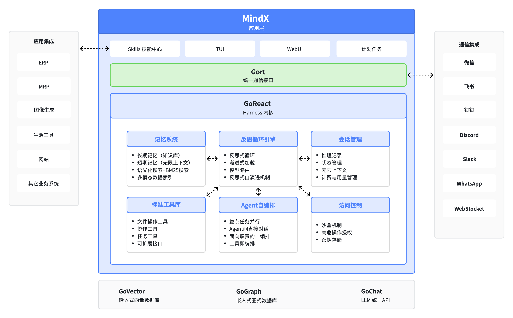

# MindX — Agent Harness

[](https://github.com/DotNetAge/mindx/releases)
[](LICENSE)
[](https://go.dev/)
[](https://formulae.brew.sh/formula/mindx)
[](https://hub.docker.com/r/dotnetage/mindx)

> MindX 是一个开源的 AI Agent 平台（Agent Harness），通过混合编排模式、智能记忆系统和自研技术栈，帮助你高效地构建、管理和运行 AI Agent 工作流。无论是日常编码辅助，还是复杂的多步骤任务自动化，MindX 都能提供专业级的AI处理能力。

<p align="center">
  
  <br />
  <em>MindX 架构图</em>
  <br />
</p>

---


## 功能特性

### 多 Agent 编排

作为一个完善的 Agent Harness，MindX 提供的是一种混合编排模式，以帮助你完成不同复杂程度的问题与业务场景：

| 模式              | 类型     | 说明                                                                        |
| ----------------- | -------- | --------------------------------------------------------------------------- |
| 单 Agent 模式     | 基础模式 | 应对简单问题                                                                |
| 反思模式（ReAct） | 思维链   | 规划 → 执行 → 观察 → 迭代的完整循环（T-A-O ReAct 引擎），寻找最优解         |
| 并发模式          | 任务驱动 | 对于长时复杂任务，Agent 会自动"分身"同时处理多个任务                        |
| 规划模式          | 计划驱动 | 规划、分配不同角色的 Agent 执行长时效、周期性复杂任务                       |
| 委派模式          | 职责驱动 | 专业的人做专业的事，遇事不决找专家                                          |
| Agentic RAG 模式  | 知识检索 | 基于工作与对话自形成的知识库，拥有人类一般的记忆力                          |
| **评估体系**      | 质量保障 | 每个 Agent 都具有质量评估和评分的能力，根据任务完成情况和质量进行"绩效计算" |

### 上下文工程

管理 LLM 会话的生命周期——上下文窗口的容量控制、会话持久化和相关上下文注入。

- **真·上下文** — 巧妙地将压缩技术与记忆体有机融合，使上下文不丢失、不失忆、不腐烂
- **会话持久化和跨重启恢复** — 会话以文件形式存储在磁盘，重启后自动恢复
- **多会话分支** — 同一项目可同时开启多个独立会话，Agent 间可共享会话，随时切换
- **渐进式能力披露** — 按需加载能力描述，不浪费上下文

### 记忆与检索

合理并有效利用上下文窗口之外的信息持久化和检索，形成短期记忆、长期记忆和全局知识库。

- **RAG / 语义记忆搜索** — 混合向量 + 全文检索，自动的无感记忆索引
- **文件地图 / 代码地图** — 全局理解项目结构，Agent 可感知文件、代码组织
- **跨会话记忆共享** — 持久化记忆记录（Immediately + LongTerm + Experience 三种记忆类型）
- **网页搜索和页面抓取** — 内置多种搜索引擎并提供深度的网络爬取，国内国外皆可搜

你无需学习甚至感知 RAG 的存在，只需要知道有一批 Advanced RAG 服务在忠实地为你提供语义服务。

### 执行能力

MindX 的设计哲学中"技能远优于工具"，因此工具只是作为 MindX 的底层能力而不是开放的接口。你无须关注或学习任何工具，因为 MindX 自己就会为你"造轮子"。MindX 并不会塞一大堆的 MCP 工具，又或者几千个根本不知道什么时候才用得上的技能给你。

- 根据你的需求为你安排处理问题的专业 Agent
- Agent 会根据自己的职责自行组装技能，无需你手动配置
- Agent 会自行总结分析自己是否"称职"，并根据需要调整技能
- Agent 会反思与总结"工作经验"，将经验总结为你服务的"专属技能"

> MindX 能为你摆脱工具与技能不足的焦虑，让你更专注于解决问题。

### 模型抽象层

统一的 LLM 提供商接口——处理提供商差异、结构化输出、用量统计和降级策略。

- **多服务商、模型支持** — 支持当前主流的 LLM 服务商统一接入
- **用量和费用追踪** — 跨所有提供商的实时监控和记录，对你的词元消耗和费用提供多个维度与视角的查询
- **精确追踪每一次对话的词元用量**

### 安全与治理

Agent 行为的控制——权限、沙箱、审计和输出护栏。

- **分层权限模式** — 命令在受限环境中执行（项目/会话目录隔离）
- **人工审批门禁** — 敏感操作需人工确认
- **凭据管理** — macOS Keychain 集成 + AES-GCM 加密文件兜底存储 API 密钥和个人密钥
- **安全漏洞检测** — 依赖扫描、密钥检测
- **全部工具调用的审计记录** — 所有工具调用留存日志，并提供即时查看工具
- **命令黑名单和白名单** — 细粒度命令控制策略（Bash 安全机制、内容模式规则）

### 状态与持久化

执行状态的追踪和恢复——检查点、差异对比、可观测性和定时任务。

- **可观测性 / Tracing** — Agent 全链路执行追踪（事件总线、日志观测点）；daemon 事件流，30+ JSON-RPC 方法
- **文件变更追踪** — 每次工具调用前后生成文件变更对比
- **检查点机制** — 增量回滚到任意历史状态
- **定时 / 周期性 Agent 任务** — 内置调度器（秒级精度，文件持久化，热加载，5 分钟超时）
- **日志系统** — 结构化日志，基于 zap + lumberjack 轮转（ANSI 控制台 + 文件，最大 100MB/30 天保留）

### 平台与交付

Harness 的打包、分发、安装和开发环境集成方式。

- **单二进制分发，零运行时依赖** — 整个平台编译为一个 Go 二进制
- **多平台发布** — Homebrew、Winget、Snap、Docker 全平台覆盖
- **终端 TUI** — 全屏终端界面，带对话侧边栏、文件变更追踪、Token 计数器和斜杠命令
- **系统服务安装** — 支持注册为系统 daemon 服务，带健康检查（launchd/systemd/schtasks）
- **设置向导** — 8 步交互式 TUI 向导（API 密钥输入、模型选择、路径设置、daemon 检查、Python 检查）
- **CI/CD 集成** — GitHub Actions、Makefile、Snap 和 Docker 发布流水线
- **环境管理** — Dockerfile（多阶段构建）、docker-compose.yml（含健康检查和卷挂载）
- **主题 / 个性化** — 界面主题自定义

---

## 系统要求

| 平台    | 最低版本                  | 备注               |
| ------- | ------------------------- | ------------------ |
| macOS   | Monterey (12.0)           | 推荐 Homebrew 安装 |
| Linux   | Ubuntu 20.04+ / CentOS 8+ | 推荐 Snap 安装     |
| Windows | Windows 10+               | 推荐 WSL 或 Docker |
| Docker  | Docker 20.10+             | 支持 amd64/arm64   |

- **内存**: 建议 2GB 以上可用内存
- **磁盘**: 建议 500MB 以上可用空间（不含工作空间）

---

## 快速开始

<p align="center">
  
  <br />
  <em>MindX WebUI</em>
</p>

<p align="center">
  
  <br />
  <em>MindX TUI</em>
</p>
### macOS（推荐）

采用 Homebrew 安装，安装完成后可以直接运行 `mindx` 命令。

```bash
brew install DotNetAge/homebrew-mindx/mindx
```

### Linux

采用 Snap 安装，安装完成后可以直接运行 `mindx` 命令。

```bash
sudo snap install mindx
```

### Docker

采用 Docker 镜像安装，官方镜像地址：[dotnetage/mindx](https://hub.docker.com/r/dotnetage/mindx)

拉取镜像：

```bash
docker pull dotnetage/mindx
```

运行容器：

```bash
docker run -d \
  --name mindx \
  -p 1313:1313 \
  -p 1314:1314 \
  -v ./workspaces:/home/mindx/workspaces \
  dotnetage/mindx:latest
```

`./workspaces` 目录可以是你本机任意的目录路径，用于存放 MindX 的工作空间文件。

### Windows

```bash
winget install DotNetAge.Mindx
```

> Windows 用户还是建议使用内置的 Ubuntu 环境或者直接用 Docker 更省事，Windows 确实不是一个适合 Agent 运行的良好环境。

### 从源码构建

从 [Releases](https://github.com/DotNetAge/mindx/releases) 下载预编译版本，或从源码构建：

```bash
git clone https://github.com/DotNetAge/mindx.git
cd mindx
make run
```

首次运行将启动交互式设置向导，引导你完成 API 密钥配置、模型选择等初始化步骤，之后进入 TUI 聊天界面。

---

## 使用指南

### 初始化配置

首次运行 `mindx` 时，系统会启动交互式设置向导，包含以下步骤：

1. **API 密钥配置** — 输入你使用的 LLM 服务商 API Key
2. **默认模型选择** — 选择主要使用的对话模型
3. **工作空间路径设置** — 配置项目文件的存储位置
4. **Daemon 服务检查** — 检测并配置后台服务
5. **Python 环境检查** — 检测 Python 运行时（部分技能依赖）

### 基本工作流

```bash
# 启动 MindX TUI 界面
mindx

# 启动 Daemon 后台服务（支持长时间运行的任务）
mindx start

# 查看 MindX 运行状态
mindx status

# 打开 Web UI（浏览器访问）
mindx web
```


### 高级功能

| 功能         | 命令/方式                                | 说明                          |
| ------------ | ---------------------------------------- | ----------------------------- |
| 长期记忆搜索 | `mindx query <关键词>`                   | 搜索历史对话中的知识          |
| 资源管理     | `mindx provider/model/agent list/rm/add` | 管理 LLM 提供商、模型和 Agent |
| 日志查看     | `mindx logs`                             | 查看结构化运行日志            |
| 系统诊断     | `mindx doctor`                           | 自动诊断和修复常见问题        |

---

## CLI 参考

| 命令                                       | 用途                |
| ------------------------------------------ | ------------------- |
| `mindx`                                    | 启动向导 + TUI 聊天 |
| `mindx start\|stop`                        | 启动/停止 Daemon    |
| `mindx status`                             | 查看系统状态        |
| `mindx doctor`                             | 诊断和修复          |
| `mindx install`                            | 安装到系统          |
| `mindx logs`                               | 查看日志            |
| `mindx web`                                | 打开 WebUI          |
| `mindx query`                              | 搜索长期记忆        |
| `mindx provider\|model\|agent list/rm/add` | 管理资源            |

---

## 架构概览

<!-- TODO: 替换为实际的技术架构图 -->
<p align="center">
  
  <br />
  <em>MindX 技术架构（TODO: 替换为实际架构图）</em>
</p>

MindX 采用分层架构设计，从上至下分为：

1. **编排层** — 多模式 Agent 编排引擎（ReAct / 并发 / 规划 / 委派）
2. **能力层** — 上下文管理、记忆检索、技能组装
3. **抽象层** — 统一 LLM 接口、模型路由、用量统计
4. **基础设施层** — 安全治理、状态持久化、可观测性

---

## 全自研生态依赖

MindX 的核心能力建立在以下全自研技术框架之上：

| 框架         | 定位                   | 仓库                                                                   |
| ------------ | ---------------------- | ---------------------------------------------------------------------- |
| **GoReact**  | Agent Harness 框架     | [github.com/DotNetAge/goreact](https://github.com/DotNetAge/goreact)   |
| **GoChat**   | LLM 统一调用框架       | [github.com/DotNetAge/gochat](https://github.com/DotNetAge/gochat)     |
| **GoRAG**    | 高性能 RAG 框架        | [github.com/DotNetAge/gorag](https://github.com/DotNetAge/gorag)       |
| **GoRT**     | 实时通信网关框架       | [github.com/DotNetAge/gort](https://github.com/DotNetAge/gort)         |
| **GoVector** | 高性能嵌入式向量数据库 | [github.com/DotNetAge/govector](https://github.com/DotNetAge/govector) |
| **GoGraph**  | 高性能嵌入式图数据库   | [github.com/DotNetAge/gograph](https://github.com/DotNetAge/gograph)   |

---

## 贡献

欢迎积极提供 PR，共同推动 MindX 的发展。参见 [CONTRIBUTING.md](CONTRIBUTING.md) 了解贡献指南。

## 许可证

MIT License. 详情请参阅 [LICENSE](LICENSE) 文件。
