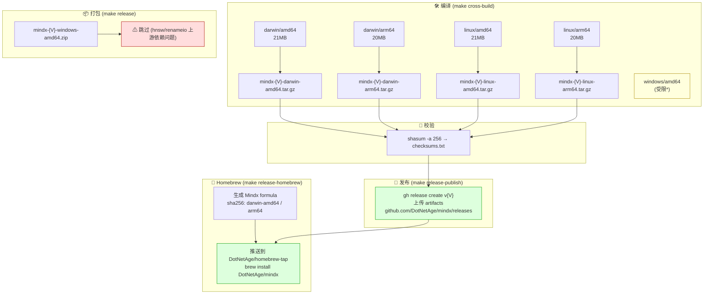
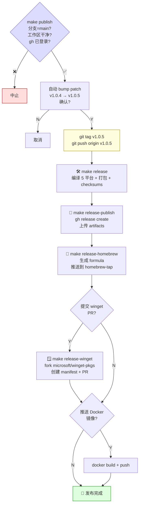

# Release Pipeline 发布流水线





## Makefile Targets

| Target | 命令 | 说明 |
|---|---|---|
| `publish` | `make publish` | 🚀 **一键发布** — 打标签 → 编译 → GitHub Release → Homebrew → Winget |
| `release` | `make release` | 编译 + 打包 + 校验和 |
| `release-notes` | `make release-notes` | 生成 RELEASE_NOTES.md（含 SHA256） |
| `release-publish` | `make release-publish` | 上传 artifacts 到 GitHub Releases |
| `release-homebrew` | `make release-homebrew` | 生成 formula → 推送到 Homebrew tap |
| `release-winget` | `make release-winget` | fork winget-pkgs → manifest → PR |

## 产物

| 平台 | 格式 | 大小 |
|---|---|---|
| macOS Intel | .tar.gz | ~21MB |
| macOS Apple Silicon | .tar.gz | ~20MB |
| Linux x86_64 | .tar.gz | ~21MB |
| Linux ARM64 | .tar.gz | ~20MB |
| Windows x86_64 | .zip | ~18MB |

## 一键发布

```bash
make publish GITHUB_REPO=DotNetAge/mindx HOMEBREW_TAP=DotNetAge/homebrew-tap
```

流程如下：
1. 检查 `main` 分支、工作区干净、`gh` 已登录
2. 自动读取最新 tag 并 bump patch 版本号（v1.0.4 → v1.0.5）
3. 交互确认后创建并推送 git tag
4. 交叉编译 5 平台（darwin + linux + windows）
5. 打包 + checksums
6. 创建 GitHub Release 并上传 artifacts
7. 生成 Homebrew formula 并推送到 tap 仓库
8. 可选提交 winget-pkgs PR → `winget install DotNetAge.Mindx`
9. 可选推送 Docker 镜像
