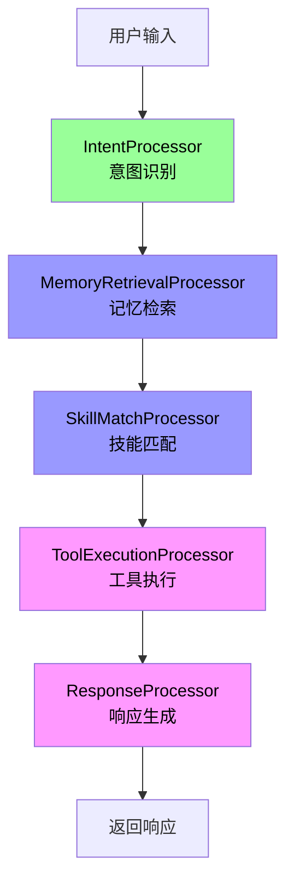
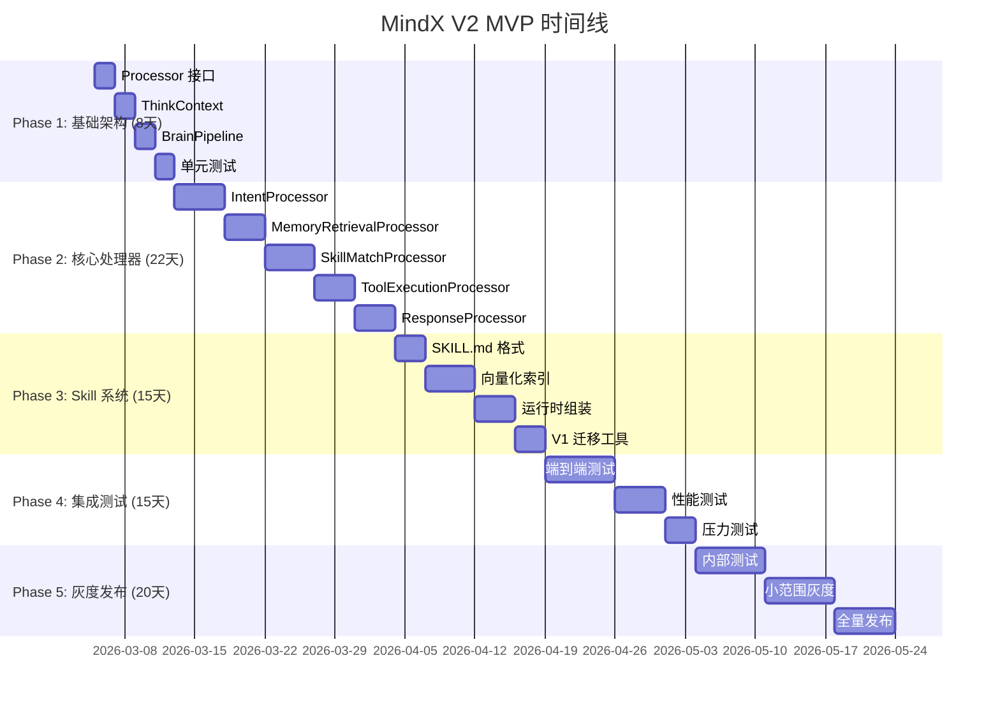

# MindX V2 MVP 路线图

> 版本：2.0-MVP | 日期：2026-03-05
>
> 目的：精简版实施计划，专注核心价值，快速验证架构

---

## 🎯 MVP 目标

**核心原则**：先把简单的做对，再追求复杂的做好

**时间目标**：80 天（比原计划缩短 24 天）

**验证目标**：
- ✅ Pipeline + ThinkContext 架构可行性
- ✅ 解决 V1 的 5 个核心问题（暂缓情感分析和澄清对话）
- ✅ 性能不低于 V1
- ✅ 代码质量可维护

---

## 📋 MVP 范围

### ✅ 包含的功能



**5 个核心处理器**：
1. **IntentProcessor** - 意图识别（本地 + 云端降级）
2. **MemoryRetrievalProcessor** - 记忆检索
3. **SkillMatchProcessor** - 技能匹配（基础版）
4. **ToolExecutionProcessor** - 工具执行
5. **ResponseProcessor** - 响应生成

**核心机制**：
- ✅ Pipeline 串行执行
- ✅ ThinkContext 共享上下文
- ✅ 基础降级策略（本地模型失败 → 云端模型）
- ✅ Skill 声明式 SOP
- ✅ Tool 与 MCP 统一接口

### ❌ 暂缓的功能（Phase 2）

- ❌ **EmotionProcessor** - 情感分析（Phase 2）
- ❌ **ClarificationProcessor** - 多轮澄清（Phase 2）
- ❌ **并行执行优化** - 先验证瓶颈（Phase 2）
- ❌ **高级降级策略** - 先实现基础版（Phase 2）

---

## 📅 MVP 时间线（80 天）



---

## 🎯 Phase 1: 基础架构（8 天）

### 目标
搭建 Pipeline 框架，验证核心抽象。

### 任务清单

#### Day 1-2: Processor 接口
```go
// internal/core/processor.go
type Processor interface {
    Name() string
    Process(ctx *ThinkContext) error
}

type ProcessorMetrics struct {
    Name          string
    ExecutionTime time.Duration
    Success       bool
}
```

**验收标准**：
- ✅ 接口定义清晰
- ✅ 有示例实现
- ✅ 通过代码审查

#### Day 3-4: ThinkContext
```go
// internal/entity/think_context.go
type ThinkContext struct {
    // 输入
    Input     string
    SessionID string

    // 意图
    Intent *IntentContext

    // 记忆
    Memories []*MemoryPoint

    // 技能
    MatchedSkills []*SkillSOP
    Tools         []ToolSchema

    // 工具结果
    ToolResults []ToolExecResult

    // 输出
    Response string

    // 元数据
    StartTime time.Time
    Errors    []ProcessorError
}
```

**验收标准**：
- ✅ 字段定义完整
- ✅ 支持序列化
- ✅ 有便捷的访问方法

#### Day 5-6: BrainPipeline
```go
// internal/usecase/brain/pipeline.go
type BrainPipeline struct {
    processors []Processor
    metrics    *PipelineMetrics
}

func (p *BrainPipeline) Execute(ctx *ThinkContext) error {
    for _, processor := range p.processors {
        start := time.Now()

        if err := processor.Process(ctx); err != nil {
            return p.handleError(processor, ctx, err)
        }

        p.recordMetrics(processor.Name(), time.Since(start))
    }
    return nil
}
```

**验收标准**：
- ✅ 串行执行正常
- ✅ 错误处理完善
- ✅ 性能指标收集

#### Day 7-8: 单元测试
```go
func TestBrainPipeline_Execute(t *testing.T) {
    pipeline := NewBrainPipeline(
        &MockProcessor{name: "p1"},
        &MockProcessor{name: "p2"},
    )

    ctx := &ThinkContext{Input: "test"}
    err := pipeline.Execute(ctx)

    assert.NoError(t, err)
    assert.Equal(t, 2, len(pipeline.metrics.ProcessorMetrics))
}
```

**验收标准**：
- ✅ 测试覆盖率 > 80%
- ✅ 所有边界情况测试
- ✅ 性能基准测试

---

## 🎯 Phase 2: 核心处理器（22 天）

### 目标
实现 5 个核心处理器，替换 V1 逻辑。

### 简化策略

#### IntentProcessor（5 天）
```go
// 简化版：只做基础意图识别
type IntentProcessor struct {
    localModel LLM
    cloudModel LLM  // 降级用
}

func (p *IntentProcessor) Process(ctx *ThinkContext) error {
    // 1. 本地模型识别
    result, err := p.localModel.RecognizeIntent(ctx.Input)
    if err != nil {
        // 2. 降级到云端模型
        result, err = p.cloudModel.RecognizeIntent(ctx.Input)
        if err != nil {
            return err
        }
    }

    // 3. 填充意图
    ctx.Intent = &IntentContext{
        Type:       result.Type,
        Keywords:   result.Keywords,
        Confidence: result.Confidence,
    }

    return nil
}
```

**MVP 简化**：
- ❌ 不做置信度阈值检查（Phase 2）
- ❌ 不生成候选意图列表（Phase 2）
- ✅ 只做基础识别 + 云端降级

#### MemoryRetrievalProcessor（4 天）
```go
// 简化版：只做关键词检索
type MemoryRetrievalProcessor struct {
    memoryStore MemoryStore
    topK        int
}

func (p *MemoryRetrievalProcessor) Process(ctx *ThinkContext) error {
    if len(ctx.Intent.Keywords) == 0 {
        return nil  // 无关键词，跳过
    }

    // 关键词检索（不做向量检索）
    memories, err := p.memoryStore.SearchByKeywords(
        ctx.Intent.Keywords,
        p.topK,
    )
    if err != nil {
        return nil  // 失败不影响核心功能
    }

    ctx.Memories = memories
    return nil
}
```

**MVP 简化**：
- ❌ 不做向量相似度搜索（Phase 2）
- ✅ 只做关键词精确匹配

#### SkillMatchProcessor（5 天）
```go
// 简化版：基于关键词匹配
type SkillMatchProcessor struct {
    skillRegistry *SkillRegistry
    toolRegistry  *ToolRegistry
}

func (p *SkillMatchProcessor) Process(ctx *ThinkContext) error {
    // 1. 关键词匹配 Skills
    matches := p.skillRegistry.SearchByKeywords(ctx.Intent.Keywords)
    if len(matches) == 0 {
        return nil
    }

    // 2. 选择最优 Skill
    bestSkill := matches[0]
    ctx.MatchedSkills = []*SkillSOP{bestSkill}

    // 3. 加载所需工具
    tools, err := p.assembleTools(bestSkill.RequiredTools)
    if err != nil {
        return err
    }

    ctx.Tools = tools
    return nil
}
```

**MVP 简化**：
- ❌ 不做向量语义匹配（Phase 2）
- ✅ 只做关键词匹配

#### ToolExecutionProcessor（4 天）
```go
// 保持完整实现
type ToolExecutionProcessor struct {
    llm          LLM
    toolRegistry *ToolRegistry
    mcpClient    *MCPClient
}

func (p *ToolExecutionProcessor) Process(ctx *ThinkContext) error {
    if len(ctx.Tools) == 0 {
        return nil
    }

    // 1. LLM 决定工具调用
    toolCalls, err := p.llm.DecideToolCalls(ctx.Input, ctx.Tools)
    if err != nil {
        return err
    }

    // 2. 执行工具
    results := make([]ToolExecResult, 0, len(toolCalls))
    for _, call := range toolCalls {
        result, err := p.executeTool(call)
        if err != nil {
            result = ToolExecResult{
                ToolCallID: call.ID,
                Error:      err.Error(),
            }
        }
        results = append(results, result)
    }

    ctx.ToolResults = results
    return nil
}
```

**MVP 保持完整**：
- ✅ 这是核心功能，不简化

#### ResponseProcessor（4 天）
```go
// 保持完整实现
type ResponseProcessor struct {
    llm LLM
}

func (p *ResponseProcessor) Process(ctx *ThinkContext) error {
    prompt := p.buildPrompt(ctx)
    response, err := p.llm.Generate(prompt)
    if err != nil {
        return err
    }

    ctx.Response = response
    return nil
}
```

**MVP 保持完整**：
- ✅ 这是核心功能，不简化

---

## 🎯 Phase 3: Skill 系统（15 天）

### 简化策略

#### SKILL.md 格式（3 天）
```markdown
---
name: weather_query
version: 1.0.0
description: 查询天气信息
keywords: [天气, weather, 气温]
---

# Skill: 天气查询

## 目标
查询指定地点的天气信息

## 执行步骤
1. 调用 `weather_tool` 查询天气
2. 格式化输出结果

## 所需工具
- weather_tool (必需)
```

**MVP 简化**：
- ❌ 不做复杂的 SOP 步骤（Phase 2）
- ✅ 只定义基本信息和所需工具

#### 向量化索引（5 天）
```go
// MVP: 只做关键词索引
type SkillIndexer struct {
    store *badger.DB
}

func (idx *SkillIndexer) IndexSkill(skill *Skill) error {
    // 只索引关键词，不生成向量
    for _, keyword := range skill.Keywords {
        key := fmt.Sprintf("keyword:%s", keyword)
        value := skill.Name
        idx.store.Set([]byte(key), []byte(value))
    }
    return nil
}
```

**MVP 简化**：
- ❌ 不做向量化（Phase 2）
- ✅ 只做关键词倒排索引

---

## 📊 MVP 成功标准

### 功能指标
- ✅ 解决 V1 的 5 个核心问题（暂缓情感和澄清）
- ✅ 所有 V1 基础功能可用
- ✅ Skill 系统重新设计完成

### 性能指标
- ✅ P95 延迟 < 3s
- ✅ 错误率 < 2%（比 V1 宽松）
- ✅ QPS > 50（比 V1 宽松）

### 质量指标
- ✅ 核心代码测试覆盖率 > 80%
- ✅ 无严重 Bug
- ✅ 代码审查通过率 100%

---

## 🚀 Phase 2 规划（MVP 之后）

### 增强特性（30 天）
1. **EmotionProcessor**（5 天）
2. **ClarificationProcessor**（10 天）
3. **向量化匹配**（10 天）
4. **并行执行优化**（5 天，如果需要）

### 完善与优化（20 天）
1. **性能优化**（10 天）
2. **监控告警**（5 天）
3. **文档完善**（5 天）

---

## 💡 关键决策

### 1. 为什么暂缓情感分析？
- **理由**：不影响核心功能，可以后续增加
- **风险**：中文语境理解可能不够精准
- **缓解**：Phase 2 优先实现

### 2. 为什么暂缓澄清对话？
- **理由**：实现复杂度高，状态管理困难
- **风险**：低置信度意图无法处理
- **缓解**：MVP 阶段直接升级到云端模型

### 3. 为什么不做向量化？
- **理由**：关键词匹配已经能满足 80% 场景
- **风险**：语义理解不够智能
- **缓解**：Phase 2 增加向量化

### 4. 为什么不做并行执行？
- **理由**：未验证瓶颈，过早优化
- **风险**：性能可能不达标
- **缓解**：Phase 1 测量瓶颈，Phase 2 针对性优化

---

## 📋 每周检查点

### Week 1-2: 基础架构
- ✅ Pipeline 框架完成
- ✅ 单元测试通过
- ✅ 代码审查通过

### Week 3-5: 核心处理器
- ✅ 5 个处理器实现完成
- ✅ 集成测试通过
- ✅ 性能基准测试

### Week 6-7: Skill 系统
- ✅ SKILL.md 格式定义
- ✅ 关键词索引完成
- ✅ V1 Skill 迁移工具

### Week 8-9: 集成测试
- ✅ 端到端测试通过
- ✅ 性能测试达标
- ✅ 压力测试通过

### Week 10-12: 灰度发布
- ✅ 内部测试通过
- ✅ 小范围灰度稳定
- ✅ 全量发布成功

---

## 🎯 总结

**MVP 核心价值**：
1. ✅ 验证 Pipeline + ThinkContext 架构
2. ✅ 解决 V1 的主要痛点
3. ✅ 为 Phase 2 打下坚实基础

**MVP 不追求**：
- ❌ 功能完美
- ❌ 性能极致
- ❌ 覆盖所有场景

**MVP 追求**：
- ✅ 架构正确
- ✅ 核心可用
- ✅ 快速验证

---

**下一步**：开始 Phase 1 Day 1 - Processor 接口设计
