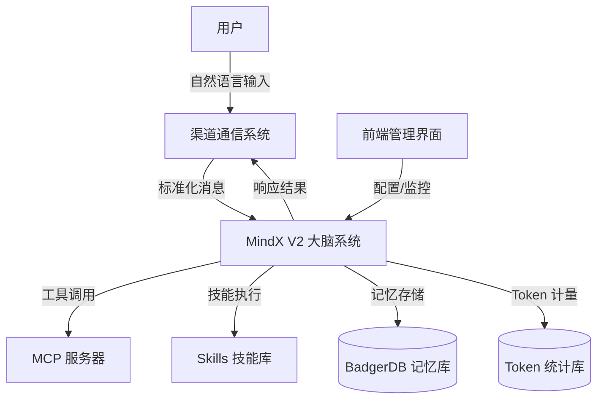
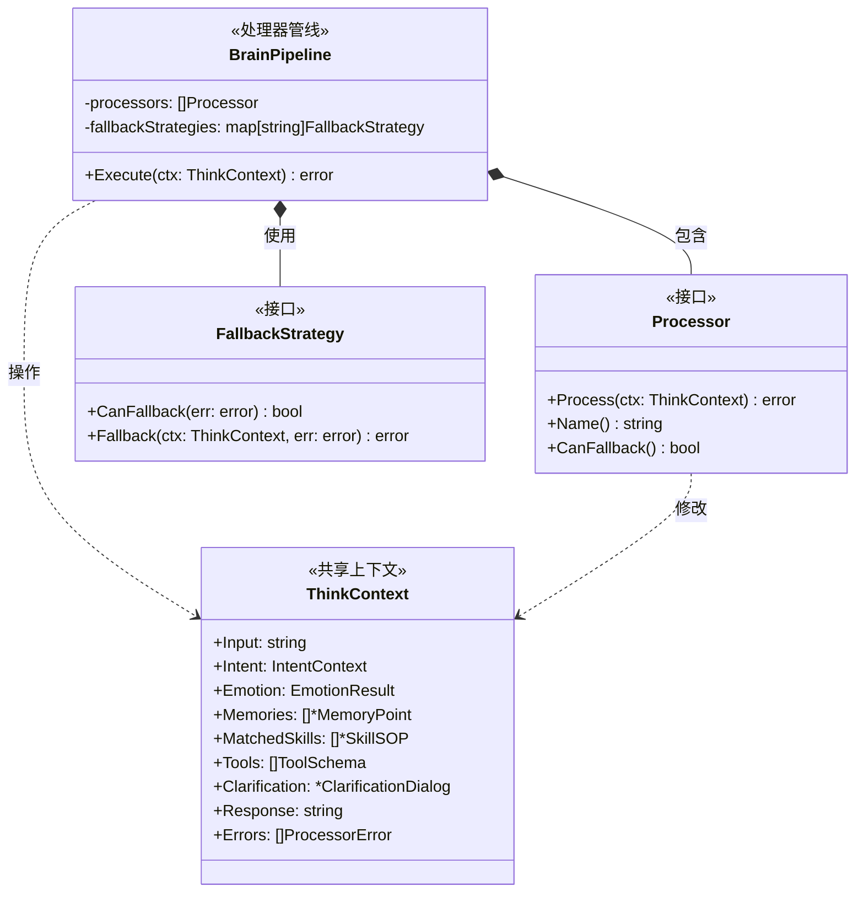
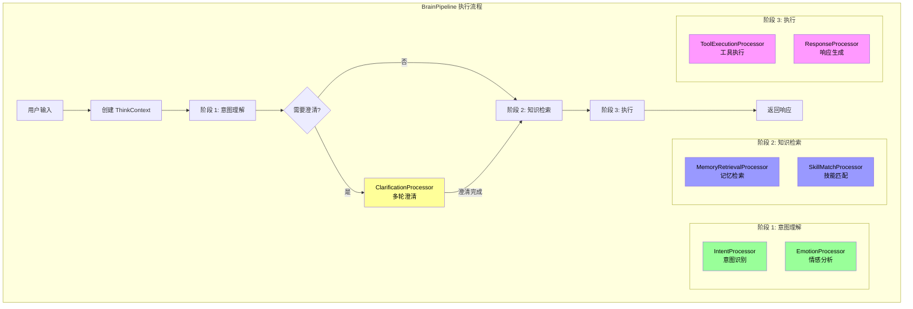
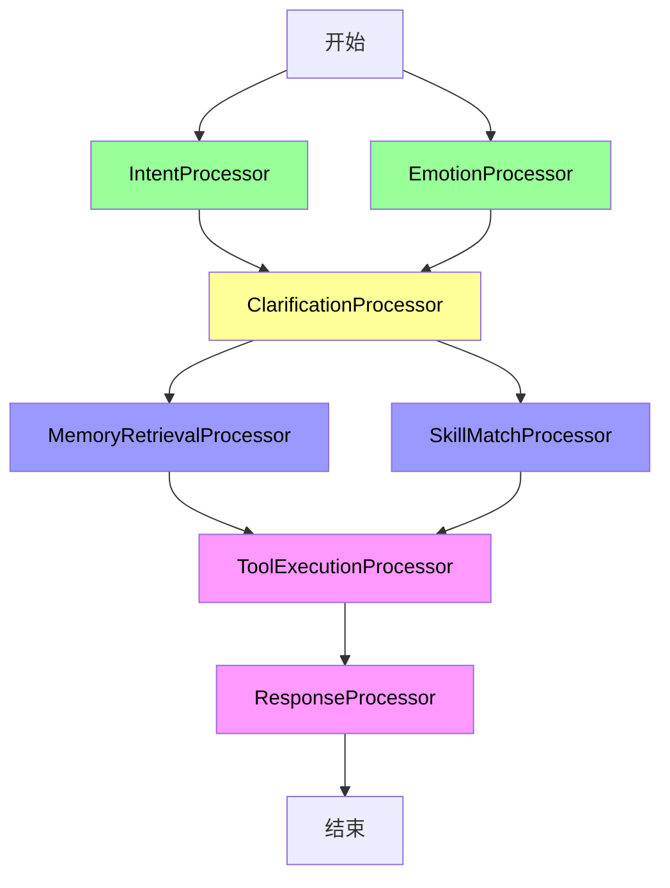
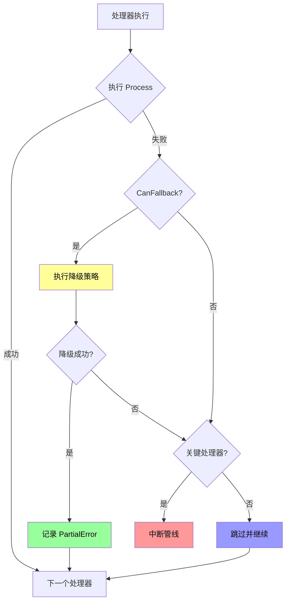
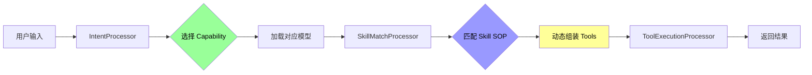
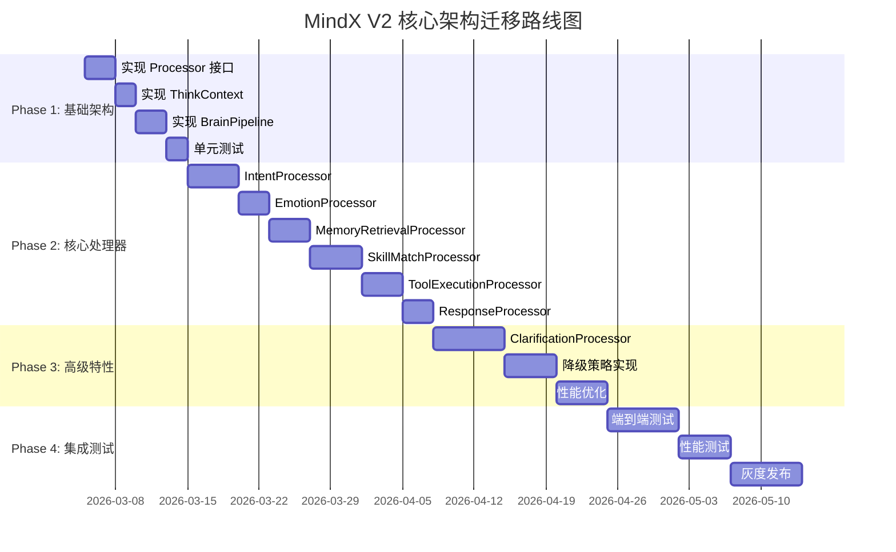

# MindX V2 核心架构设计

> 版本：2.0 | 日期：2026-03-05
>
> 目的：基于问题驱动重新设计 MindX 大脑架构，采用处理器管线 + 共享上下文的新范式

---

## 1. 设计原则

### 1.1 问题驱动

V2 架构专注于解决 V1 的 7 个核心问题（详见 `01-problem.md`）：

1. ✅ 意图识别一锤子买卖 → **多轮澄清机制**
2. ✅ Intent 结构体膨胀 → **共享上下文对象**
3. ✅ 左右脑严格串行 → **处理器管线**
4. ✅ 错误处理全有或全无 → **降级策略**
5. ✅ 能力外聚 → **内聚于管线**
6. ✅ 情感盲区 → **情感分析处理器**
7. ✅ Skill 概念偏差 → **声明式 SOP**

### 1.2 架构目标

- **简单优先**：先把基础架构做对，再追求高级特性
- **渐进式**：支持从 V1 平滑迁移，逐步替换组件
- **可测试**：每个处理器独立可测，管线可组装测试
- **可观测**：内置性能监控和错误追踪

---

## 2. 核心架构

### 2.1 系统上下文图（C4 Level 1）



### 2.2 核心组件图



### 2.3 处理器管线架构



---

## 3. 核心接口设计

### 3.1 Processor 接口

```go
// Processor 处理器接口
type Processor interface {
    // Name 返回处理器名称（用于日志和监控）
    Name() string

    // Process 处理上下文，修改 ThinkContext
    Process(ctx *ThinkContext) error

    // CanFallback 是否支持降级
    CanFallback() bool

    // Dependencies 返回依赖的处理器名称列表
    Dependencies() []string
}
```

### 3.2 ThinkContext 结构

```go
// ThinkContext 共享上下文对象
type ThinkContext struct {
    // 输入
    Input     string    // 用户原始输入
    SessionID string    // 会话 ID

    // 意图理解
    Intent    *IntentContext  // 意图上下文
    Emotion   *EmotionResult  // 情感分析结果

    // 知识检索
    Memories      []*MemoryPoint  // 检索到的记忆点
    MatchedSkills []*SkillSOP     // 匹配的技能 SOP

    // 工具执行
    Tools       []ToolSchema    // 可用工具列表
    ToolResults []ToolExecResult // 工具执行结果

    // 澄清对话
    Clarification *ClarificationDialog // 澄清对话状态

    // 输出
    Response string // 最终响应

    // 错误处理
    Errors []ProcessorError // 各处理器的错误记录

    // 元数据
    StartTime time.Time
    Metadata  map[string]interface{}
}

// IntentContext 意图上下文
type IntentContext struct {
    Type       string   // 意图类型
    Keywords   []string // 关键词
    Confidence float64  // 置信度 [0.0, 1.0]
    Candidates []Intent // 候选意图列表
}

// EmotionResult 情感分析结果
type EmotionResult struct {
    Primary   EmotionType // 主要情感
    Intensity float64     // 强度 [0.0, 1.0]
    Urgency   int         // 紧急度 [1-5]
}

// ProcessorError 处理器错误
type ProcessorError struct {
    ProcessorName string
    Error         error
    Fallback      bool // 是否已降级处理
    Timestamp     time.Time
}
```

### 3.3 FallbackStrategy 接口

```go
// FallbackStrategy 降级策略接口
type FallbackStrategy interface {
    // CanFallback 判断错误是否可降级
    CanFallback(err error) bool

    // Fallback 执行降级逻辑
    Fallback(ctx *ThinkContext, err error) error
}

// 示例：意图识别降级策略
type IntentFallbackStrategy struct {
    localModel LLM  // 本地模型
    cloudModel LLM  // 云端模型
}

func (s *IntentFallbackStrategy) CanFallback(err error) bool {
    return errors.Is(err, ErrLocalModelFailed) ||
           errors.Is(err, ErrLowConfidence)
}

func (s *IntentFallbackStrategy) Fallback(ctx *ThinkContext, err error) error {
    switch {
    case errors.Is(err, ErrLocalModelFailed):
        // 本地模型失败 -> 升级到云端模型
        return s.cloudModel.RecognizeIntent(ctx)

    case errors.Is(err, ErrLowConfidence):
        // 置信度低 -> 触发澄清对话
        ctx.Clarification = NewClarificationDialog(ctx.Intent)
        return nil

    default:
        return err
    }
}
```

---

## 4. 处理器依赖关系

### 4.1 依赖 DAG



### 4.2 并行执行规则

```go
// ProcessorStage 处理器阶段
type ProcessorStage struct {
    Name       string
    Processors []Processor
    Parallel   bool // 是否并行执行
}

// 管线配置
var DefaultPipeline = []ProcessorStage{
    {
        Name:       "意图理解",
        Processors: []Processor{IntentProcessor, EmotionProcessor},
        Parallel:   true, // 可并行
    },
    {
        Name:       "澄清检查",
        Processors: []Processor{ClarificationProcessor},
        Parallel:   false,
    },
    {
        Name:       "知识检索",
        Processors: []Processor{MemoryRetrievalProcessor, SkillMatchProcessor},
        Parallel:   true, // 可并行
    },
    {
        Name:       "工具执行",
        Processors: []Processor{ToolExecutionProcessor},
        Parallel:   false,
    },
    {
        Name:       "响应生成",
        Processors: []Processor{ResponseProcessor},
        Parallel:   false,
    },
}
```

---

## 5. 错误处理与降级

### 5.1 错误处理流程



### 5.2 关键处理器定义

```go
// 关键处理器：失败时必须中断
var CriticalProcessors = []string{
    "IntentProcessor",      // 意图识别失败无法继续
    "ResponseProcessor",    // 响应生成失败无法返回
}

// 可选处理器：失败时可跳过
var OptionalProcessors = []string{
    "EmotionProcessor",     // 情感分析失败不影响核心功能
    "MemoryRetrievalProcessor", // 记忆检索失败可继续
}
```

---

## 6. Capability 与 Skill 职责划分

### 6.1 明确定义

```go
// Capability: 模型选择 + System Prompt（简单）
type Capability struct {
    Name         string   // 能力名称
    Model        string   // 绑定的模型
    SystemPrompt string   // 系统提示词
    Description  string   // 能力描述
}

// Skill: 声明式 SOP + 运行时工具组装（复杂）
type Skill struct {
    Name          string    // 技能名称
    Description   string    // 技能描述
    GoalVector    []float32 // 目标向量
    TriggerVector []float32 // 触发条件向量
    SOPContent    string    // SOP 正文
    RequiredTools []string  // 所需工具列表
}
```

### 6.2 调用链



**职责清晰**：
- **Capability**：决定"用什么模型思考"
- **Skill**：决定"按什么流程执行"
- **Tool**：决定"调用什么工具"

---

## 7. 性能考虑

### 7.1 向量检索优化

```go
// VectorCache 向量缓存层
type VectorCache struct {
    cache *lru.Cache // LRU 缓存
    ttl   time.Duration
}

// 缓存策略
func (c *VectorCache) Get(key string) ([]float32, bool) {
    if val, ok := c.cache.Get(key); ok {
        return val.([]float32), true
    }
    return nil, false
}

// 批量向量计算
func (s *VectorService) BatchEmbed(texts []string) ([][]float32, error) {
    // 批量调用 embedding 模型，减少网络开销
    return s.provider.BatchEmbed(texts)
}
```

### 7.2 性能监控指标

```go
// ProcessorMetrics 处理器性能指标
type ProcessorMetrics struct {
    ProcessorName string
    ExecutionTime time.Duration
    Success       bool
    Fallback      bool
}

// PipelineMetrics 管线性能指标
type PipelineMetrics struct {
    TotalTime       time.Duration
    ProcessorMetrics []ProcessorMetrics
    P95Latency      time.Duration
    QPS             float64
}
```

---

## 8. 迁移路径

### 8.1 分阶段实施



### 8.2 兼容性策略

```go
// V1 兼容适配器
type V1CompatibilityAdapter struct {
    v2Pipeline *BrainPipeline
}

func (a *V1CompatibilityAdapter) Ask(question string) (string, error) {
    // 将 V1 的 Ask 调用转换为 V2 的 Pipeline 执行
    ctx := &ThinkContext{
        Input:     question,
        SessionID: generateSessionID(),
    }

    if err := a.v2Pipeline.Execute(ctx); err != nil {
        return "", err
    }

    return ctx.Response, nil
}
```

---

## 9. 测试策略

### 9.1 单元测试

```go
func TestIntentProcessor(t *testing.T) {
    processor := NewIntentProcessor(mockLLM)
    ctx := &ThinkContext{
        Input: "明天北京天气怎么样？",
    }

    err := processor.Process(ctx)
    assert.NoError(t, err)
    assert.Equal(t, "weather_query", ctx.Intent.Type)
    assert.Greater(t, ctx.Intent.Confidence, 0.7)
}
```

### 9.2 集成测试

```go
func TestPipelineIntegration(t *testing.T) {
    pipeline := NewBrainPipeline(
        NewIntentProcessor(llm),
        NewEmotionProcessor(llm),
        NewSkillMatchProcessor(skillRegistry),
        NewToolExecutionProcessor(toolRegistry),
        NewResponseProcessor(llm),
    )

    ctx := &ThinkContext{
        Input: "帮我查一下明天的天气",
    }

    err := pipeline.Execute(ctx)
    assert.NoError(t, err)
    assert.NotEmpty(t, ctx.Response)
}
```

---

## 10. 下一步

- 📖 详细处理器设计：参见 `03-processor-design.md`
- 🔧 Skill 系统设计：参见 `04-skill-system.md`
- 🚀 未来增强特性：参见 `05-future-enhancements.md`
- 📋 迁移实施计划：参见 `06-migration-plan.md`
