# MindX V2 架构设计

> 版本：2.0 | 日期：2026-03-05
> 
> 目的：基于问题驱动重新设计 MindX 大脑架构，采用处理器管线 + 共享上下文的新范式

---

## 1. 架构总览

### 1.1 系统上下文图（C4 Level 1）

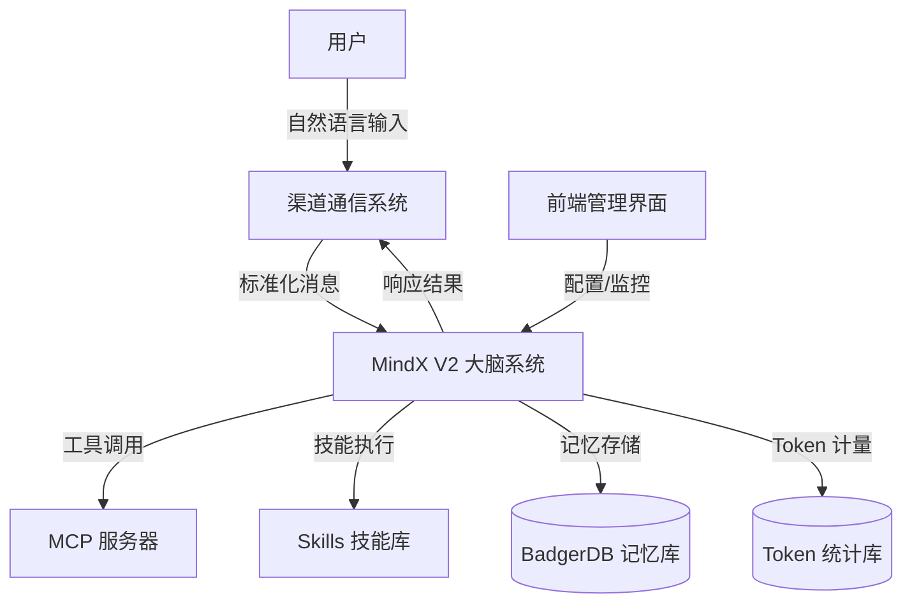
```mermaid
graph TB
    User[用户] -->|自然语言输入 | Channel[渠道通信系统]
    Channel -->|标准化消息 | MindX[MindX V2 大脑系统]
    
    MindX -->|响应结果 | Channel
    MindX -->|工具调用 | MCP[MCP 服务器]
    MindX -->|技能执行 | Skills[Skills 技能库]
    MindX -->|记忆存储 | MemoryDB[(BadgerDB 记忆库)]
    MindX -->|Token 计量 | TokenDB[(Token 统计库)]
    
    Dashboard[前端管理界面] -->|配置/监控 | MindX
```

### 1.2 核心组件图

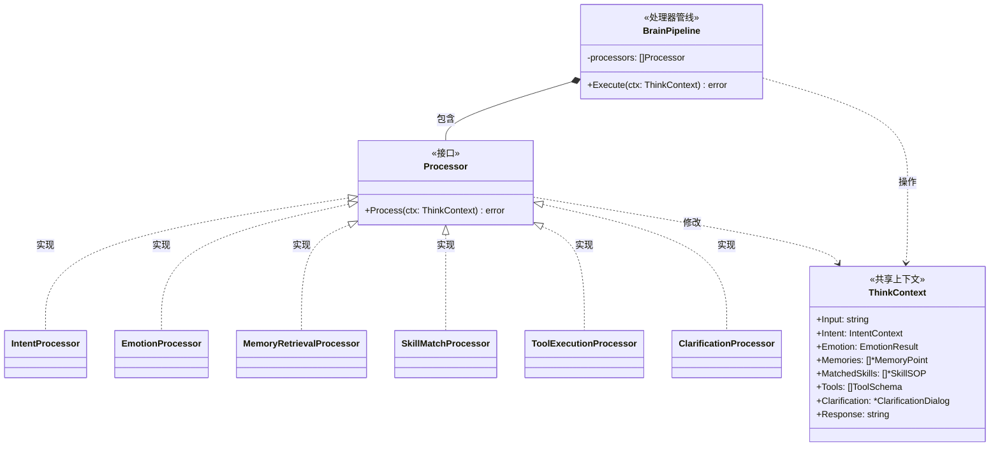
```mermaid
classDiagram
    class BrainPipeline {
        <<处理器管线>>
        +Execute(ctx: ThinkContext) error
        -processors: []Processor
    }
    
    class Processor {
        <<接口>>
        +Process(ctx: ThinkContext) error
    }
    
    class ThinkContext {
        <<共享上下文>>
        +Input: string
        +Intent: IntentContext
        +Emotion: EmotionResult
        +Memories: []*MemoryPoint
        +MatchedSkills: []*SkillSOP
        +Tools: []ToolSchema
        +Clarification: *ClarificationDialog
        +Response: string
    }
    
    class IntentProcessor
    class EmotionProcessor
    class MemoryRetrievalProcessor
    class SkillMatchProcessor
    class ToolExecutionProcessor
    class ClarificationProcessor
    
    BrainPipeline *-- Processor : 包含
    BrainPipeline ..> ThinkContext : 操作
    Processor <|.. IntentProcessor : 实现
    Processor <|.. EmotionProcessor : 实现
    Processor <|.. MemoryRetrievalProcessor : 实现
    Processor <|.. SkillMatchProcessor : 实现
    Processor <|.. ToolExecutionProcessor : 实现
    Processor <|.. ClarificationProcessor : 实现
    
    Processor ..> ThinkContext : 修改
```

### 1.3 整体分层架构

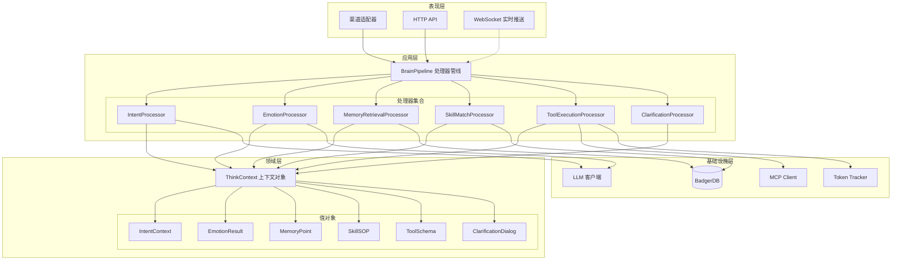
```mermaid
graph TB
    subgraph "表现层"
        CH[渠道适配器]
        DH[HTTP API]
        WS[WebSocket 实时推送]
    end
    
    subgraph "应用层"
        BP[BrainPipeline 处理器管线]
        
        subgraph "处理器集合"
            IP[IntentProcessor]
            EP[EmotionProcessor]
            MP[MemoryRetrievalProcessor]
            SP[SkillMatchProcessor]
            TP[ToolExecutionProcessor]
            CP[ClarificationProcessor]
        end
    end
    
    subgraph "领域层"
        BC[ThinkContext 上下文对象]
        
        subgraph "值对象"
            IC[IntentContext]
            ER[EmotionResult]
            MS[MemoryPoint]
            SS[SkillSOP]
            TS[ToolSchema]
            CD[ClarificationDialog]
        end
    end
    
    subgraph "基础设施层"
        BD[(BadgerDB)]
        LLM[LLM 客户端]
        MC[MCP Client]
        TK[Token Tracker]
    end
    
    CH --> BP
    DH --> BP
    WS -.-> BP
    
    BP --> IP
    BP --> EP
    BP --> MP
    BP --> SP
    BP --> TP
    BP --> CP
    
    IP --> BC
    EP --> BC
    MP --> BC
    SP --> BC
    TP --> BC
    CP --> BC
    
    BC --> IC
    BC --> ER
    BC --> MS
    BC --> SS
    BC --> TS
    BC --> CD
    
    IP --> LLM
    EP --> LLM
    MP --> BD
    SP --> BD
    TP --> MC
    TP --> TK
```

---

## 2. 核心设计决策

### 2.1 问题与解决方案映射

| 问题 | 解决方案 | 实现机制 |
|------|---------|---------|
| 意图识别一锤子买卖 | **多轮澄清机制** | 置信度阈值 + ClarificationDialog 状态机 |
| Intent 结构体膨胀 | **共享上下文对象** | ThinkContext 在各处理器间传递和丰富 |
| 左右脑严格串行 | **处理器管线** | Pipeline 模式 + 部分处理器并行执行 |
| 错误处理全有或全无 | **降级策略** | FallbackProcessor 接口 + PartialError |
| 能力外聚 | **内聚于管线** | Memory/Skills/Token 作为管线的内部处理器 |
| 情感盲区 | **情感分析处理器** | 独立 EmotionProcessor，与 IntentProcessor 并行 |
| Skill 概念偏差 | **声明式 SOP** | BadgerDB 向量索引 + 运行时动态 Tool 组装 |

### 2.2 架构演进方向

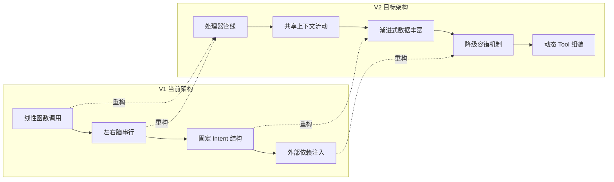
```mermaid
graph LR
    subgraph "V1 当前架构"
        A1[线性函数调用] --> A2[左右脑串行]
        A2 --> A3[固定 Intent 结构]
        A3 --> A4[外部依赖注入]
    end
    
    subgraph "V2 目标架构"
        B1[处理器管线] --> B2[共享上下文流动]
        B2 --> B3[渐进式数据丰富]
        B3 --> B4[降级容错机制]
        B4 --> B5[动态 Tool 组装]
    end
    
    A1 -.->|重构 | B1
    A2 -.->|重构 | B1
    A3 -.->|重构 | B3
    A4 -.->|重构 | B4
```

---

## 3. 数据流与协作

### 3.1 完整数据处理流程

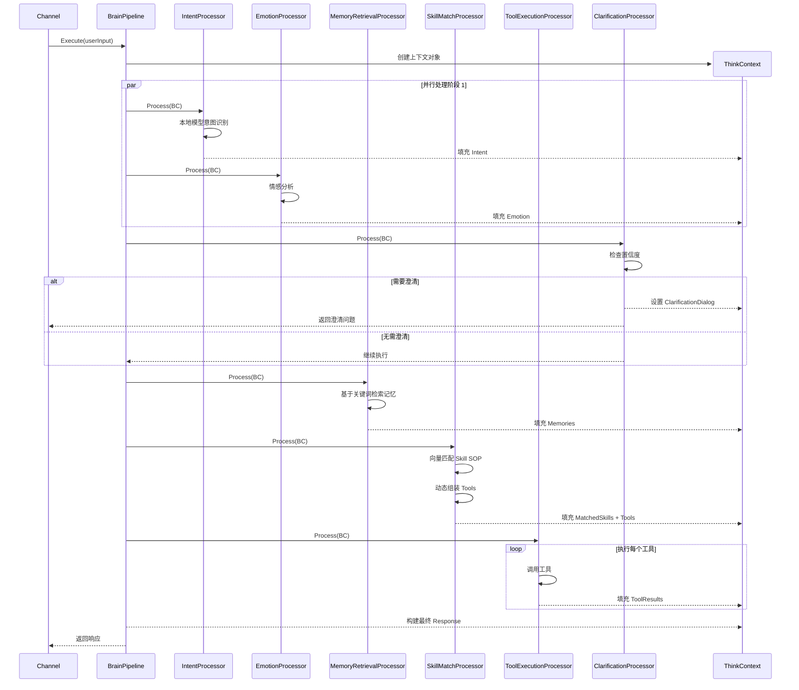
```mermaid
sequenceDiagram
    participant C as Channel
    participant BP as BrainPipeline
    participant IP as IntentProcessor
    participant EP as EmotionProcessor
    participant MP as MemoryRetrievalProcessor
    participant SP as SkillMatchProcessor
    participant TP as ToolExecutionProcessor
    participant CP as ClarificationProcessor
    
    C->>BP: Execute(userInput)
    create participant BC as ThinkContext
    
    BP->>BC: 创建上下文对象
    
    par 并行处理阶段 1
        BP->>IP: Process(BC)
        IP->>IP: 本地模型意图识别
        IP-->>BC: 填充 Intent
        
        BP->>EP: Process(BC)
        EP->>EP: 情感分析
        EP-->>BC: 填充 Emotion
    end
    
    BP->>CP: Process(BC)
    CP->>CP: 检查置信度
    alt 需要澄清
        CP-->>BC: 设置 ClarificationDialog
        CP-->>C: 返回澄清问题
    else 无需澄清
        CP-->>BP: 继续执行
    end
    
    BP->>MP: Process(BC)
    MP->>MP: 基于关键词检索记忆
    MP-->>BC: 填充 Memories
    
    BP->>SP: Process(BC)
    SP->>SP: 向量匹配 Skill SOP
    SP->>SP: 动态组装 Tools
    SP-->>BC: 填充 MatchedSkills + Tools
    
    BP->>TP: Process(BC)
    loop 执行每个工具
        TP->>TP: 调用工具
        TP-->>BC: 填充 ToolResults
    end
    
    BP-->>BC: 构建最终 Response
    BP-->>C: 返回响应
    
    destroy BC
```

### 3.2 降级策略活动图

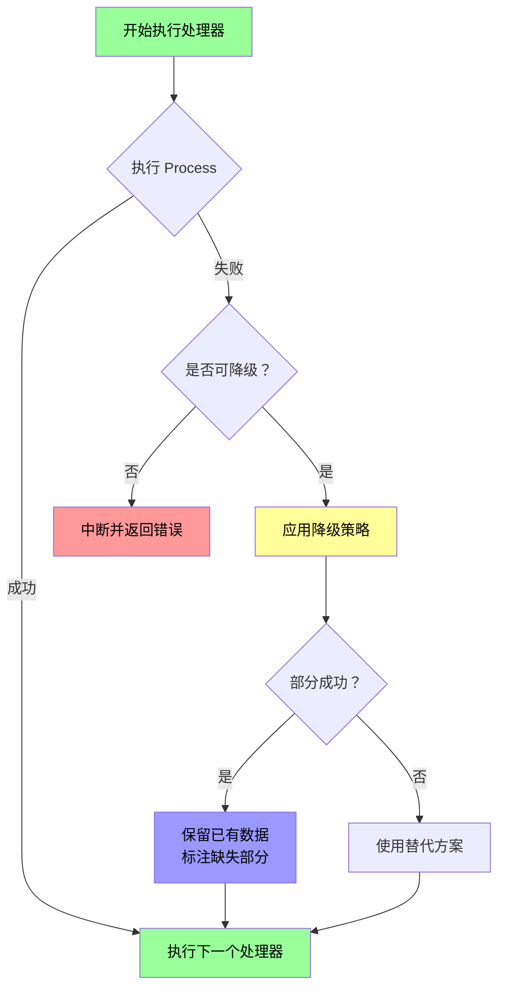
```mermaid
flowchart TD
    Start[开始执行处理器] --> P{执行 Process}
    
    P -->|成功 | Next[执行下一个处理器]
    P -->|失败 | F{是否可降级？}
    
    F -->|是 | FS[应用降级策略]
    F -->|否 | Err[中断并返回错误]
    
    FS --> PS{部分成功？}
    PS -->|是 | PD[保留已有数据<br/>标注缺失部分]
    PS -->|否 | Alt[使用替代方案]
    
    PD --> Next
    Alt --> Next
    
    style Start fill:#9f9,color:#000
    style Next fill:#9f9,color:#000
    style FS fill:#ff9,color:#000
    style PD fill:#99f,color:#000
    style Err fill:#f99,color:#000
```

### 3.3 澄清对话状态机

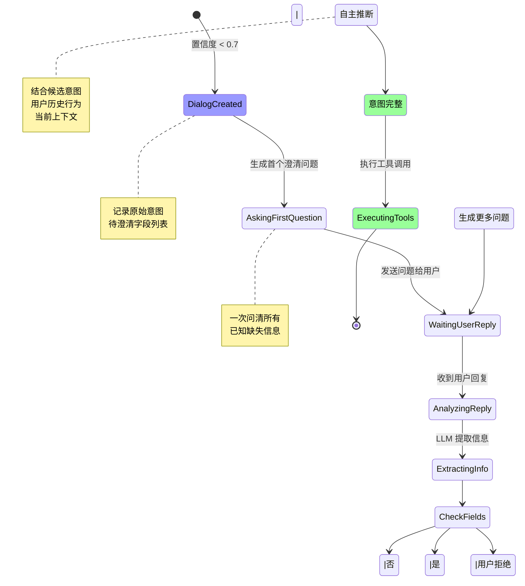
```mermaid
stateDiagram-v2
    [*] --> DialogCreated: 置信度 < 0.7
    
    DialogCreated --> AskingFirstQuestion: 生成首个澄清问题
    AskingFirstQuestion --> WaitingUserReply: 发送问题给用户
    
    WaitingUserReply --> AnalyzingReply: 收到用户回复
    AnalyzingReply --> ExtractingInfo: LLM 提取信息
    
    ExtractingInfo --> CheckFields
    state CheckFields <<choice>>
    
    CheckFields -->|否 | AskingMoreQuestions: 生成更多问题
    AskingMoreQuestions --> WaitingUserReply
    
    CheckFields -->|是 | DialogCompleted: 意图完整
    
    CheckFields -->|用户拒绝 | AutonomousDecision: 自主推断
    
    AutonomousDecision --> DialogCompleted
    
    DialogCompleted --> ExecutingTools: 执行工具调用
    ExecutingTools --> [*]
    
    note right of DialogCreated
        记录原始意图
        待澄清字段列表
    end note
    
    note right of AskingFirstQuestion
        一次问清所有
        已知缺失信息
    end note
    
    note right of AutonomousDecision
        结合候选意图
        用户历史行为
        当前上下文
    end note
    
    style DialogCreated fill:#99f,color:#000
    style DialogCompleted fill:#9f9,color:#000
    style ExecutingTools fill:#9f9,color:#000
```

---

## 4. 关键机制设计

### 4.1 Skill 运行时组装流程

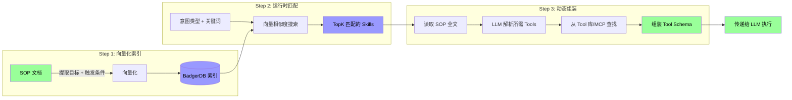
```mermaid
flowchart LR
    subgraph "Step 1: 向量化索引"
        A[SOP 文档] -->|提取目标 + 触发条件 | B[向量化]
        B --> C[(BadgerDB 索引)]
    end
    
    subgraph "Step 2: 运行时匹配"
        D[意图类型 + 关键词] --> E[向量相似度搜索]
        C --> E
        E --> F[TopK 匹配的 Skills]
    end
    
    subgraph "Step 3: 动态组装"
        F --> G[读取 SOP 全文]
        G --> H[LLM 解析所需 Tools]
        H --> I[从 Tool 库/MCP 查找]
        I --> J[组装 Tool Schema]
    end
    
    J --> K[传递给 LLM 执行]
    
    style A fill:#9f9,color:#000
    style C fill:#99f,color:#000
    style F fill:#99f,color:#000
    style J fill:#9f9,color:#000
    style K fill:#9f9,color:#000
```

### 4.2 三级置信度机制

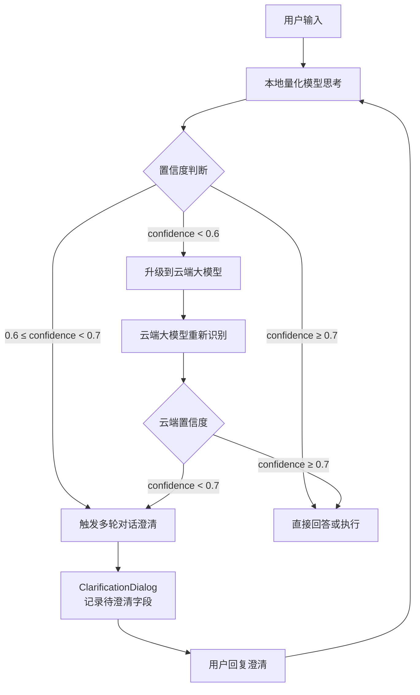
```mermaid
flowchart TD
    Start[用户输入] --> LocalModel[本地量化模型思考]
    LocalModel --> CheckConfidence{置信度判断}
    
    CheckConfidence -->|confidence < 0.6| UpgradeCloud[升级到云端大模型]
    CheckConfidence -->|0.6 ≤ confidence < 0.7| TriggerClarify[触发多轮对话澄清]
    CheckConfidence -->|confidence ≥ 0.7| DirectAnswer[直接回答或执行]
    
    UpgradeCloud --> CloudModel[云端大模型重新识别]
    CloudModel --> CloudCheck{云端置信度}
    
    CloudCheck -->|confidence < 0.7| TriggerClarify
    CloudCheck -->|confidence ≥ 0.7| DirectAnswer
    
    TriggerClarify --> ClarifyDialog[ClarificationDialog<br/>记录待澄清字段]
    ClarifyDialog --> UserResponds[用户回复澄清]
    UserResponds --> LocalModel
```

### 4.3 基本情感维度（实验期）

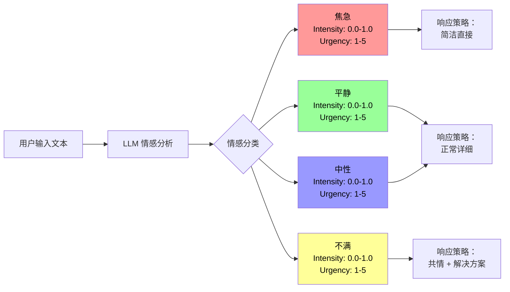
```mermaid
graph LR
    Text[用户输入文本] --> LLM[LLM 情感分析]
    LLM --> Result{情感分类}
    
    Result --> E1[焦急<br/>Intensity: 0.0-1.0<br/>Urgency: 1-5]
    Result --> E2[平静<br/>Intensity: 0.0-1.0<br/>Urgency: 1-5]
    Result --> E3[不满<br/>Intensity: 0.0-1.0<br/>Urgency: 1-5]
    Result --> E4[中性<br/>Intensity: 0.0-1.0<br/>Urgency: 1-5]
    
    E1 --> Style1[响应策略：<br/>简洁直接]
    E2 --> Style2[响应策略：<br/>正常详细]
    E3 --> Style3[响应策略：<br/>共情 + 解决方案]
    E4 --> Style2
    
    style E1 fill:#f99,color:#000
    style E2 fill:#9f9,color:#000
    style E3 fill:#ff9,color:#000
    style E4 fill:#99f,color:#000
```

## 4. 核心工作机制详解

### 4.1 Skill 工作机理

#### 4.1.1 声明式 Skill SOP 设计

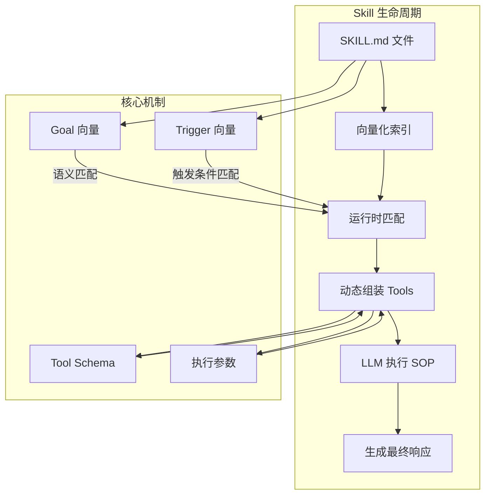
```mermaid
graph TB
    subgraph "Skill 生命周期"
        A[SKILL.md 文件] --> B[向量化索引]
        B --> C[运行时匹配]
        C --> D[动态组装 Tools]
        D --> E[LLM 执行 SOP]
        E --> F[生成最终响应]
    end
    
    subgraph "核心机制"
        B1[Goal 向量] -->|语义匹配 | C
        B2[Trigger 向量] -->|触发条件匹配 | C
        D1[Tool Schema] --> D
        D2[执行参数] --> D
    end
    
    A --> B1
    A --> B2
    D --> D1
    D --> D2
```

#### 4.1.2 运行时动态组装流程

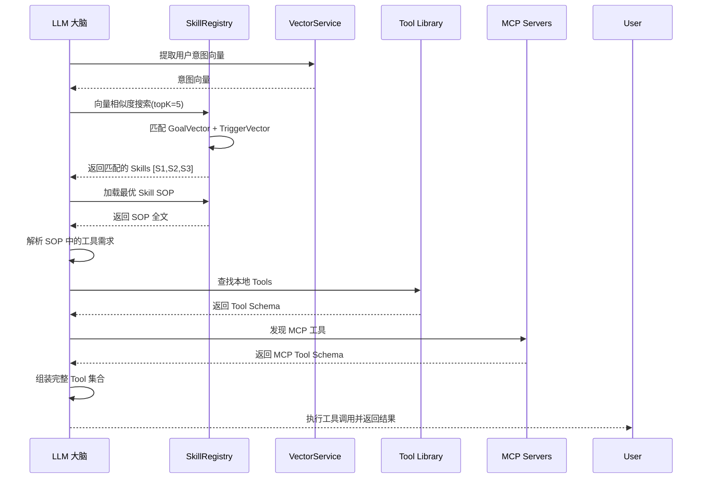
```mermaid
sequenceDiagram
    participant LLM as LLM 大脑
    participant SR as SkillRegistry
    participant VS as VectorService
    participant TL as Tool Library
    participant MCP as MCP Servers
    
    LLM->>VS: 提取用户意图向量
    VS-->>LLM: 意图向量
    
    LLM->>SR: 向量相似度搜索(topK=5)
    SR->>SR: 匹配 GoalVector + TriggerVector
    SR-->>LLM: 返回匹配的 Skills [S1,S2,S3]
    
    LLM->>SR: 加载最优 Skill SOP
    SR-->>LLM: 返回 SOP 全文
    
    LLM->>LLM: 解析 SOP 中的工具需求
    LLM->>TL: 查找本地 Tools
    TL-->>LLM: 返回 Tool Schema
    
    LLM->>MCP: 发现 MCP 工具
    MCP-->>LLM: 返回 MCP Tool Schema
    
    LLM->>LLM: 组装完整 Tool 集合
    LLM-->>User: 执行工具调用并返回结果
```

### 4.1.3 Skill SOP 标准结构

```markdown
# Skill: 旅行规划师

## 元信息
- **名称**: TravelPlanner
- **版本**: 1.0
- **描述**: 帮助用户规划完整的旅行行程

## 触发条件 (用于向量匹配)
当用户提到以下关键词或语义时触发：
- "旅行"、"出游"、"行程规划"、"订机票"、"订酒店"

## 操作步骤 (SOP 执行流程)
1. **询问基本信息**
   - 目的地
   - 出行时间
   - 预算范围
   - 同行人数
   
2. **查询天气**
   - 调用 `weather_tool` 查询目的地天气
   
3. **查询机票**
   - 调用 `flight_search_tool` 查询往返机票
   
4. **预订酒店**
   - 调用 `hotel_booking_tool` 根据预算筛选酒店
   
5. **生成行程表**
   - 综合以上信息生成详细行程表

## 所需工具集 (动态组装依据)
- weather_tool (必需)
- flight_search_tool (必需)
- hotel_booking_tool (必需)
- map_tool (可选)

## 输出格式
以 Markdown 表格形式输出行程表

## 异常处理
- 如果用户未提供目的地 → 追问目的地
- 如果航班售罄 → 推荐替代方案
```

### 4.1.7 Capability 与 CrewAI 角色化协作的深度融合

#### 核心洞察：概念本质的统一性

**CrewAI 的角色化设计**：
```python
researcher = Agent(
    role='资深研究员',           # 角色定位
    goal='深入研究用户问题',      # 目标导向
    backstory='10年研究经验',    # 背景故事
    tools=[search_tool]          # 能力工具
)
```

**MindX Capability 的本质**：
```yaml
# config/capabilities.yml
researcher:
  name: "资深研究员"
  system_prompt: |
    你是一位拥有10年研究经验的资深研究员...
    你的专长是深入分析复杂问题，收集权威信息...
  tools:                    # 运行时动态注入
    - search_engine
    - document_reader
```

**本质统一性**：
- 都是**角色化的能力封装**
- 都包含**目标导向的行为定义**
- 都通过**System Prompt**定义角色特质
- 都支持**工具的动态组合**

#### 当前 MindX Capability 实现的问题

1. **静态配置 vs 动态协作**
   - 当前：Capability 只是预定义的 System Prompt 集合
   - 缺失：缺乏多 Capability 协作的编排机制

2. **单点执行 vs 团队协作**
   - 当前：一次只能激活一个 Capability
   - 缺失：多个 Capability 间的任务分配和协调

3. **工具绑定 vs 上下文注入**
   - 当前：tools 在配置中静态绑定
   - 理想：tools 根据上下文动态注入

#### 融合创新方案：Crew-Style Capability Orchestration

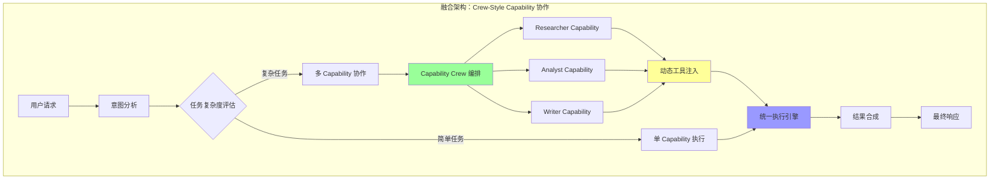
```mermaid
graph TB
    subgraph "融合架构：Crew-Style Capability 协作"
        A[用户请求] --> B[意图分析]
        B --> C{任务复杂度评估}
        
        C -->|简单任务 | D[单 Capability 执行]
        C -->|复杂任务 | E[多 Capability 协作]
        
        E --> F[Capability Crew 编排]
        F --> G[Researcher Capability]
        F --> H[Analyst Capability] 
        F --> I[Writer Capability]
        
        G --> J[动态工具注入]
        H --> J
        I --> J
        
        J --> K[统一执行引擎]
        K --> L[结果合成]
        
        D --> K
        L --> M[最终响应]
    end
    
    style F fill:#9f9
    style J fill:#ff9
    style K fill:#99f
```

#### 具体实现设计

```go
// 1. 角色化 Capability 定义
type CapabilityRole struct {
    Name        string   `yaml:"name"`         // 角色名称
    Description string   `yaml:"description"`  // 角色描述
    Backstory   string   `yaml:"backstory"`    // 背景故事
    Goals       []string `yaml:"goals"`        // 目标列表
    SystemPrompt string  `yaml:"system_prompt"` // 系统提示词
    BaseTools   []string `yaml:"base_tools"`   // 基础工具集
}

// 2. Crew-style 编排器
type CapabilityCrew struct {
    Name        string           `yaml:"name"`
    Description string           `yaml:"description"`
    Roles       []CapabilityRole `yaml:"roles"`
    Process     CrewProcess      `yaml:"process"`  // sequential/parallel/hierarchical
    Context     *CrewContext     // 共享上下文
}

type CrewProcess string
const (
    ProcessSequential    CrewProcess = "sequential"
    ProcessParallel      CrewProcess = "parallel"  
    ProcessHierarchical  CrewProcess = "hierarchical"
)

// 3. 动态工具注入机制
type DynamicToolInjector struct {
    contextAnalyzer *ContextAnalyzer
    toolRegistry    *ToolRegistry
    capabilityStore *CapabilityStore
}

func (i *DynamicToolInjector) InjectTools(role *CapabilityRole, context *TaskContext) []Tool {
    // 基于上下文动态选择工具
    baseTools := i.toolRegistry.GetTools(role.BaseTools)
    contextTools := i.contextAnalyzer.Analyze(context)
    
    return append(baseTools, contextTools...)
}

// 4. 任务协调器
type TaskCoordinator struct {
    crew        *CapabilityCrew
    injector    *DynamicToolInjector
    dispatcher  *TaskDispatcher
}

func (c *TaskCoordinator) Coordinate(ctx *BrainContext) error {
    // 1. 分析任务复杂度，选择合适的 Crew
    crew := c.selectAppropriateCrew(ctx.Intent)
    
    // 2. 为每个角色动态注入工具
    for _, role := range crew.Roles {
        tools := c.injector.InjectTools(&role, ctx.TaskContext)
        role.RuntimeTools = tools
    }
    
    // 3. 按照 Process 执行
    switch crew.Process {
    case ProcessSequential:
        return c.executeSequential(crew, ctx)
    case ProcessParallel:
        return c.executeParallel(crew, ctx)
    case ProcessHierarchical:
        return c.executeHierarchical(crew, ctx)
    }
    
    return nil
}
```

#### 配置示例：研究分析 Crew

```yaml
# configs/crews/research_analysis.yml
name: "研究分析团队"
description: "专门处理复杂研究和分析任务的多角色协作团队"
process: "sequential"  # 研究 → 分析 → 撰写

roles:
  - name: "资深研究员"
    description: "负责深度信息搜集和权威资料验证"
    backstory: |
      你是一位拥有10年学术研究经验的专家，
      专长于跨学科信息整合和可信度评估。
    goals:
      - "收集与主题相关的权威资料"
      - "验证信息来源的可靠性和时效性"
      - "识别关键信息和知识缺口"
    system_prompt: |
      作为资深研究员，你的任务是：
      1. 使用学术搜索引擎查找peer-reviewed文献
      2. 交叉验证多个来源的信息一致性
      3. 重点关注最近3年的研究成果
      4. 标注信息的置信度等级
    base_tools:
      - academic_search
      - fact_checker
      - citation_extractor

  - name: "数据分析师"  
    description: "负责数据处理、趋势分析和洞察提取"
    backstory: |
      你是一位专业的数据科学家，擅长从复杂数据中
      发现模式和趋势，将数字转化为有价值的洞察。
    goals:
      - "处理和清洗收集到的数据"
      - "识别关键趋势和异常点"
      - "生成数据驱动的洞察结论"
    system_prompt: |
      作为数据分析师，你的任务是：
      1. 将非结构化信息转化为结构化数据
      2. 应用适当的统计方法分析数据
      3. 识别correlation和causation关系
      4. 为后续撰写提供数据支撑
    base_tools:
      - data_processor
      - statistical_analyzer
      - visualization_tool

  - name: "技术撰稿人"
    description: "负责将分析结果转化为清晰易懂的报告"
    backstory: |
      你是一位经验丰富的技术作家，善于将复杂概念
      用通俗易懂的语言传达给不同背景的读者。
    goals:
      - "撰写结构清晰的研究报告"
      - "平衡技术深度与可读性"
      - "提供可行的建议和下一步行动"
    system_prompt: |
      作为技术撰稿人，你的任务是：
      1. 整合前两个角色的输出
      2. 按照逻辑顺序组织内容
      3. 使用恰当的技术术语但保持可读性
      4. 提供具体的结论和建议
    base_tools:
      - report_writer
      - content_formatter
      - readability_optimizer
```

#### 执行流程示例

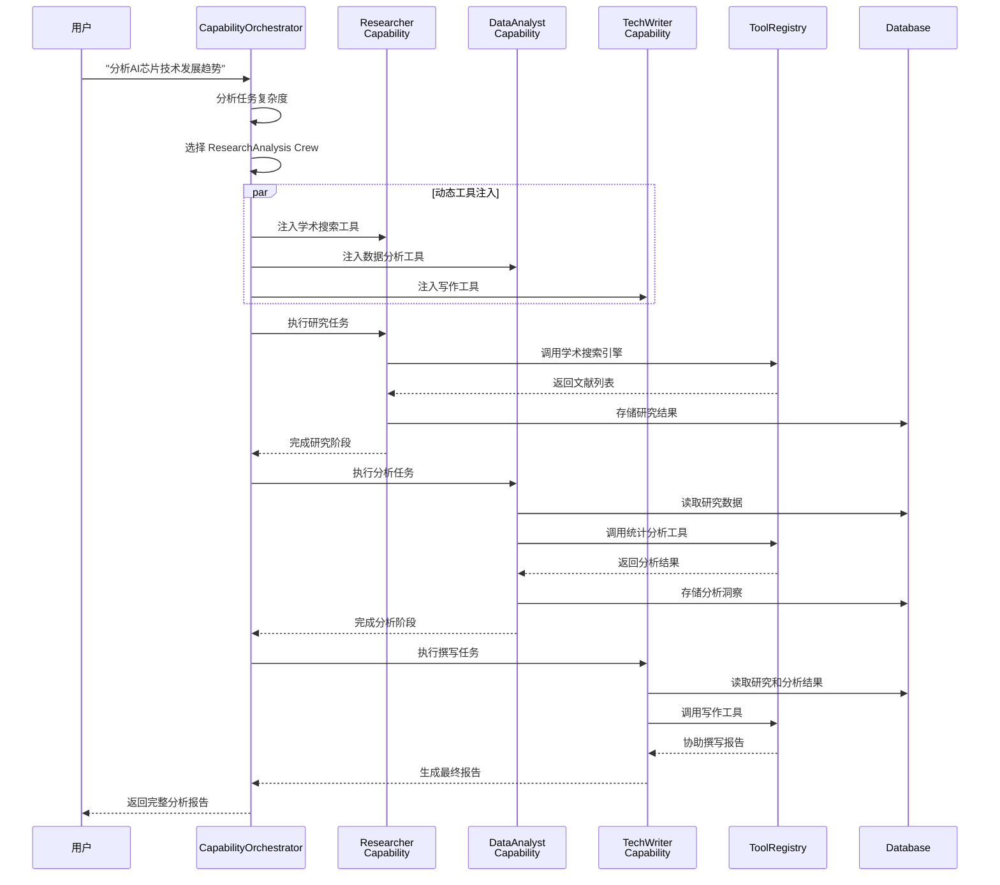
```mermaid
sequenceDiagram
    participant User as 用户
    participant CO as CapabilityOrchestrator
    participant RC as Researcher<br/>Capability
    participant DA as DataAnalyst<br/>Capability
    participant TW as TechWriter<br/>Capability
    participant TR as ToolRegistry
    participant DB as Database
    
    User->>CO: "分析AI芯片技术发展趋势"
    
    CO->>CO: 分析任务复杂度
    CO->>CO: 选择 ResearchAnalysis Crew
    
    par 动态工具注入
        CO->>RC: 注入学术搜索工具
        CO->>DA: 注入数据分析工具
        CO->>TW: 注入写作工具
    end
    
    CO->>RC: 执行研究任务
    RC->>TR: 调用学术搜索引擎
    TR-->>RC: 返回文献列表
    RC->>DB: 存储研究结果
    RC-->>CO: 完成研究阶段
    
    CO->>DA: 执行分析任务
    DA->>DB: 读取研究数据
    DA->>TR: 调用统计分析工具
    TR-->>DA: 返回分析结果
    DA->>DB: 存储分析洞察
    DA-->>CO: 完成分析阶段
    
    CO->>TW: 执行撰写任务
    TW->>DB: 读取研究和分析结果
    TW->>TR: 调用写作工具
    TR-->>TW: 协助撰写报告
    TW-->>CO: 生成最终报告
    
    CO-->>User: 返回完整分析报告
```

#### 与现有架构的无缝集成

```go
// 在现有的 Processor 管线中集成
type CapabilityCoordinationProcessor struct {
    coordinator *TaskCoordinator
    crewManager *CrewManager
}

func (p *CapabilityCoordinationProcessor) Process(ctx *BrainContext) error {
    // 1. 判断是否需要多 Capability 协作
    if p.requiresCollaboration(ctx.Intent) {
        // 2. 启动 Crew-style 编排
        return p.coordinator.Coordinate(ctx)
    }
    
    // 3. 否则使用传统的单 Capability 模式
    return p.executeSingleCapability(ctx)
}
```

这样就实现了：
✅ **Capability 角色化**：每个 Capability 成为有明确职责的"角色"
✅ **动态工具注入**：根据上下文为角色配备合适工具
✅ **协作编排**：支持顺序、并行、层次化的多角色协作
✅ **无缝集成**：与现有 Processor 管线完美融合

MindX 的 Capability 系统因此获得了类似 CrewAI 的强大协作能力！

除 LangChain 外，当前主流 AI Agent 框架各有特色，值得我们融合学习：

#### 1. **CrewAI - 角色化多智能体协作**

**核心理念**：将多 Agent 系统建模为人类团队协作，每个 Agent 有明确角色、背景故事和目标。

```python
# CrewAI 典型用法
from crewai import Agent, Task, Crew

# 定义角色化 Agents
researcher = Agent(
    role='资深研究员',
    goal='深入研究用户问题并收集权威信息',
    backstory='拥有10年研究经验的专家...',
    tools=[search_tool, read_tool]
)

writer = Agent(
    role='专业撰稿人',
    goal='将研究成果转化为高质量文章',
    backstory='科技媒体资深编辑...',
    tools=[write_tool]
)

# 定义任务流程
research_task = Task(
    description='研究人工智能发展趋势',
    agent=researcher
)

write_task = Task(
    description='撰写趋势分析报告',
    agent=writer,
    context=[research_task]  # 依赖前置任务
)

# 组装团队
crew = Crew(
    agents=[researcher, writer],
    tasks=[research_task, write_task],
    process=Process.sequential  # 顺序执行
)
```

**值得借鉴**：
- **角色化设计**：Agent 职责清晰，降低协作复杂度
- **任务依赖管理**：明确的前置任务和上下文传递
- **团队生命周期**：Crew 作为协作单元的完整生命周期管理

#### 2. **AutoGen - 对话式多 Agent 协作**

**核心理念**：Agent 通过结构化对话交流，通过消息传递迭代解决问题。

```python
# AutoGen 核心模式
from autogen import AssistantAgent, UserProxyAgent

# 定义对话参与者
assistant = AssistantAgent(
    name="assistant",
    system_message="你是一个 helpful AI 助手",
    llm_config={"config_list": config_list}
)

user_proxy = UserProxyAgent(
    name="user_proxy",
    human_input_mode="NEVER",  # 自动执行无需人工干预
    max_consecutive_auto_reply=10,  # 防止无限循环
    code_execution_config={"work_dir": "coding"}
)

# 启动对话
user_proxy.initiate_chat(
    assistant,
    message="帮我写一个Python爬虫程序"
)
```

**值得借鉴**：
- **消息驱动架构**：通过对话自然实现状态传递
- **内置代码执行**：Agent 可直接执行代码并验证结果
- **防循环机制**：最大回复次数限制防止失控

#### 3. **LlamaIndex - 知识导向的检索增强**

**核心理念**：以知识库为中心的 RAG 架构，Agent 作为知识检索和推理的协调者。

```python
# LlamaIndex Agentic RAG
from llama_index.core.agent import AgentRunner
from llama_index.core.tools import FunctionTool

# 定义知识工具
def search_knowledge(query: str) -> str:
    """搜索内部知识库"""
    # 实现检索逻辑
    return f"检索结果: {query}"

search_tool = FunctionTool.from_defaults(fn=search_knowledge)

# 创建智能 Agent
agent = AgentRunner.from_llm(
    tools=[search_tool],
    llm=llm,
    verbose=True
)

# 执行查询
response = agent.chat("公司最新的产品策略是什么？")
```

**值得借鉴**：
- **知识优先原则**：始终以检索到的事实为准
- **工具链抽象**：统一的 Tool 接口设计
- **链式推理**：支持多跳检索和推理

#### 4. **SuperAGI - 自主化编排架构**

**核心理念**：目标驱动的自主 Agent 编排，强调最小人工干预。

```yaml
# SuperAGI 配置示例
orchestrator:
  type: goal_oriented
  max_iterations: 50
  
agents:
  - name: researcher
    role: "信息搜集专家"
    tools: [web_search, document_reader]
    goals: ["收集相关资料", "验证信息准确性"]
    
  - name: analyzer  
    role: "数据分析专家"
    tools: [data_processor, visualization]
    goals: ["分析数据趋势", "生成洞察报告"]
    
workflow:
  entry_point: researcher
  coordination: decentralized  # 去中心化协调
  communication: message_passing
```

**值得借鉴**：
- **目标驱动**：以最终目标为导向的自主执行
- **去中心化协调**：Agent 间直接通信减少中心瓶颈
- **弹性容错**：Agent 失败时的自动恢复机制

#### 5. **MindX V2 融合创新方案**

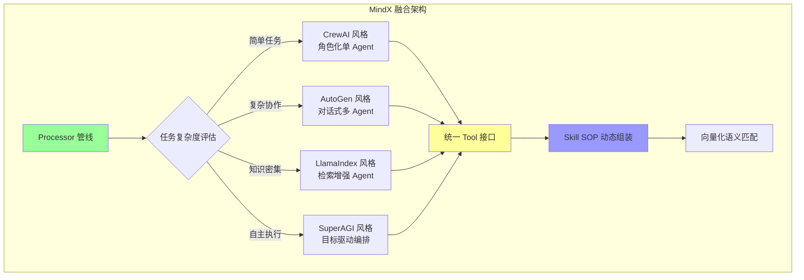
```mermaid
graph TB
    subgraph "MindX 融合架构"
        A[Processor 管线] --> B{任务复杂度评估}
        
        B -->|简单任务 | C[CrewAI 风格<br/>角色化单 Agent]
        B -->|复杂协作 | D[AutoGen 风格<br/>对话式多 Agent]
        B -->|知识密集 | E[LlamaIndex 风格<br/>检索增强 Agent]
        B -->|自主执行 | F[SuperAGI 风格<br/>目标驱动编排]
        
        C --> G[统一 Tool 接口]
        D --> G
        E --> G
        F --> G
        
        G --> H[Skill SOP 动态组装]
        H --> I[向量化语义匹配]
    end
    
    style A fill:#9f9
    style G fill:#ff9
    style H fill:#99f
```

**融合策略**：
1. **统一抽象层**：底层统一使用 Processor 管线
2. **策略模式**：根据任务特征选择最适合的协作模式
3. **工具标准化**：所有框架的工具都适配统一接口
4. **语义驱动**：Skill 向量化匹配决定执行策略

**具体实现**：
```go
type CollaborationStrategy int
const (
    StrategySimple     CollaborationStrategy = iota // CrewAI 风格
    StrategyConversational                          // AutoGen 风格  
    StrategyKnowledgeBased                          // LlamaIndex 风格
    StrategyAutonomous                              // SuperAGI 风格
)

type AdaptiveAgentOrchestrator struct {
    taskAnalyzer    *TaskComplexityAnalyzer
    strategyFactory *StrategyFactory
    toolRegistry    *UnifiedToolRegistry
}

func (o *AdaptiveAgentOrchestrator) Execute(ctx *BrainContext) error {
    // 1. 分析任务复杂度
    strategy := o.taskAnalyzer.Analyze(ctx.Intent)
    
    // 2. 选择执行策略
    executor := o.strategyFactory.Create(strategy)
    
    // 3. 执行并返回结果
    return executor.Execute(ctx)
}
```

这样 MindX 既能保持自身的技术优势，又能灵活吸收各家之长！

尽管我们在核心技术上有创新，但 LangChain 的一些设计思想值得融合：

#### 1. **文件系统组织的简洁性**
LangChain 的目录结构非常直观：
```
skills/
├── web-research/
│   ├── SKILL.md
│   └── research.py
├── sql-assistant/
│   ├── SKILL.md
│   └── database.py
```

**值得借鉴**：
- 保持类似的目录结构，便于开发者理解和维护
- SKILL.md 作为单一入口文件的设计很清晰

#### 2. **YAML Frontmatter 的元数据管理**
```yaml
---
name: web_research
version: 1.0
description: Web research and information gathering
tags: [research, web, scraping]
author: LangChain Team
---
```

**值得借鉴**：
- 使用 YAML 管理结构化元数据
- 支持标签系统，便于分类和搜索
- 版本控制，利于技能迭代管理

#### 3. **渐进式披露的核心思想**
LangChain 通过 YAML frontmatter 实现基础信息加载，需要时再加载完整内容。

**值得借鉴**：
- 分层加载机制：元数据 → SOP正文 → 工具细节
- 减少初始上下文负载

#### 4. **团队协作的分布式开发**
不同团队可以独立开发和维护各自的 Skills。

**值得借鉴**：
- 支持技能的模块化开发
- 独立的版本管理和发布流程

#### 5. **融合方案设计**

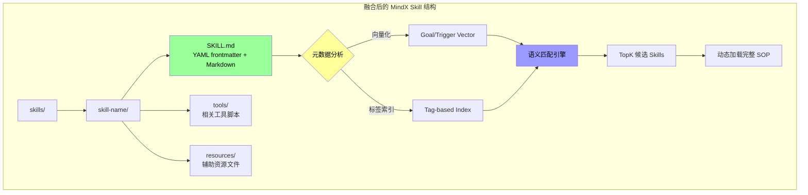
```mermaid
graph TB
    subgraph "融合后的 MindX Skill 结构"
        A[skills/] --> B[skill-name/]
        B --> C[SKILL.md<br/>YAML frontmatter + Markdown]
        B --> D[tools/<br/>相关工具脚本]
        B --> E[resources/<br/>辅助资源文件]
        
        C --> F{元数据分析}
        F -->|向量化 | G[Goal/Trigger Vector]
        F -->|标签索引 | H[Tag-based Index]
        
        G --> I[语义匹配引擎]
        H --> I
        
        I --> J[TopK 候选 Skills]
        J --> K[动态加载完整 SOP]
    end
    
    style C fill:#9f9,color:#000
    style F fill:#ff9,color:#000
    style I fill:#99f,color:#000
```

#### 6. **具体融合建议**

1. **保持目录结构兼容性**：
   ```bash
   # MindX 推荐的 Skill 目录结构
   skills/
   ├── travel-planner/
   │   ├── SKILL.md          # YAML + Markdown (LangChain 兼容)
   │   ├── tools/            # 工具脚本
   │   └── resources/        # 资源文件
   ```

2. **元数据标准化**：
   ```yaml
   # SKILL.md 的 YAML frontmatter
   ---
   name: travel_planner
   version: 1.0.0
   description: 旅行行程规划助手
   tags: [travel, planning, itinerary]
   author: MindX Team
   compatibility: mindx-v2
   vector_indexed: true      # 标识是否已向量化
   last_indexed: 2026-03-05T10:30:00Z
   ---
   ```

3. **双模索引机制**：
   - **向量索引**：语义匹配（MindX 创新）
   - **标签索引**：精确分类（LangChain 优势）
   - **混合排序**：综合相关性得分

4. **渐进加载优化**：
   ```go
   type SkillLoader struct {
       metadataCache map[string]*SkillMetadata  // YAML 元数据缓存
       sopCache      map[string]*SkillSOP       // SOP 正文缓存
       vectorIndex   *VectorIndex               // 向量索引
       tagIndex      *TagIndex                  // 标签索引
   }
   
   func (l *SkillLoader) LoadSkillProgressive(skillName string) *FullSkill {
       // 1. 先从缓存获取元数据（快速）
       meta := l.metadataCache[skillName]
       
       // 2. 如需完整内容，再加载 SOP（按需）
       if needFullContent {
           sop := l.sopCache[skillName]
           return &FullSkill{Metadata: meta, SOP: sop}
       }
       
       return &FullSkill{Metadata: meta} // 只返回元数据
   }
   ```

这样既保留了 LangChain 在组织结构和协作方面的优势，又融入了我们在语义理解和性能优化上的创新！

#### 核心差异对比

| 维度 | LangChain Skills | MindX V2 Skills |
|------|------------------|-----------------|
| **加载机制** | 文件系统扫描 + 手动注册 | 向量化索引 + 语义匹配 |
| **匹配方式** | 基于技能名称精确匹配 | 语义向量相似度搜索 |
| **Token 优化** | YAML frontmatter 渐进加载 | Goal/Trigger 双向量 + TopK 检索 |
| **动态性** | 启动时静态加载 | 运行时动态发现 + 缓存 |
| **扩展性** | 目录结构扁平化 | 支持层次化 Skill 组织 |

#### LangChain 的局限性

1. **语义理解不足**：只能基于技能名称匹配，无法理解用户意图的语义
2. **Token 消耗高**：需要预加载所有技能的 YAML 元数据
3. **扩展困难**：新增技能需要重启服务，无法热插拔
4. **缺乏智能排序**：多个匹配技能时缺乏语义相关性排序

#### MindX 的创新点

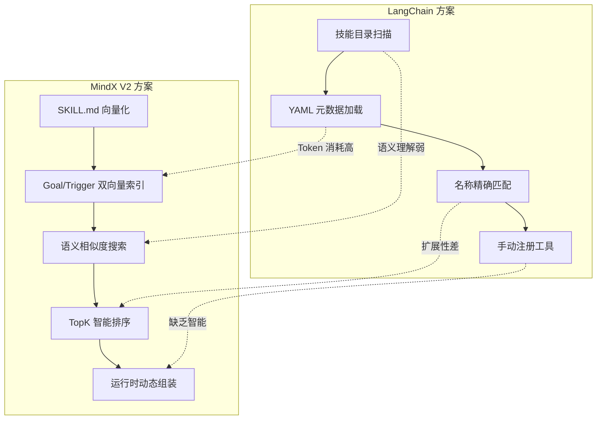
```mermaid
graph TB
    subgraph "LangChain 方案"
        A[技能目录扫描] --> B[YAML 元数据加载]
        B --> C[名称精确匹配]
        C --> D[手动注册工具]
    end
    
    subgraph "MindX V2 方案"
        E[SKILL.md 向量化] --> F[Goal/Trigger 双向量索引]
        F --> G[语义相似度搜索]
        G --> H[TopK 智能排序]
        H --> I[运行时动态组装]
    end
    
    A -.->|语义理解弱 | G
    B -.->|Token 消耗高 | F
    C -.->|扩展性差 | H
    D -.->|缺乏智能 | I
```

#### 技术实现优势

1. **向量语义匹配**：
   ```go
   // LangChain: 名称匹配
   if skill.Name == "web_research" {
       loadSkill(skill.Path)
   }
   
   // MindX: 语义匹配
   matches := skillRegistry.SearchByVector(userIntent, topK=3)
   // 返回: [旅行规划师(0.85), 出行助手(0.72), 天气查询(0.68)]
   ```

2. **渐进式 Token 优化**：
   ```mermaid
   graph LR
       A[用户查询] --> B{向量检索}
       B --> C[Top3 候选 Skills]
       C --> D[加载最优 SOP]
       D --> E[解析工具需求]
       E --> F[动态组装 Tools]
       
       style B fill:#9f9,color:#000
       style C fill:#ff9,color:#000
       style D fill:#99f,color:#000
   ```

3. **运行时热插拔**：
   - 支持新增 Skill 无需重启
   - 后台异步重建向量索引
   - LRU 缓存热门 Skills

### 4.2 MCP 与 Tool 工作原理

#### 4.2.1 统一工具调用架构

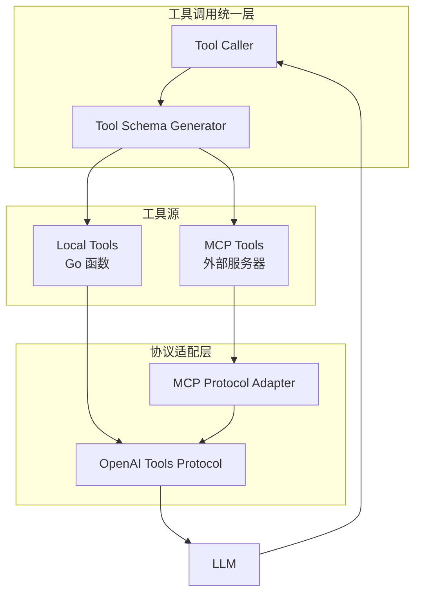
```mermaid
graph TB
    subgraph "工具调用统一层"
        TC[Tool Caller]
        TS[Tool Schema Generator]
    end
    
    subgraph "工具源"
        LT[Local Tools<br/>Go 函数]
        MT[MCP Tools<br/>外部服务器]
    end
    
    subgraph "协议适配层"
        OA[OpenAI Tools Protocol]
        MA[MCP Protocol Adapter]
    end
    
    LLM --> TC
    TC --> TS
    TS --> LT
    TS --> MT
    
    LT --> OA
    MT --> MA
    MA --> OA
    
    OA --> LLM
```

#### 4.2.2 MCP 工作流程

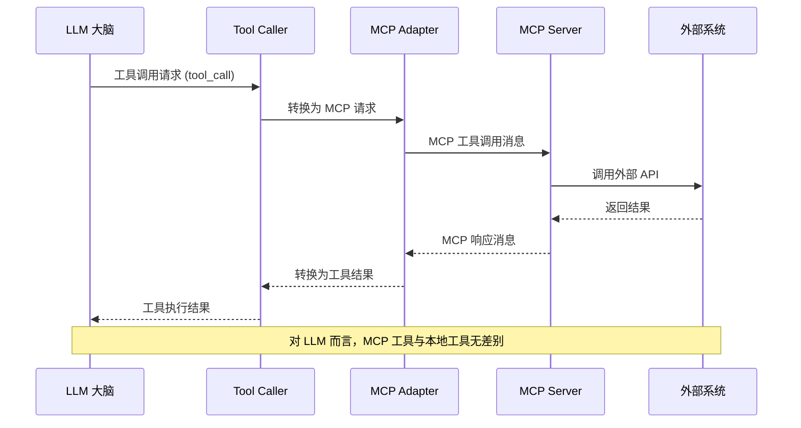
```mermaid
sequenceDiagram
    participant LLM as LLM 大脑
    participant TC as Tool Caller
    participant MA as MCP Adapter
    participant MS as MCP Server
    participant Ext as 外部系统
    
    LLM->>TC: 工具调用请求 (tool_call)
    TC->>MA: 转换为 MCP 请求
    MA->>MS: MCP 工具调用消息
    MS->>Ext: 调用外部 API
    Ext-->>MS: 返回结果
    MS-->>MA: MCP 响应消息
    MA-->>TC: 转换为工具结果
    TC-->>LLM: 工具执行结果
    
    note over LLM,Ext: 对 LLM 而言，MCP 工具与本地工具无差别
```

#### 4.2.3 Tool Schema 生成机制

```go
// 统一的工具描述结构
type ToolSchema struct {
    Name        string      `json:"name"`
    Description string      `json:"description"`
    Parameters  ParameterSchema `json:"parameters"`
    Source      ToolSource  `json:"source"`  // LOCAL | MCP
}

type ToolSource string
const (
    ToolSourceLocal ToolSource = "local"
    ToolSourceMCP   ToolSource = "mcp"
)

// Schema 生成流程
func GenerateToolSchema(tool interface{}) (*ToolSchema, error) {
    switch src := tool.(type) {
    case LocalTool:
        return generateFromGoFunc(src.Func)
    case MCPTool:
        return generateFromMCPDefinition(src.Definition)
    default:
        return nil, errors.New("unsupported tool type")
    }
}
```

#### 4.2.4 工具执行统一接口

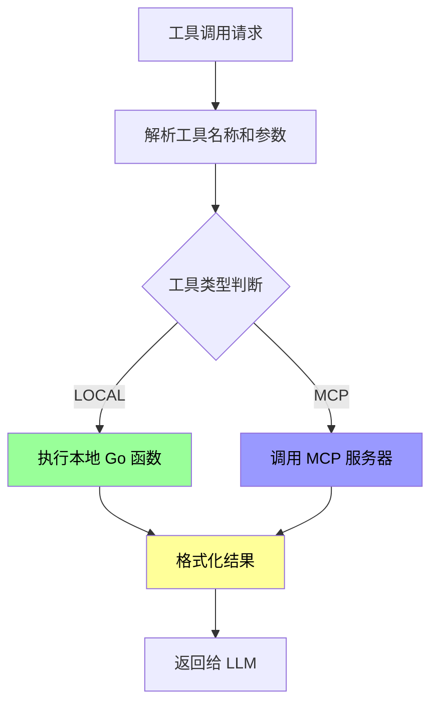
```mermaid
flowchart TD
    Start[工具调用请求] --> Parse[解析工具名称和参数]
    Parse --> Route{工具类型判断}
    
    Route -->|LOCAL | ExecuteLocal[执行本地 Go 函数]
    Route -->|MCP | ExecuteMCP[调用 MCP 服务器]
    
    ExecuteLocal --> Format[格式化结果]
    ExecuteMCP --> Format
    
    Format --> Return[返回给 LLM]
    
    style ExecuteLocal fill:#9f9,color:#000
    style ExecuteMCP fill:#99f,color:#000
    style Format fill:#ff9,color:#000
```

### 4.3 向量索引与检索机制

#### 4.3.1 Skill 向量化策略

```mermaid
graph LR
    A[SKILL.md] --> B{提取关键段落}
    B --> C[Goal 段落]
    B --> D[Trigger 段落]
    
    C --> E[生成 GoalVector]
    D --> F[生成 TriggerVector]
    
    E --> G[(BadgerDB 索引)]
    F --> G
    
    H[用户查询] --> I[生成查询向量]
    I --> J{相似度计算}
    G --> J
    J --> K[TopK 匹配结果]
```

#### 4.3.2 多向量混合检索

```go
type SkillMatcher struct {
    goalIndex    VectorIndex  // Goal 向量索引
    triggerIndex VectorIndex  // Trigger 向量索引
    keywordIndex KeywordIndex // 关键词倒排索引
}

func (m *SkillMatcher) Search(query string, topK int) ([]*SkillMatch, error) {
    // 1. 向量检索
    goalMatches := m.goalIndex.Search(query, topK*2)
    triggerMatches := m.triggerIndex.Search(query, topK*2)
    
    // 2. 关键词检索
    keywordMatches := m.keywordIndex.Search(query)
    
    // 3. 融合排序
    return m.fuseAndRank([][]*SkillMatch{
        goalMatches,
        triggerMatches,
        keywordMatches,
    }, topK)
}
```

---

## 5. 数据存储设计

### 5.1 BadgerDB 键值结构

```go
// Key 前缀约定
const (
    PrefixDialogState     = "dialog:"      // dialog:{session_id}
    PrefixSkillIndex      = "skill_idx:"   // skill_idx:{skill_name}
    PrefixEmotionVectors  = "emotion_vec:" // emotion_vec:{session_id}
    PrefixMemoryVectors   = "memory_vec:"  // memory_vec:{memory_id}
)

// Value 结构
type DialogStateValue struct {
    SessionID     string
    StateJSON     []byte // 序列化的 ClarificationDialog
    CompressedAt  time.Time
    ExpiresAt     time.Time
}

type SkillIndexValue struct {
    SkillName     string
    GoalVector    []float32  // "目标"段落的向量
    TriggerVector []float32  // "触发条件"段落的向量
    Keywords      []string   // 关键词列表
    RequiredTools []string   // 所需工具列表
    SOPPath       string     // SKILL.md文件路径
    IndexedAt     time.Time
}
```

### 5.2 向量服务接口

```go
type VectorService interface {
    // 生成向量
    Embed(text string) ([]float32, error)
    
    // 计算余弦相似度
    CosineSimilarity(vec1, vec2 []float32) float32
    
    // 批量搜索 TopK
    SearchTopK(collection string, queryVec []float32, topK int) ([]VectorResult, error)
}

// 应用场景：
// 1. Skill 匹配（GoalVector + TriggerVector）
// 2. 记忆检索（记忆点向量）
// 3. 情感语义匹配（历史情感向量）
```

---

## 6. 迁移路径

### 6.1 分阶段实施计划

```mermaid
gantt
    title MindX V2 架构迁移路线图
    dateFormat  YYYY-MM-DD
    section Phase 1
    情感分析模块实现       :a1, 2026-03-05, 7d
    多级意图识别管道       :a2, after a1, 10d
    section Phase 2
    处理器管线重构         :b1, 2026-03-22, 14d
    并行处理优化           :b2, after b1, 7d
    section Phase 3
    Skill SOP 规范化       :c1, 2026-04-05, 14d
    运行时动态组装          :c2, after c1, 10d
    section Phase 4
    多轮对话澄清机制        :d1, 2026-04-19, 14d
    对话状态持久化          :d2, after d1, 7d
    section Phase 5
    全系统集成测试         :e1, 2026-05-03, 14d
```

---

## 7. 附录

### 7.1 术语表

| 术语 | 定义 |
|------|------|
| SOP | Standard Operating Procedure，标准操作程序 |
| Processor | 处理器，负责单一职责的数据处理单元 |
| Pipeline | 处理器管线，按顺序执行多个处理器 |
| ThinkContext | 共享上下文对象，在管线中传递和丰富 |
| ClarificationDialog | 多轮对话澄清机制 |
| FallbackStrategy | 降级策略 |

### 7.2 参考文档

- [Agentskills.io Specification](https://agentskills.io/specification)
- [MindX V1 问题文档](../../docs/v2/01-problem.md)
- [MindX V1 架构文档](../../.qoder/repowiki/zh/content/系统架构设计/整体架构概览.md)

---

**文档状态**：草稿 v2.0  