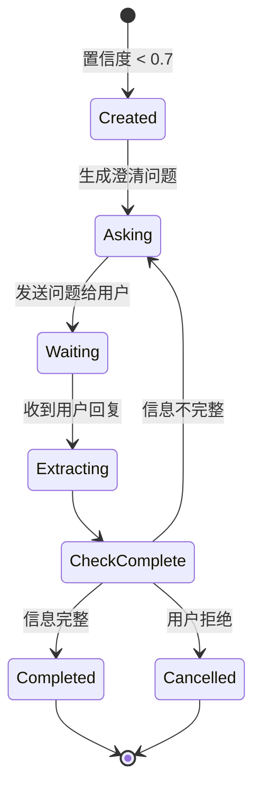

# MindX V2 处理器详细设计

> 版本：2.0 | 日期：2026-03-05
>
> 目的：详细设计各个处理器的实现逻辑、接口和交互方式

---

## 1. IntentProcessor - 意图识别处理器

### 1.1 职责

- 从用户输入中识别意图类型
- 提取关键词
- 计算置信度
- 生成候选意图列表

### 1.2 实现设计

```go
type IntentProcessor struct {
    localModel  LLM  // 本地量化模型
    cloudModel  LLM  // 云端大模型（降级用）
    confidence  float64 // 置信度阈值
}

func (p *IntentProcessor) Process(ctx *ThinkContext) error {
    // 1. 使用本地模型识别意图
    result, err := p.localModel.RecognizeIntent(ctx.Input)
    if err != nil {
        return fmt.Errorf("local model failed: %w", err)
    }

    // 2. 填充意图上下文
    ctx.Intent = &IntentContext{
        Type:       result.Type,
        Keywords:   result.Keywords,
        Confidence: result.Confidence,
        Candidates: result.Candidates,
    }

    // 3. 检查置信度
    if ctx.Intent.Confidence < p.confidence {
        return ErrLowConfidence
    }

    return nil
}

func (p *IntentProcessor) CanFallback() bool {
    return true
}

func (p *IntentProcessor) Dependencies() []string {
    return []string{} // 无依赖
}
```

### 1.3 Prompt 设计

```go
const IntentRecognitionPrompt = `
你是一个意图识别专家。分析用户输入，识别其意图类型。

用户输入：{{.Input}}

请以 JSON 格式返回：
{
  "type": "意图类型（weather_query/schedule_create/message_send/general_chat等）",
  "keywords": ["关键词1", "关键词2"],
  "confidence": 0.85,
  "candidates": [
    {"type": "候选意图1", "confidence": 0.85},
    {"type": "候选意图2", "confidence": 0.65}
  ]
}
`
```

### 1.4 降级策略

```go
type IntentFallbackStrategy struct {
    cloudModel LLM
}

func (s *IntentFallbackStrategy) Fallback(ctx *ThinkContext, err error) error {
    if errors.Is(err, ErrLowConfidence) {
        // 置信度低 -> 升级到云端模型
        result, err := s.cloudModel.RecognizeIntent(ctx.Input)
        if err != nil {
            return err
        }

        ctx.Intent = &IntentContext{
            Type:       result.Type,
            Keywords:   result.Keywords,
            Confidence: result.Confidence,
            Candidates: result.Candidates,
        }

        // 如果云端模型置信度仍然低，触发澄清
        if ctx.Intent.Confidence < 0.7 {
            ctx.Clarification = NewClarificationDialog(ctx.Intent)
        }
    }

    return nil
}
```

---

## 2. EmotionProcessor - 情感分析处理器

### 2.1 职责

- 分析用户输入的情感倾向
- 识别紧急度
- 为响应策略提供依据

### 2.2 实现设计

```go
type EmotionProcessor struct {
    model LLM
}

type EmotionType string

const (
    EmotionCalm    EmotionType = "calm"     // 平静
    EmotionUrgent  EmotionType = "urgent"   // 焦急
    EmotionAngry   EmotionType = "angry"    // 不满
    EmotionNeutral EmotionType = "neutral"  // 中性
)

func (p *EmotionProcessor) Process(ctx *ThinkContext) error {
    // 1. 分析情感
    result, err := p.model.AnalyzeEmotion(ctx.Input)
    if err != nil {
        // 情感分析失败不影响核心功能，使用默认值
        ctx.Emotion = &EmotionResult{
            Primary:   EmotionNeutral,
            Intensity: 0.5,
            Urgency:   3,
        }
        return nil // 不返回错误
    }

    // 2. 填充情感结果
    ctx.Emotion = &EmotionResult{
        Primary:   result.Primary,
        Intensity: result.Intensity,
        Urgency:   result.Urgency,
    }

    return nil
}

func (p *EmotionProcessor) CanFallback() bool {
    return false // 失败时使用默认值，不需要降级
}

func (p *EmotionProcessor) Dependencies() []string {
    return []string{} // 无依赖，可与 IntentProcessor 并行
}
```

### 2.3 Prompt 设计

```go
const EmotionAnalysisPrompt = `
分析用户输入的情感倾向和紧急度。

用户输入：{{.Input}}

考虑因素：
- 标点符号（！！表示强烈情绪）
- 语气词（呵呵、哎、唉等）
- 用词强度（立刻、马上、赶紧等）
- 上下文情绪

返回 JSON：
{
  "primary": "urgent/calm/angry/neutral",
  "intensity": 0.8,
  "urgency": 4
}
`
```

### 2.4 响应策略映射

```go
func (p *EmotionProcessor) GetResponseStrategy(emotion *EmotionResult) ResponseStrategy {
    switch emotion.Primary {
    case EmotionUrgent:
        return ResponseStrategy{
            Style:   "简洁直接",
            MaxLen:  100,
            Details: false,
        }
    case EmotionAngry:
        return ResponseStrategy{
            Style:   "共情 + 解决方案",
            MaxLen:  200,
            Details: true,
        }
    case EmotionCalm:
        return ResponseStrategy{
            Style:   "详细解释",
            MaxLen:  500,
            Details: true,
        }
    default:
        return ResponseStrategy{
            Style:   "正常",
            MaxLen:  300,
            Details: true,
        }
    }
}
```

---

## 3. ClarificationProcessor - 澄清对话处理器

### 3.1 职责

- 检查意图置信度
- 生成澄清问题
- 管理多轮对话状态
- 从用户回复中提取信息

### 3.2 实现设计

```go
type ClarificationProcessor struct {
    model     LLM
    threshold float64 // 触发澄清的置信度阈值
}

type ClarificationDialog struct {
    SessionID      string
    OriginalIntent *IntentContext
    Questions      []string
    UserReplies    []string
    ExtractedInfo  map[string]interface{}
    State          DialogState
    CreatedAt      time.Time
}

type DialogState string

const (
    DialogStateCreated   DialogState = "created"
    DialogStateAsking    DialogState = "asking"
    DialogStateWaiting   DialogState = "waiting"
    DialogStateCompleted DialogState = "completed"
    DialogStateCancelled DialogState = "cancelled"
)

func (p *ClarificationProcessor) Process(ctx *ThinkContext) error {
    // 1. 检查是否需要澄清
    if ctx.Intent.Confidence >= p.threshold {
        return nil // 置信度足够，无需澄清
    }

    // 2. 检查是否已有澄清对话
    if ctx.Clarification != nil {
        return p.continueDialog(ctx)
    }

    // 3. 创建新的澄清对话
    return p.startDialog(ctx)
}

func (p *ClarificationProcessor) startDialog(ctx *ThinkContext) error {
    // 生成澄清问题
    questions, err := p.generateQuestions(ctx.Intent)
    if err != nil {
        return err
    }

    ctx.Clarification = &ClarificationDialog{
        SessionID:      ctx.SessionID,
        OriginalIntent: ctx.Intent,
        Questions:      questions,
        State:          DialogStateAsking,
        CreatedAt:      time.Now(),
    }

    // 设置响应为澄清问题
    ctx.Response = questions[0]

    return ErrNeedClarification // 特殊错误，表示需要用户回复
}

func (p *ClarificationProcessor) continueDialog(ctx *ThinkContext) error {
    dialog := ctx.Clarification

    // 1. 提取用户回复中的信息
    info, err := p.extractInfo(ctx.Input, dialog.OriginalIntent)
    if err != nil {
        return err
    }

    // 2. 更新已提取信息
    for k, v := range info {
        dialog.ExtractedInfo[k] = v
    }
    dialog.UserReplies = append(dialog.UserReplies, ctx.Input)

    // 3. 检查是否还有未澄清的字段
    if p.isComplete(dialog) {
        dialog.State = DialogStateCompleted
        // 更新意图上下文
        p.updateIntent(ctx.Intent, dialog.ExtractedInfo)
        return nil
    }

    // 4. 生成下一个问题
    nextQuestion := p.generateNextQuestion(dialog)
    ctx.Response = nextQuestion
    dialog.State = DialogStateWaiting

    return ErrNeedClarification
}

func (p *ClarificationProcessor) generateQuestions(intent *IntentContext) ([]string, error) {
    prompt := fmt.Sprintf(`
用户意图不明确，需要澄清。

意图类型：%s
候选意图：%v
置信度：%.2f

请生成 1-2 个澄清问题，帮助明确用户真实意图。
问题应该简洁、直接、易于回答。

返回 JSON 数组：["问题1", "问题2"]
`, intent.Type, intent.Candidates, intent.Confidence)

    result, err := p.model.Generate(prompt)
    if err != nil {
        return nil, err
    }

    var questions []string
    if err := json.Unmarshal([]byte(result), &questions); err != nil {
        return nil, err
    }

    return questions, nil
}
```

### 3.3 状态机



---

## 4. MemoryRetrievalProcessor - 记忆检索处理器

### 4.1 职责

- 基于关键词检索相关记忆
- 向量相似度搜索
- 记忆点排序和过滤

### 4.2 实现设计

```go
type MemoryRetrievalProcessor struct {
    memoryStore   MemoryStore
    vectorService VectorService
    topK          int
}

func (p *MemoryRetrievalProcessor) Process(ctx *ThinkContext) error {
    // 1. 提取搜索关键词
    keywords := ctx.Intent.Keywords
    if len(keywords) == 0 {
        return nil // 无关键词，跳过记忆检索
    }

    // 2. 向量检索
    queryVec, err := p.vectorService.Embed(ctx.Input)
    if err != nil {
        // 记忆检索失败不影响核心功能
        return nil
    }

    memories, err := p.memoryStore.SearchByVector(queryVec, p.topK)
    if err != nil {
        return nil
    }

    // 3. 关键词过滤
    filtered := p.filterByKeywords(memories, keywords)

    // 4. 填充上下文
    ctx.Memories = filtered

    return nil
}

func (p *MemoryRetrievalProcessor) filterByKeywords(
    memories []*MemoryPoint,
    keywords []string,
) []*MemoryPoint {
    var result []*MemoryPoint
    for _, mem := range memories {
        if p.matchKeywords(mem, keywords) {
            result = append(result, mem)
        }
    }
    return result
}

func (p *MemoryRetrievalProcessor) Dependencies() []string {
    return []string{"IntentProcessor"} // 依赖意图识别的关键词
}
```

---

## 5. SkillMatchProcessor - 技能匹配处理器

### 5.1 职责

- 向量匹配 Skill SOP
- 动态组装 Tools
- 生成工具 Schema

### 5.2 实现设计

```go
type SkillMatchProcessor struct {
    skillRegistry *SkillRegistry
    toolRegistry  *ToolRegistry
    mcpClient     *MCPClient
    topK          int
}

func (p *SkillMatchProcessor) Process(ctx *ThinkContext) error {
    // 1. 向量匹配 Skills
    matches, err := p.skillRegistry.SearchByIntent(ctx.Intent, p.topK)
    if err != nil {
        return err
    }

    if len(matches) == 0 {
        return nil // 无匹配技能
    }

    // 2. 选择最优 Skill
    bestSkill := matches[0]
    ctx.MatchedSkills = []*SkillSOP{bestSkill}

    // 3. 加载 SOP 全文
    sop, err := p.skillRegistry.LoadSOP(bestSkill.Name)
    if err != nil {
        return err
    }

    // 4. 解析所需工具
    requiredTools, err := p.parseRequiredTools(sop)
    if err != nil {
        return err
    }

    // 5. 动态组装 Tools
    tools, err := p.assembleTools(requiredTools)
    if err != nil {
        return err
    }

    ctx.Tools = tools

    return nil
}

func (p *SkillMatchProcessor) assembleTools(required []string) ([]ToolSchema, error) {
    var tools []ToolSchema

    for _, name := range required {
        // 先从本地 Tool 库查找
        if tool, ok := p.toolRegistry.Get(name); ok {
            tools = append(tools, tool.Schema())
            continue
        }

        // 再从 MCP 服务器查找
        if tool, ok := p.mcpClient.GetTool(name); ok {
            tools = append(tools, tool.Schema())
            continue
        }

        // 工具未找到，记录警告但不中断
        log.Warnf("tool not found: %s", name)
    }

    return tools, nil
}

func (p *SkillMatchProcessor) Dependencies() []string {
    return []string{"IntentProcessor"} // 依赖意图识别
}
```

---

## 6. ToolExecutionProcessor - 工具执行处理器

### 6.1 职责

- 调用 LLM 决定工具调用
- 执行工具（本地 Tool 或 MCP）
- 收集工具执行结果

### 6.2 实现设计

```go
type ToolExecutionProcessor struct {
    llm          LLM
    toolRegistry *ToolRegistry
    mcpClient    *MCPClient
}

func (p *ToolExecutionProcessor) Process(ctx *ThinkContext) error {
    if len(ctx.Tools) == 0 {
        return nil // 无可用工具
    }

    // 1. LLM 决定工具调用
    toolCalls, err := p.llm.DecideToolCalls(ctx.Input, ctx.Tools)
    if err != nil {
        return err
    }

    if len(toolCalls) == 0 {
        return nil // LLM 决定不调用工具
    }

    // 2. 执行工具调用
    results := make([]ToolExecResult, 0, len(toolCalls))
    for _, call := range toolCalls {
        result, err := p.executeTool(call)
        if err != nil {
            // 单个工具失败不中断整个流程
            result = ToolExecResult{
                ToolCallID:   call.ID,
                FunctionName: call.Name,
                Error:        err.Error(),
            }
        }
        results = append(results, result)
    }

    ctx.ToolResults = results

    return nil
}

func (p *ToolExecutionProcessor) executeTool(call ToolCall) (ToolExecResult, error) {
    // 1. 判断工具类型
    if tool, ok := p.toolRegistry.Get(call.Name); ok {
        // 本地工具
        return p.executeLocalTool(tool, call)
    }

    if tool, ok := p.mcpClient.GetTool(call.Name); ok {
        // MCP 工具
        return p.executeMCPTool(tool, call)
    }

    return ToolExecResult{}, fmt.Errorf("tool not found: %s", call.Name)
}

func (p *ToolExecutionProcessor) Dependencies() []string {
    return []string{"SkillMatchProcessor"} // 依赖技能匹配提供的工具列表
}
```

---

## 7. ResponseProcessor - 响应生成处理器

### 7.1 职责

- 综合所有上下文信息
- 生成最终响应
- 应用情感响应策略

### 7.2 实现设计

```go
type ResponseProcessor struct {
    llm LLM
}

func (p *ResponseProcessor) Process(ctx *ThinkContext) error {
    // 1. 构建响应生成 Prompt
    prompt := p.buildPrompt(ctx)

    // 2. 生成响应
    response, err := p.llm.Generate(prompt)
    if err != nil {
        return err
    }

    // 3. 应用情感响应策略
    if ctx.Emotion != nil {
        response = p.applyEmotionStrategy(response, ctx.Emotion)
    }

    ctx.Response = response

    return nil
}

func (p *ResponseProcessor) buildPrompt(ctx *ThinkContext) string {
    var builder strings.Builder

    // 用户输入
    builder.WriteString(fmt.Sprintf("用户输入：%s\n\n", ctx.Input))

    // 意图信息
    if ctx.Intent != nil {
        builder.WriteString(fmt.Sprintf("意图类型：%s\n", ctx.Intent.Type))
        builder.WriteString(fmt.Sprintf("关键词：%v\n\n", ctx.Intent.Keywords))
    }

    // 记忆信息
    if len(ctx.Memories) > 0 {
        builder.WriteString("相关记忆：\n")
        for _, mem := range ctx.Memories {
            builder.WriteString(fmt.Sprintf("- %s\n", mem.Content))
        }
        builder.WriteString("\n")
    }

    // 工具执行结果
    if len(ctx.ToolResults) > 0 {
        builder.WriteString("工具执行结果：\n")
        for _, result := range ctx.ToolResults {
            builder.WriteString(fmt.Sprintf("- %s: %s\n", result.FunctionName, result.Result))
        }
        builder.WriteString("\n")
    }

    // 响应要求
    builder.WriteString("请基于以上信息生成回复。")

    return builder.String()
}

func (p *ResponseProcessor) applyEmotionStrategy(
    response string,
    emotion *EmotionResult,
) string {
    switch emotion.Primary {
    case EmotionUrgent:
        // 焦急情绪 -> 简化响应
        return p.simplify(response, 100)
    case EmotionAngry:
        // 不满情绪 -> 添加共情前缀
        return "我理解您的感受。" + response
    default:
        return response
    }
}

func (p *ResponseProcessor) Dependencies() []string {
    return []string{
        "IntentProcessor",
        "MemoryRetrievalProcessor",
        "ToolExecutionProcessor",
    }
}
```

---

## 8. 处理器注册与管理

### 8.1 处理器工厂

```go
type ProcessorFactory struct {
    llm           LLM
    memoryStore   MemoryStore
    skillRegistry *SkillRegistry
    toolRegistry  *ToolRegistry
    mcpClient     *MCPClient
}

func (f *ProcessorFactory) CreateDefaultPipeline() *BrainPipeline {
    return NewBrainPipeline(
        NewIntentProcessor(f.llm),
        NewEmotionProcessor(f.llm),
        NewClarificationProcessor(f.llm, 0.7),
        NewMemoryRetrievalProcessor(f.memoryStore, f.vectorService, 5),
        NewSkillMatchProcessor(f.skillRegistry, f.toolRegistry, f.mcpClient, 3),
        NewToolExecutionProcessor(f.llm, f.toolRegistry, f.mcpClient),
        NewResponseProcessor(f.llm),
    )
}
```

### 8.2 处理器配置

```yaml
# config/processors.yml
processors:
  intent:
    confidence_threshold: 0.7
    local_model: "qwen2.5:3b"
    cloud_model: "gpt-4"

  emotion:
    enabled: true
    model: "qwen2.5:3b"

  clarification:
    enabled: true
    threshold: 0.7
    max_rounds: 3

  memory:
    enabled: true
    top_k: 5

  skill:
    enabled: true
    top_k: 3

  tool:
    enabled: true
    timeout: 30s

  response:
    max_length: 500
```

---

## 9. 性能优化

### 9.1 并行执行

```go
func (p *BrainPipeline) executeStage(stage ProcessorStage, ctx *ThinkContext) error {
    if !stage.Parallel {
        // 串行执行
        for _, processor := range stage.Processors {
            if err := processor.Process(ctx); err != nil {
                return p.handleError(processor, ctx, err)
            }
        }
        return nil
    }

    // 并行执行
    var wg sync.WaitGroup
    errChan := make(chan error, len(stage.Processors))

    for _, processor := range stage.Processors {
        wg.Add(1)
        go func(p Processor) {
            defer wg.Done()
            if err := p.Process(ctx); err != nil {
                errChan <- p.handleError(p, ctx, err)
            }
        }(processor)
    }

    wg.Wait()
    close(errChan)

    // 收集错误
    for err := range errChan {
        if err != nil {
            return err
        }
    }

    return nil
}
```

### 9.2 缓存策略

```go
type ProcessorCache struct {
    intentCache  *lru.Cache
    emotionCache *lru.Cache
    skillCache   *lru.Cache
}

func (c *ProcessorCache) GetIntent(input string) (*IntentContext, bool) {
    if val, ok := c.intentCache.Get(input); ok {
        return val.(*IntentContext), true
    }
    return nil, false
}
```

---

## 10. 监控与调试

### 10.1 处理器日志

```go
func (p *IntentProcessor) Process(ctx *ThinkContext) error {
    start := time.Now()
    defer func() {
        log.Infof("IntentProcessor executed in %v", time.Since(start))
    }()

    // 处理逻辑...
}
```

### 10.2 性能指标

```go
type ProcessorMetrics struct {
    Name          string
    ExecutionTime time.Duration
    Success       bool
    Fallback      bool
    CacheHit      bool
}

func (p *BrainPipeline) collectMetrics() PipelineMetrics {
    // 收集各处理器的性能指标
}
```

---

## 下一步

- 🔧 Skill 系统设计：参见 `04-skill-system.md`
- 🚀 未来增强特性：参见 `05-future-enhancements.md`
- 📋 迁移实施计划：参见 `06-migration-plan.md`
