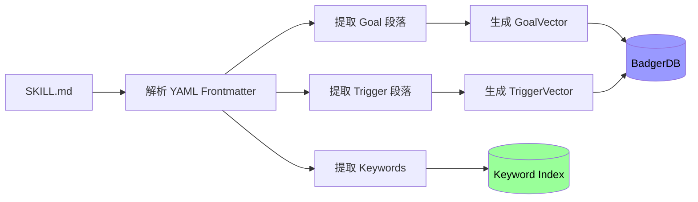
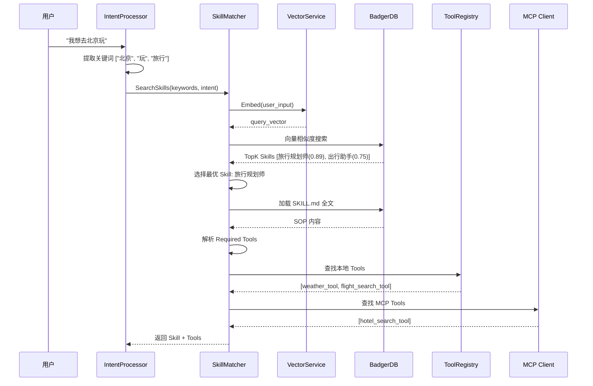

# MindX V2 Skill 系统设计

> 版本：2.0 | 日期：2026-03-05
>
> 目的：重新设计 Skill 系统，遵循 agentskills.io 规范，实现声明式 SOP + 运行时动态组装

---

## 1. 核心理念

### 1.1 Skill 的本质

**标准定义**（来自 [agentskills.io](https://agentskills.io/specification)）：
- Skill 是**声明式的能力描述**，定义"做什么"和"何时使用"
- Skill 是**SOP（标准操作程序）**，而非可执行代码
- Skill 是**资源包**，包含目标、触发条件、执行步骤、所需工具

**V1 的问题**：
- 将 Skill 等同于可执行工具（命令式实现）
- 包含具体执行逻辑和依赖管理
- 用户扩展成本高

**V2 的改进**：
- Skill = 声明式 SOP 文档（SKILL.md）
- Tool = 可执行工具（Go 函数或 MCP 服务）
- 运行时动态组装：LLM 读取 SOP → 查找 Tools → 执行

---

## 2. Skill 文件结构

### 2.1 目录组织

```
skills/
├── travel-planner/
│   ├── SKILL.md              # SOP 文档（核心）
│   ├── resources/            # 辅助资源
│   │   ├── templates/        # 模板文件
│   │   └── examples/         # 示例数据
│   └── .skill-meta.json      # 元数据缓存（自动生成）
│
├── code-reviewer/
│   ├── SKILL.md
│   └── resources/
│
└── meeting-scheduler/
    └── SKILL.md
```

### 2.2 SKILL.md 标准结构

```markdown
---
name: travel_planner
version: 1.0.0
description: 帮助用户规划完整的旅行行程
tags: [travel, planning, itinerary]
author: MindX Team
compatibility: mindx-v2
---

# Skill: 旅行规划师

## 目标（Goal）
帮助用户规划完整的旅行行程，包括交通、住宿、景点推荐和行程安排。

## 触发条件（Trigger）
当用户提到以下关键词或语义时触发：
- "旅行"、"出游"、"行程规划"
- "订机票"、"订酒店"、"景点推荐"
- "去XX玩"、"XX旅游攻略"

## 前置条件（Prerequisites）
- 用户需提供：目的地、出行时间
- 可选信息：预算范围、同行人数、偏好类型

## 执行步骤（Steps）

### 1. 收集基本信息
如果用户未提供完整信息，依次询问：
- 目的地（必需）
- 出行时间（必需）
- 预算范围（可选，默认：中等）
- 同行人数（可选，默认：1人）

### 2. 查询天气信息
调用 `weather_tool` 查询目的地未来7天天气：
```json
{
  "tool": "weather_tool",
  "params": {
    "location": "{{destination}}",
    "days": 7
  }
}
```

### 3. 搜索交通方案
调用 `flight_search_tool` 查询往返机票：
```json
{
  "tool": "flight_search_tool",
  "params": {
    "from": "{{user_location}}",
    "to": "{{destination}}",
    "departure_date": "{{start_date}}",
    "return_date": "{{end_date}}"
  }
}
```

### 4. 推荐住宿
调用 `hotel_search_tool` 根据预算筛选酒店：
```json
{
  "tool": "hotel_search_tool",
  "params": {
    "location": "{{destination}}",
    "check_in": "{{start_date}}",
    "check_out": "{{end_date}}",
    "budget": "{{budget}}"
  }
}
```

### 5. 生成行程表
综合以上信息，生成详细行程表，包括：
- 每日行程安排
- 交通方式和时间
- 住宿信息
- 预算明细

## 所需工具（Required Tools）
- `weather_tool` (必需) - 天气查询
- `flight_search_tool` (必需) - 机票搜索
- `hotel_search_tool` (必需) - 酒店搜索
- `map_tool` (可选) - 地图导航

## 输出格式（Output Format）
以 Markdown 表格形式输出行程表：

| 日期 | 行程 | 交通 | 住宿 | 预算 |
|------|------|------|------|------|
| Day 1 | ... | ... | ... | ... |

## 异常处理（Error Handling）
- 如果用户未提供目的地 → 追问目的地
- 如果航班售罄 → 推荐替代方案（高铁、自驾）
- 如果预算不足 → 推荐经济型方案
- 如果工具调用失败 → 使用通用知识生成建议

## 示例对话（Example）

**用户**：我想去北京玩3天

**助手**：好的！我来帮你规划北京3日游行程。请问：
1. 出发时间是什么时候？
2. 预算大概多少？（可选）

**用户**：下周五出发，预算3000元

**助手**：[调用工具查询天气、机票、酒店...]

明白了！为你规划了北京3日游行程：

| 日期 | 行程 | 交通 | 住宿 | 预算 |
|------|------|------|------|------|
| Day 1 | 天安门、故宫 | 地铁 | 如家酒店 | 800元 |
| Day 2 | 长城、鸟巢 | 包车 | 如家酒店 | 1000元 |
| Day 3 | 颐和园、返程 | 地铁+飞机 | - | 1200元 |

总预算：3000元
```

---

## 3. 向量化索引机制

### 3.1 双向量策略

```go
type SkillIndex struct {
    Name          string
    GoalVector    []float32  // "目标"段落的向量
    TriggerVector []float32  // "触发条件"段落的向量
    Keywords      []string   // 关键词列表
    RequiredTools []string   // 所需工具列表
    SOPPath       string     // SKILL.md 文件路径
    IndexedAt     time.Time
}
```

### 3.2 索引构建流程



### 3.3 实现代码

```go
type SkillIndexer struct {
    vectorService VectorService
    store         *badger.DB
}

func (idx *SkillIndexer) IndexSkill(skillPath string) error {
    // 1. 解析 SKILL.md
    skill, err := idx.parseSkillFile(skillPath)
    if err != nil {
        return err
    }

    // 2. 生成向量
    goalVec, err := idx.vectorService.Embed(skill.Goal)
    if err != nil {
        return err
    }

    triggerVec, err := idx.vectorService.Embed(skill.Trigger)
    if err != nil {
        return err
    }

    // 3. 存储索引
    index := &SkillIndex{
        Name:          skill.Name,
        GoalVector:    goalVec,
        TriggerVector: triggerVec,
        Keywords:      skill.Keywords,
        RequiredTools: skill.RequiredTools,
        SOPPath:       skillPath,
        IndexedAt:     time.Now(),
    }

    return idx.saveIndex(index)
}

func (idx *SkillIndexer) parseSkillFile(path string) (*Skill, error) {
    content, err := os.ReadFile(path)
    if err != nil {
        return nil, err
    }

    // 解析 YAML frontmatter
    parts := bytes.Split(content, []byte("---"))
    if len(parts) < 3 {
        return nil, errors.New("invalid SKILL.md format")
    }

    var meta SkillMetadata
    if err := yaml.Unmarshal(parts[1], &meta); err != nil {
        return nil, err
    }

    // 解析 Markdown 内容
    markdown := string(parts[2])
    goal := extractSection(markdown, "## 目标")
    trigger := extractSection(markdown, "## 触发条件")
    steps := extractSection(markdown, "## 执行步骤")
    tools := extractRequiredTools(markdown)

    return &Skill{
        Metadata:      meta,
        Goal:          goal,
        Trigger:       trigger,
        Steps:         steps,
        RequiredTools: tools,
    }, nil
}
```

---

## 4. 运行时匹配与组装

### 4.1 匹配流程



### 4.2 实现代码

```go
type SkillMatcher struct {
    vectorService VectorService
    store         *badger.DB
    toolRegistry  *ToolRegistry
    mcpClient     *MCPClient
    cache         *lru.Cache
}

func (m *SkillMatcher) SearchSkills(intent *IntentContext, topK int) ([]*SkillMatch, error) {
    // 1. 生成查询向量
    queryVec, err := m.vectorService.Embed(intent.Keywords...)
    if err != nil {
        return nil, err
    }

    // 2. 向量相似度搜索
    goalMatches := m.searchByGoalVector(queryVec, topK*2)
    triggerMatches := m.searchByTriggerVector(queryVec, topK*2)

    // 3. 融合排序
    matches := m.fuseAndRank(goalMatches, triggerMatches, topK)

    return matches, nil
}

func (m *SkillMatcher) LoadSkillWithTools(skillName string) (*SkillWithTools, error) {
    // 1. 检查缓存
    if cached, ok := m.cache.Get(skillName); ok {
        return cached.(*SkillWithTools), nil
    }

    // 2. 加载 SKILL.md
    skill, err := m.loadSkillSOP(skillName)
    if err != nil {
        return nil, err
    }

    // 3. 动态组装 Tools
    tools, err := m.assembleTools(skill.RequiredTools)
    if err != nil {
        return nil, err
    }

    result := &SkillWithTools{
        Skill: skill,
        Tools: tools,
    }

    // 4. 缓存结果
    m.cache.Add(skillName, result)

    return result, nil
}

func (m *SkillMatcher) assembleTools(required []string) ([]ToolSchema, error) {
    var tools []ToolSchema

    for _, name := range required {
        // 优先从本地 Tool 库查找
        if tool, ok := m.toolRegistry.Get(name); ok {
            tools = append(tools, tool.Schema())
            continue
        }

        // 再从 MCP 服务器查找
        if tool, ok := m.mcpClient.GetTool(name); ok {
            tools = append(tools, tool.Schema())
            continue
        }

        // 工具未找到，记录警告
        log.Warnf("tool not found: %s", name)
    }

    return tools, nil
}
```

---

## 5. Tool 与 MCP 统一接口

### 5.1 Tool 接口设计

```go
// Tool 统一接口
type Tool interface {
    Name() string
    Description() string
    Schema() ToolSchema
    Execute(params map[string]interface{}) (string, error)
}

// ToolSchema OpenAI Tools 格式
type ToolSchema struct {
    Type     string                 `json:"type"`
    Function ToolFunctionSchema     `json:"function"`
}

type ToolFunctionSchema struct {
    Name        string                 `json:"name"`
    Description string                 `json:"description"`
    Parameters  map[string]interface{} `json:"parameters"`
}
```

### 5.2 本地 Tool 实现

```go
// 本地 Go 函数工具
type LocalTool struct {
    name        string
    description string
    fn          func(map[string]interface{}) (string, error)
    params      map[string]interface{}
}

func (t *LocalTool) Name() string {
    return t.name
}

func (t *LocalTool) Schema() ToolSchema {
    return ToolSchema{
        Type: "function",
        Function: ToolFunctionSchema{
            Name:        t.name,
            Description: t.description,
            Parameters:  t.params,
        },
    }
}

func (t *LocalTool) Execute(params map[string]interface{}) (string, error) {
    return t.fn(params)
}

// 示例：天气查询工具
func NewWeatherTool() Tool {
    return &LocalTool{
        name:        "weather_tool",
        description: "查询指定地点的天气信息",
        params: map[string]interface{}{
            "type": "object",
            "properties": map[string]interface{}{
                "location": map[string]interface{}{
                    "type":        "string",
                    "description": "城市名称",
                },
                "days": map[string]interface{}{
                    "type":        "integer",
                    "description": "查询天数",
                },
            },
            "required": []string{"location"},
        },
        fn: func(params map[string]interface{}) (string, error) {
            location := params["location"].(string)
            days := 1
            if d, ok := params["days"]; ok {
                days = int(d.(float64))
            }

            // 调用天气 API
            weather, err := queryWeather(location, days)
            if err != nil {
                return "", err
            }

            return weather.String(), nil
        },
    }
}
```

### 5.3 MCP Tool 适配器

```go
// MCP 工具适配器
type MCPTool struct {
    client     *MCPClient
    serverName string
    toolName   string
    schema     ToolSchema
}

func (t *MCPTool) Name() string {
    return t.toolName
}

func (t *MCPTool) Schema() ToolSchema {
    return t.schema
}

func (t *MCPTool) Execute(params map[string]interface{}) (string, error) {
    // 调用 MCP 服务器
    result, err := t.client.CallTool(t.serverName, t.toolName, params)
    if err != nil {
        return "", err
    }

    return result.Content, nil
}

// MCP Client 实现
type MCPClient struct {
    servers map[string]*MCPServer
}

func (c *MCPClient) GetTool(name string) (Tool, bool) {
    // 遍历所有 MCP 服务器查找工具
    for serverName, server := range c.servers {
        if tool, ok := server.GetTool(name); ok {
            return &MCPTool{
                client:     c,
                serverName: serverName,
                toolName:   name,
                schema:     tool.Schema,
            }, true
        }
    }
    return nil, false
}
```

---

## 6. Skill 生命周期管理

### 6.1 自动索引

```go
type SkillWatcher struct {
    indexer   *SkillIndexer
    skillsDir string
    watcher   *fsnotify.Watcher
}

func (w *SkillWatcher) Start() error {
    // 1. 初始索引
    if err := w.indexAllSkills(); err != nil {
        return err
    }

    // 2. 监听文件变化
    go w.watchChanges()

    return nil
}

func (w *SkillWatcher) watchChanges() {
    for {
        select {
        case event := <-w.watcher.Events:
            if event.Op&fsnotify.Write == fsnotify.Write {
                // SKILL.md 文件被修改
                if strings.HasSuffix(event.Name, "SKILL.md") {
                    log.Infof("re-indexing skill: %s", event.Name)
                    w.indexer.IndexSkill(event.Name)
                }
            }
        case err := <-w.watcher.Errors:
            log.Errorf("watcher error: %v", err)
        }
    }
}
```

### 6.2 版本管理

```go
type SkillVersion struct {
    Name      string
    Version   string
    IndexedAt time.Time
    Hash      string // SKILL.md 内容的 SHA256
}

func (idx *SkillIndexer) shouldReindex(skill *Skill) bool {
    // 检查版本和内容哈希
    cached, err := idx.getCachedVersion(skill.Name)
    if err != nil {
        return true
    }

    currentHash := idx.computeHash(skill)
    return cached.Hash != currentHash
}
```

---

## 7. 性能优化

### 7.1 分层加载

```go
type SkillLoader struct {
    metadataCache map[string]*SkillMetadata  // 元数据缓存（快速）
    sopCache      *lru.Cache                 // SOP 正文缓存（按需）
}

func (l *SkillLoader) LoadMetadata(skillName string) (*SkillMetadata, error) {
    // 只加载 YAML frontmatter
    if meta, ok := l.metadataCache[skillName]; ok {
        return meta, nil
    }

    meta, err := l.parseMetadata(skillName)
    if err != nil {
        return nil, err
    }

    l.metadataCache[skillName] = meta
    return meta, nil
}

func (l *SkillLoader) LoadFullSOP(skillName string) (*Skill, error) {
    // 加载完整 SOP 内容
    if cached, ok := l.sopCache.Get(skillName); ok {
        return cached.(*Skill), nil
    }

    skill, err := l.parseFullSkill(skillName)
    if err != nil {
        return nil, err
    }

    l.sopCache.Add(skillName, skill)
    return skill, nil
}
```

### 7.2 向量缓存

```go
type VectorCache struct {
    cache *lru.Cache
    ttl   time.Duration
}

func (c *VectorCache) GetOrCompute(text string, compute func(string) ([]float32, error)) ([]float32, error) {
    // 检查缓存
    if vec, ok := c.cache.Get(text); ok {
        return vec.([]float32), nil
    }

    // 计算向量
    vec, err := compute(text)
    if err != nil {
        return nil, err
    }

    // 缓存结果
    c.cache.Add(text, vec)
    return vec, nil
}
```

---

## 8. Skill 开发指南

### 8.1 创建新 Skill

```bash
# 使用 CLI 创建 Skill 模板
mindx skill create travel-planner

# 生成的目录结构
skills/travel-planner/
├── SKILL.md              # 编辑此文件
└── resources/            # 可选资源目录
```

### 8.2 Skill 验证

```bash
# 验证 SKILL.md 格式
mindx skill validate travel-planner

# 输出
✓ YAML frontmatter valid
✓ Required sections present
✓ Tool references valid
✗ Warning: tool 'hotel_search_tool' not found
```

### 8.3 Skill 测试

```bash
# 测试 Skill 匹配
mindx skill test "我想去北京玩"

# 输出
Matched Skills:
1. travel-planner (score: 0.89)
2. trip-assistant (score: 0.75)

Required Tools:
- weather_tool (local) ✓
- flight_search_tool (local) ✓
- hotel_search_tool (mcp) ✓
```

---

## 9. 与 V1 的对比

| 维度 | V1 Skill | V2 Skill |
|------|----------|----------|
| **定义方式** | 可执行代码 | 声明式 SOP |
| **扩展方式** | 编写 Go/Python 代码 | 编写 Markdown 文档 |
| **工具调用** | 硬编码在 Skill 中 | 运行时动态组装 |
| **匹配方式** | 名称精确匹配 | 向量语义匹配 |
| **学习成本** | 高（需要编程） | 低（只需写文档） |
| **灵活性** | 低（修改需重新编译） | 高（修改即生效） |
| **可维护性** | 差（代码耦合） | 好（文档独立） |

---

## 10. 迁移计划

### 10.1 V1 Skill 迁移

```bash
# 自动迁移工具
mindx skill migrate v1-skills/ v2-skills/

# 迁移步骤：
# 1. 解析 V1 skill.json
# 2. 生成 SKILL.md 模板
# 3. 提取工具依赖
# 4. 生成向量索引
```

### 10.2 兼容性适配器

```go
// V1 Skill 兼容适配器
type V1SkillAdapter struct {
    v1SkillPath string
    v2Skill     *Skill
}

func (a *V1SkillAdapter) ConvertToV2() (*Skill, error) {
    // 读取 V1 skill.json
    v1Skill, err := a.parseV1Skill()
    if err != nil {
        return nil, err
    }

    // 转换为 V2 SKILL.md
    return &Skill{
        Metadata: SkillMetadata{
            Name:        v1Skill.Name,
            Version:     "1.0.0",
            Description: v1Skill.Description,
        },
        Goal:          v1Skill.Description,
        Trigger:       strings.Join(v1Skill.Keywords, ", "),
        RequiredTools: v1Skill.Tools,
    }, nil
}
```

---

## 下一步

- 🚀 未来增强特性：参见 `05-future-enhancements.md`
- 📋 迁移实施计划：参见 `06-migration-plan.md`
