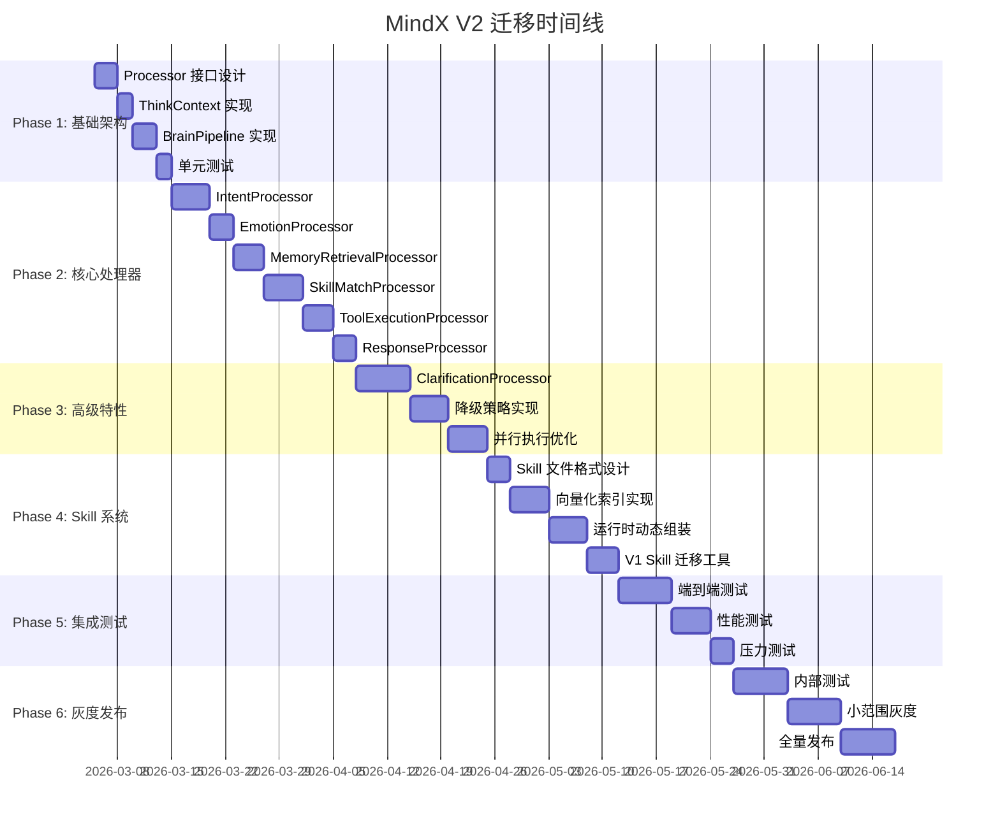

# MindX V2 迁移实施计划

> 版本：2.0 | 日期：2026-03-05
>
> 目的：详细的分阶段迁移计划，确保从 V1 平滑过渡到 V2

---

## 1. 迁移总览

### 1.1 迁移原则

- **渐进式**：分阶段实施，每个阶段可独立验证
- **向后兼容**：V1 功能在迁移期间保持可用
- **风险可控**：每个阶段都有回滚方案
- **可观测**：完善的监控和日志

### 1.2 迁移时间线



---

## 2. Phase 1: 基础架构（10天）

### 2.1 目标

实现 Pipeline 和 ThinkContext 的基础框架。

### 2.2 任务清单

#### Task 1.1: Processor 接口设计（3天）

```go
// internal/core/processor.go
package core

type Processor interface {
    Name() string
    Process(ctx *ThinkContext) error
    CanFallback() bool
    Dependencies() []string
}

type ProcessorStage struct {
    Name       string
    Processors []Processor
    Parallel   bool
}
```

**验收标准**：
- ✅ 接口定义清晰
- ✅ 通过代码审查
- ✅ 有完整的文档注释

#### Task 1.2: ThinkContext 实现（2天）

```go
// internal/entity/think_context.go
package entity

type ThinkContext struct {
    Input     string
    SessionID string
    Intent    *IntentContext
    Emotion   *EmotionResult
    Memories  []*MemoryPoint
    // ... 其他字段
}
```

**验收标准**：
- ✅ 所有字段定义完整
- ✅ 提供便捷的访问方法
- ✅ 支持序列化/反序列化

#### Task 1.3: BrainPipeline 实现（3天）

```go
// internal/usecase/brain/pipeline.go
package brain

type BrainPipeline struct {
    stages            []ProcessorStage
    fallbackStrategies map[string]FallbackStrategy
    metrics           *PipelineMetrics
}

func (p *BrainPipeline) Execute(ctx *ThinkContext) error {
    for _, stage := range p.stages {
        if err := p.executeStage(stage, ctx); err != nil {
            return p.handleError(stage, ctx, err)
        }
    }
    return nil
}
```

**验收标准**：
- ✅ 支持串行执行
- ✅ 错误处理机制完善
- ✅ 性能指标收集

#### Task 1.4: 单元测试（2天）

```go
func TestBrainPipeline_Execute(t *testing.T) {
    pipeline := NewBrainPipeline(
        NewMockProcessor("p1"),
        NewMockProcessor("p2"),
    )

    ctx := &ThinkContext{Input: "test"}
    err := pipeline.Execute(ctx)

    assert.NoError(t, err)
}
```

**验收标准**：
- ✅ 测试覆盖率 > 80%
- ✅ 所有边界情况测试
- ✅ 性能基准测试

---

## 3. Phase 2: 核心处理器（24天）

### 3.1 目标

实现所有核心处理器，替换 V1 的左右脑逻辑。

### 3.2 任务清单

#### Task 2.1: IntentProcessor（5天）

**实现内容**：
- 本地模型意图识别
- 置信度计算
- 候选意图生成

**测试用例**：
```go
func TestIntentProcessor_Process(t *testing.T) {
    tests := []struct {
        input      string
        wantType   string
        wantConf   float64
    }{
        {"明天北京天气", "weather_query", 0.9},
        {"帮我订个会议", "schedule_create", 0.85},
    }

    for _, tt := range tests {
        // 测试逻辑
    }
}
```

**验收标准**：
- ✅ 意图识别准确率 > 85%
- ✅ 平均响应时间 < 500ms
- ✅ 支持降级到云端模型

#### Task 2.2: EmotionProcessor（3天）

**实现内容**：
- 情感类型识别
- 强度和紧急度计算
- 响应策略映射

**验收标准**：
- ✅ 情感识别准确率 > 75%
- ✅ 失败时使用默认值
- ✅ 不影响核心功能

#### Task 2.3: MemoryRetrievalProcessor（4天）

**实现内容**：
- 向量相似度搜索
- 关键词过滤
- TopK 排序

**验收标准**：
- ✅ 检索准确率 > 80%
- ✅ 平均响应时间 < 200ms
- ✅ 支持缓存

#### Task 2.4: SkillMatchProcessor（5天）

**实现内容**：
- 向量匹配 Skills
- 动态组装 Tools
- 生成 Tool Schema

**验收标准**：
- ✅ 匹配准确率 > 85%
- ✅ 支持本地 Tool 和 MCP
- ✅ 工具未找到时优雅降级

#### Task 2.5: ToolExecutionProcessor（4天）

**实现内容**：
- LLM 决定工具调用
- 执行本地 Tool
- 执行 MCP Tool

**验收标准**：
- ✅ 工具调用成功率 > 95%
- ✅ 单个工具失败不影响整体
- ✅ 超时控制

#### Task 2.6: ResponseProcessor（3天）

**实现内容**：
- 综合上下文生成响应
- 应用情感策略
- 格式化输出

**验收标准**：
- ✅ 响应质量评分 > 4.0/5.0
- ✅ 支持多种输出格式
- ✅ 情感策略生效

---

## 4. Phase 3: 高级特性（17天）

### 4.1 目标

实现澄清对话、降级策略和并行优化。

### 4.2 任务清单

#### Task 3.1: ClarificationProcessor（7天）

**实现内容**：
- 置信度检查
- 生成澄清问题
- 多轮对话状态管理
- 信息提取

**测试场景**：
```go
func TestClarificationProcessor_MultiRound(t *testing.T) {
    // 场景：用户说"我想去玩"，需要澄清目的地和时间

    // Round 1
    ctx1 := &ThinkContext{Input: "我想去玩"}
    err := processor.Process(ctx1)
    assert.Equal(t, ErrNeedClarification, err)
    assert.Contains(t, ctx1.Response, "目的地")

    // Round 2
    ctx2 := &ThinkContext{
        Input: "北京",
        Clarification: ctx1.Clarification,
    }
    err = processor.Process(ctx2)
    assert.Equal(t, ErrNeedClarification, err)
    assert.Contains(t, ctx2.Response, "时间")

    // Round 3
    ctx3 := &ThinkContext{
        Input: "下周五",
        Clarification: ctx2.Clarification,
    }
    err = processor.Process(ctx3)
    assert.NoError(t, err)
    assert.Equal(t, "北京", ctx3.Intent.Destination)
}
```

**验收标准**：
- ✅ 支持最多 3 轮澄清
- ✅ 状态持久化
- ✅ 用户可随时取消

#### Task 3.2: 降级策略实现（5天）

**实现内容**：
- IntentFallbackStrategy
- SkillFallbackStrategy
- ToolFallbackStrategy

**验收标准**：
- ✅ 本地模型失败自动升级云端
- ✅ 工具未找到时优雅降级
- ✅ 降级次数有限制

#### Task 3.3: 并行执行优化（5天）

**实现内容**：
- 识别可并行的处理器
- 实现并行执行逻辑
- 错误收集和处理

**性能目标**：
- ✅ IntentProcessor + EmotionProcessor 并行后总时间减少 30%
- ✅ MemoryRetrievalProcessor + SkillMatchProcessor 并行后总时间减少 25%

---

## 5. Phase 4: Skill 系统（17天）

### 5.1 目标

重新设计 Skill 系统，支持声明式 SOP。

### 5.2 任务清单

#### Task 4.1: Skill 文件格式设计（3天）

**实现内容**：
- SKILL.md 标准结构
- YAML frontmatter 定义
- Markdown 解析器

**验收标准**：
- ✅ 符合 agentskills.io 规范
- ✅ 支持 YAML frontmatter
- ✅ 解析器健壮

#### Task 4.2: 向量化索引实现（5天）

**实现内容**：
- Goal/Trigger 向量生成
- BadgerDB 存储
- 相似度搜索

**验收标准**：
- ✅ 索引构建时间 < 1s/skill
- ✅ 搜索响应时间 < 100ms
- ✅ 支持增量更新

#### Task 4.3: 运行时动态组装（5天）

**实现内容**：
- SOP 解析
- Tool 查找（本地 + MCP）
- Schema 生成

**验收标准**：
- ✅ 组装时间 < 200ms
- ✅ 工具未找到时记录警告
- ✅ 支持缓存

#### Task 4.4: V1 Skill 迁移工具（4天）

**实现内容**：
- 解析 V1 skill.json
- 生成 SKILL.md
- 批量迁移脚本

**验收标准**：
- ✅ 迁移成功率 > 95%
- ✅ 自动生成向量索引
- ✅ 提供迁移报告

---

## 6. Phase 5: 集成测试（15天）

### 6.1 目标

全面测试 V2 系统的功能和性能。

### 6.2 任务清单

#### Task 5.1: 端到端测试（7天）

**测试场景**：
1. 简单查询（天气、时间等）
2. 复杂任务（旅行规划、代码审查）
3. 多轮对话（澄清、追问）
4. 错误处理（工具失败、模型超时）

**验收标准**：
- ✅ 所有场景通过
- ✅ 响应质量评分 > 4.0/5.0
- ✅ 无严重 Bug

#### Task 5.2: 性能测试（5天）

**测试指标**：
- P50 延迟 < 1s
- P95 延迟 < 3s
- P99 延迟 < 5s
- QPS > 100

**验收标准**：
- ✅ 所有指标达标
- ✅ 性能优于 V1
- ✅ 资源占用合理

#### Task 5.3: 压力测试（3天）

**测试场景**：
- 并发 100 用户
- 持续运行 24 小时
- 模拟各种异常

**验收标准**：
- ✅ 无内存泄漏
- ✅ 无死锁
- ✅ 错误率 < 1%

---

## 7. Phase 6: 灰度发布（21天）

### 7.1 目标

逐步将 V2 推广到生产环境。

### 7.2 任务清单

#### Task 6.1: 内部测试（7天）

**参与人员**：开发团队 + 内部用户

**测试内容**：
- 日常使用场景
- 边界情况
- 用户体验反馈

**验收标准**：
- ✅ 无阻塞性 Bug
- ✅ 用户满意度 > 4.0/5.0
- ✅ 性能稳定

#### Task 6.2: 小范围灰度（7天）

**灰度策略**：
- 5% 用户使用 V2
- 95% 用户使用 V1
- 实时监控指标

**监控指标**：
- 错误率
- 响应时间
- 用户反馈

**回滚条件**：
- 错误率 > 5%
- P95 延迟 > 5s
- 严重 Bug

#### Task 6.3: 全量发布（7天）

**发布计划**：
- Day 1-2: 20% 流量
- Day 3-4: 50% 流量
- Day 5-6: 80% 流量
- Day 7: 100% 流量

**验收标准**：
- ✅ 所有指标正常
- ✅ 用户无明显感知
- ✅ V1 可完全下线

---

## 8. 兼容性策略

### 8.1 V1 兼容适配器

```go
// internal/adapters/v1_compat.go
package adapters

type V1CompatibilityAdapter struct {
    v2Pipeline *BrainPipeline
}

func (a *V1CompatibilityAdapter) Ask(question string, sessionID string) (string, string, error) {
    // 将 V1 的 Ask 调用转换为 V2 的 Pipeline 执行
    ctx := &ThinkContext{
        Input:     question,
        SessionID: sessionID,
    }

    if err := a.v2Pipeline.Execute(ctx); err != nil {
        return "", "", err
    }

    return ctx.Response, ctx.SendTo, nil
}
```

### 8.2 配置开关

```yaml
# config/server.yml
brain:
  version: "v2"  # v1 或 v2
  fallback_to_v1: true  # V2 失败时回退到 V1
```

### 8.3 灰度控制

```go
type GrayReleaseController struct {
    v1Brain *V1Brain
    v2Brain *V2Brain
    ratio   float64  // V2 流量比例
}

func (c *GrayReleaseController) Route(sessionID string) Brain {
    hash := hashSessionID(sessionID)
    if float64(hash%100)/100 < c.ratio {
        return c.v2Brain
    }
    return c.v1Brain
}
```

---

## 9. 回滚方案

### 9.1 回滚触发条件

- 错误率 > 5%
- P95 延迟 > 5s
- 严重功能性 Bug
- 用户投诉激增

### 9.2 回滚步骤

1. **立即切换**：将流量切回 V1
2. **保留现场**：保存 V2 的日志和数据
3. **问题分析**：定位根本原因
4. **修复验证**：在测试环境修复并验证
5. **重新发布**：修复后重新灰度

### 9.3 回滚脚本

```bash
#!/bin/bash
# scripts/rollback-v2.sh

echo "Rolling back to V1..."

# 1. 修改配置
sed -i 's/version: "v2"/version: "v1"/' config/server.yml

# 2. 重启服务
systemctl restart mindx

# 3. 验证
curl http://localhost:911/health

echo "Rollback completed"
```

---

## 10. 监控与告警

### 10.1 关键指标

```yaml
# config/monitoring.yml
metrics:
  - name: pipeline_execution_time
    type: histogram
    labels: [stage, processor]

  - name: processor_error_rate
    type: counter
    labels: [processor, error_type]

  - name: clarification_rounds
    type: histogram

  - name: skill_match_accuracy
    type: gauge
```

### 10.2 告警规则

```yaml
# config/alerts.yml
alerts:
  - name: HighErrorRate
    condition: error_rate > 0.05
    duration: 5m
    severity: critical

  - name: SlowResponse
    condition: p95_latency > 5s
    duration: 5m
    severity: warning

  - name: MemoryLeak
    condition: memory_usage_growth > 10%/hour
    duration: 1h
    severity: critical
```

---

## 11. 文档与培训

### 11.1 文档清单

- ✅ 架构设计文档（本系列文档）
- ✅ API 文档
- ✅ 开发者指南
- ✅ 运维手册
- ✅ 故障排查指南

### 11.2 培训计划

**内部培训**（2天）：
- Day 1: V2 架构讲解
- Day 2: 实战演练

**外部文档**：
- 迁移指南
- 最佳实践
- FAQ

---

## 12. 风险与缓解

| 风险 | 影响 | 概率 | 缓解措施 |
|------|------|------|---------|
| 性能不达标 | 高 | 中 | 充分的性能测试，优化热点 |
| 兼容性问题 | 高 | 低 | V1 兼容适配器，灰度发布 |
| Skill 迁移失败 | 中 | 中 | 自动化迁移工具，人工审核 |
| 用户体验下降 | 高 | 低 | 充分测试，快速回滚 |
| 团队学习曲线 | 中 | 高 | 培训，文档，代码审查 |

---

## 13. 成功标准

### 13.1 功能指标

- ✅ 解决 V1 的 7 个核心问题
- ✅ 所有 V1 功能在 V2 中可用
- ✅ 新增澄清对话功能
- ✅ 新增情感分析功能

### 13.2 性能指标

- ✅ P95 延迟 < 3s
- ✅ 错误率 < 1%
- ✅ QPS > 100
- ✅ 资源占用不增加

### 13.3 质量指标

- ✅ 测试覆盖率 > 80%
- ✅ 代码审查通过率 100%
- ✅ 无严重 Bug
- ✅ 文档完整

### 13.4 用户指标

- ✅ 用户满意度 > 4.0/5.0
- ✅ 意图识别准确率 > 85%
- ✅ 响应质量评分 > 4.0/5.0

---

## 14. 总结

本迁移计划预计耗时 **104 天**（约 3.5 个月），分 6 个阶段实施：

1. **Phase 1**（10天）：基础架构
2. **Phase 2**（24天）：核心处理器
3. **Phase 3**（17天）：高级特性
4. **Phase 4**（17天）：Skill 系统
5. **Phase 5**（15天）：集成测试
6. **Phase 6**（21天）：灰度发布

关键成功因素：
- ✅ 严格的阶段划分和验收标准
- ✅ 完善的测试和监控
- ✅ 灰度发布和快速回滚
- ✅ 充分的文档和培训

---

## 附录

### A. 每日站会模板

```markdown
## 日期：YYYY-MM-DD

### 昨日完成
- [ ] 任务 1
- [ ] 任务 2

### 今日计划
- [ ] 任务 3
- [ ] 任务 4

### 遇到的问题
- 问题描述
- 需要的帮助

### 风险提示
- 风险描述
- 缓解措施
```

### B. 代码审查清单

- [ ] 代码符合项目规范
- [ ] 有完整的单元测试
- [ ] 测试覆盖率 > 80%
- [ ] 有清晰的注释
- [ ] 无明显性能问题
- [ ] 错误处理完善
- [ ] 日志记录合理

### C. 发布清单

- [ ] 所有测试通过
- [ ] 代码审查通过
- [ ] 文档更新
- [ ] 配置文件准备
- [ ] 监控告警配置
- [ ] 回滚方案准备
- [ ] 发布公告准备
