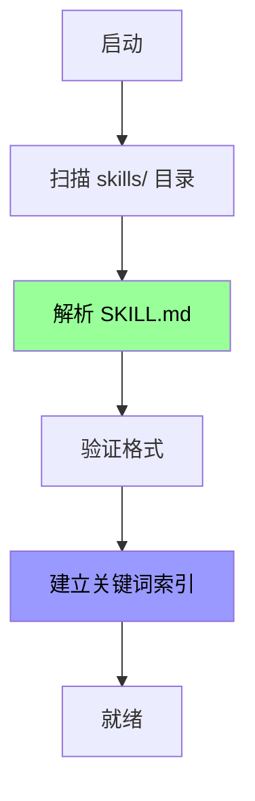

# Skill 文件格式规范 (MVP)

> 版本：1.0 | 日期：2026-03-05
>
> 基于 agentskills.io 规范的简化版实现

---

## 1. 文件结构

每个 Skill 包含一个 `SKILL.md` 文件，采用 YAML Frontmatter + Markdown 正文的格式。

```
skills/
├── weather_query/
│   └── SKILL.md
├── calendar_reminder/
│   └── SKILL.md
└── calculator/
    └── SKILL.md
```

---

## 2. SKILL.md 格式

### 2.1 完整示例

```markdown
---
name: weather_query
version: 1.0.0
description: 查询指定地点的天气信息
keywords:
  - 天气
  - weather
  - 气温
  - 温度
required_tools:
  - weather_tool
---

# Skill: 天气查询

## 目标（Goal）
查询指定地点的天气信息，包括温度、天气状况、湿度等。

## 触发条件（Trigger）
当用户提到以下关键词或语义时触发：
- "天气"、"气温"、"温度"
- "今天/明天/后天 + 地点 + 天气"
- "XX 地方天气怎么样"

## 执行步骤（Steps）

1. 提取地点信息
   - 如果用户未提供地点，询问："请问您想查询哪里的天气？"

2. 调用天气工具
   - 工具：weather_tool
   - 参数：location（地点）

3. 格式化输出
   - 返回格式："{地点}今天天气{状况}，温度{温度}度"

## 所需工具（Required Tools）
- weather_tool (必需) - 天气查询工具

## 示例对话（Example）

**用户**：北京天气怎么样

**助手**：[调用 weather_tool(location="北京")]

北京今天天气晴朗，温度25度，湿度60%。
```

### 2.2 YAML Frontmatter 字段说明

| 字段 | 类型 | 必需 | 说明 |
|------|------|------|------|
| `name` | string | ✅ | Skill 唯一标识符（小写+下划线） |
| `version` | string | ✅ | 版本号（语义化版本） |
| `description` | string | ✅ | 简短描述（一句话） |
| `keywords` | array | ✅ | 关键词列表（用于匹配） |
| `required_tools` | array | ❌ | 所需工具列表 |

### 2.3 Markdown 正文结构

| 章节 | 必需 | 说明 |
|------|------|------|
| `# Skill: {名称}` | ✅ | 标题 |
| `## 目标（Goal）` | ✅ | 描述 Skill 的目标 |
| `## 触发条件（Trigger）` | ✅ | 何时触发此 Skill |
| `## 执行步骤（Steps）` | ❌ | MVP 暂不解析 |
| `## 所需工具（Required Tools）` | ❌ | MVP 从 Frontmatter 读取 |
| `## 示例对话（Example）` | ❌ | 可选的示例 |

---

## 3. MVP 简化策略

### 3.1 只解析 Frontmatter

MVP 阶段只解析 YAML Frontmatter，不解析 Markdown 正文。

```go
type SkillMetadata struct {
    Name          string   `yaml:"name"`
    Version       string   `yaml:"version"`
    Description   string   `yaml:"description"`
    Keywords      []string `yaml:"keywords"`
    RequiredTools []string `yaml:"required_tools"`
}
```

### 3.2 关键词匹配

MVP 使用 `keywords` 字段进行简单的关键词匹配，不做向量化。

```go
func (s *SkillRegistry) SearchByKeywords(userKeywords []string) ([]*Skill, error) {
    matches := []SkillMatch{}

    for _, skill := range s.skills {
        score := calculateKeywordScore(skill.Keywords, userKeywords)
        if score > 0 {
            matches = append(matches, SkillMatch{
                Skill: skill,
                Score: score,
            })
        }
    }

    // 按分数排序
    sort.Slice(matches, func(i, j int) bool {
        return matches[i].Score > matches[j].Score
    })

    return extractSkills(matches), nil
}
```

---

## 4. 内置 Skills

MVP 提供以下内置 Skills：

1. **weather_query** - 天气查询
2. **calculator** - 计算器
3. **time_query** - 时间查询
4. **general_chat** - 通用闲聊（兜底）

---

## 5. Skill 加载流程



---

## 6. 文件示例

### 6.1 weather_query/SKILL.md

```markdown
---
name: weather_query
version: 1.0.0
description: 查询天气信息
keywords:
  - 天气
  - weather
  - 气温
required_tools:
  - weather_tool
---

# Skill: 天气查询

## 目标
查询指定地点的天气信息。

## 触发条件
- 天气、气温、温度
- 今天/明天 + 地点 + 天气
```

### 6.2 calculator/SKILL.md

```markdown
---
name: calculator
version: 1.0.0
description: 执行数学计算
keywords:
  - 计算
  - 算
  - 数学
  - 加减乘除
required_tools:
  - calculator_tool
---

# Skill: 计算器

## 目标
执行基本的数学计算。

## 触发条件
- 计算、算一下
- 数学表达式（如：1+1）
```

### 6.3 general_chat/SKILL.md

```markdown
---
name: general_chat
version: 1.0.0
description: 通用闲聊对话
keywords:
  - 你好
  - 谢谢
  - 再见
  - 闲聊
required_tools: []
---

# Skill: 通用闲聊

## 目标
处理日常闲聊对话。

## 触发条件
- 问候语（你好、早上好）
- 感谢语（谢谢、多谢）
- 告别语（再见、拜拜）
```

---

## 7. Phase 2 增强计划

Phase 2 将实现以下增强功能：

1. **向量化索引** - 使用 embedding 进行语义匹配
2. **SOP 解析** - 解析 Markdown 正文的执行步骤
3. **动态工具组装** - 根据 required_tools 动态查找和组装
4. **多语言支持** - 支持英文 SKILL.md

---

## 8. 验证规则

### 8.1 必需字段检查

```go
func ValidateSkillMetadata(meta *SkillMetadata) error {
    if meta.Name == "" {
        return errors.New("name is required")
    }
    if meta.Version == "" {
        return errors.New("version is required")
    }
    if meta.Description == "" {
        return errors.New("description is required")
    }
    if len(meta.Keywords) == 0 {
        return errors.New("keywords is required")
    }
    return nil
}
```

### 8.2 命名规范检查

```go
func ValidateSkillName(name string) error {
    // 只允许小写字母、数字、下划线
    matched, _ := regexp.MatchString("^[a-z0-9_]+$", name)
    if !matched {
        return errors.New("name must be lowercase with underscores")
    }
    return nil
}
```

---

## 9. 错误处理

| 错误类型 | 处理方式 |
|---------|---------|
| SKILL.md 不存在 | 跳过该目录，记录警告 |
| YAML 解析失败 | 跳过该 Skill，记录错误 |
| 必需字段缺失 | 跳过该 Skill，记录错误 |
| 关键词为空 | 跳过该 Skill，记录错误 |

---

## 10. CLI 工具

提供 CLI 工具用于验证和管理 Skills：

```bash
# 验证 Skill 格式
mindx skill validate weather_query

# 列出所有 Skills
mindx skill list

# 测试 Skill 匹配
mindx skill test "北京天气怎么样"
```
