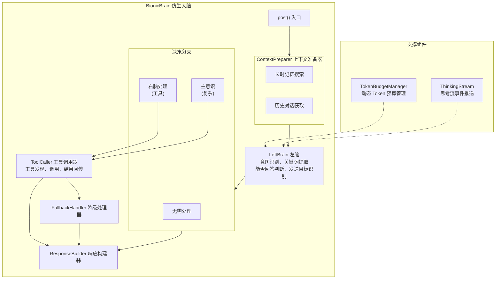
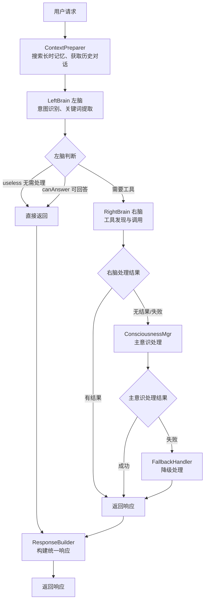

# Brain 模块

## 模块概述

Brain 模块是一个仿生大脑系统，模拟人类大脑的左右脑分工机制来处理用户的思考请求。该模块通过分层决策架构，实现了从简单对话到复杂工具调用的多级处理能力。

## 核心职能

- **意图理解**：分析用户输入的意图和关键词
- **上下文管理**：整合历史对话和长时记忆
- **分层决策**：左脑 → 右脑 → 主意识的逐级处理
- **工具调用**：与技能系统协作执行具体任务
- **Token 预算管理**：动态优化上下文长度

## 架构图

### 组件架构

### 处理流程

## 入口类与组件说明

### BionicBrain

**文件**: [brain.go](brain.go)

**职责**: 仿生大脑的主入口，协调所有组件的工作流程。

**核心方法**:
- `NewBrain()`: 创建大脑实例，初始化所有组件
- `post()`: 处理思考请求的主入口，协调整个处理流程

**工作方式**:
1. 接收思考请求
2. 调用 ContextPreparer 准备上下文
3. 调用左脑进行意图分析
4. 根据左脑结果决定后续处理路径
5. 协调右脑、主意识或降级处理

---

### Thinking

**文件**: [thinking.go](thinking.go)

**职责**: 核心思考引擎，封装与 LLM 的交互逻辑。

**核心方法**:
- `Think()`: 基础思考，返回意图、关键词、答案等
- `ThinkWithTools()`: 带工具的思考，让模型决定调用哪个工具
- `ReturnFuncResult()`: 向模型回传工具执行结果
- `CalculateMaxHistoryCount()`: 计算最大历史对话轮数

**工作方式**:
- 构建包含系统提示、历史对话、当前问题的消息列表
- 调用 LLM API 获取响应
- 解析响应并记录 Token 使用情况
- 支持流式输出事件推送

---

### ConsciousnessManager

**文件**: [consciousness_manager.go](consciousness_manager.go)

**职责**: 管理主意识的动态创建和生命周期。

**核心方法**:
- `Create()`: 根据能力配置动态创建主意识
- `Get()`: 获取当前主意识实例
- `IsNil()`: 判断主意识是否已创建
- `Think()`: 使用主意识进行思考

**工作方式**:
- 主意识按需创建，不预先初始化
- 创建时注入人设信息和能力配置
- 使用独立的模型配置（可不同于左右脑）

---

### ContextPreparer

**文件**: [context_preparer.go](context_preparer.go)

**职责**: 准备思考所需的上下文信息。

**核心方法**:
- `Prepare()`: 准备完整的处理上下文

**工作方式**:
1. 从 Memory 搜索相关的长时记忆
2. 将记忆构建为参考提示
3. 根据左脑的 Token 预算计算最大历史轮数
4. 获取指定轮数的历史对话

---

### ToolCaller

**文件**: [tool_caller.go](tool_caller.go)

**职责**: 执行工具调用流程。

**核心方法**:
- `ExecuteToolCall()`: 执行完整的工具调用流程
- `SearchTools()`: 搜索可用工具

**工作方式**:
1. 调用 Thinking 的 ThinkWithTools 让模型决定调用哪个工具
2. 通过 SkillMgr 执行具体的技能函数
3. 将执行结果回传给模型获取最终回复

---

### FallbackHandler

**文件**: [fallback_handler.go](fallback_handler.go)

**职责**: 降级处理器，在主意识失败时提供兜底方案。

**核心方法**:
- `Handle()`: 处理降级逻辑

**工作方式**:
1. 尝试使用左脑已搜索到的工具让右脑处理
2. 如果右脑也无法处理，返回左脑的分析结果

---

### ResponseBuilder

**文件**: [response_builder.go](response_builder.go)

**职责**: 构建统一的响应对象。

**核心方法**:
- `BuildLeftBrainResponse()`: 构建左脑响应
- `BuildToolCallResponse()`: 构建工具调用响应

**工作方式**:
- 统一响应格式，包含答案、使用的工具、发送目标

---

### TokenBudgetManager

**文件**: [token_budget.go](token_budget.go)

**职责**: 动态管理 Token 预算，优化上下文长度。

**核心方法**:
- `RecordUsage()`: 记录 Token 使用情况
- `CalculateDynamicMaxHistoryCount()`: 动态计算最大历史轮数
- `GetStatistics()`: 获取统计信息

**工作方式**:
- 基于实际运行时的 Token 消耗动态调整
- 使用平滑更新避免剧烈波动
- 公式: `最大轮数 = (模型容量 - 预留输出) / 平均每轮消耗`

---

### ThinkingStream

**文件**: [thinking_stream.go](thinking_stream.go)

**职责**: 思考流事件推送，支持实时反馈。

**事件类型**:
- `ThinkingEventStart`: 开始思考
- `ThinkingEventProgress`: 思考进度
- `ThinkingEventChunk`: 流式输出片段
- `ThinkingEventToolCall`: 工具调用
- `ThinkingEventToolResult`: 工具调用结果
- `ThinkingEventComplete`: 思考完成
- `ThinkingEventError`: 思考错误

**工作方式**:
- 通过回调函数推送事件
- 支持进度和元数据传递

## 三脑协作机制

### 左脑 (LeftBrain)

- **定位**: 快速响应、意图识别
- **配置**: 使用轻量级模型
- **职责**:
  - 分析用户意图
  - 提取关键词
  - 判断能否直接回答
  - 识别发送目标

### 右脑 (RightBrain)

- **定位**: 工具调用、技能执行
- **配置**: 使用标准模型
- **职责**:
  - 从工具列表中选择合适的工具
  - 决定工具调用参数
  - 整合工具执行结果

### 主意识 (Consciousness)

- **定位**: 复杂问题处理、深度思考
- **配置**: 按需创建，可使用高级模型
- **职责**:
  - 处理左脑无法回答的复杂问题
  - 支持特定领域的专业能力
  - 可调用专属工具集

## 设计原则

1. **分层决策**: 从简单到复杂逐级处理，优先使用低成本方案
2. **按需创建**: 主意识延迟初始化，节省资源
3. **优雅降级**: 每一层都有兜底方案，确保总能返回响应
4. **动态优化**: Token 预算基于实际消耗动态调整
5. **关注点分离**: 各组件职责单一，便于测试和维护
