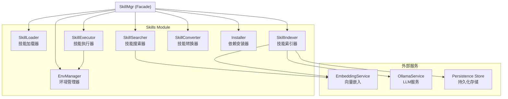
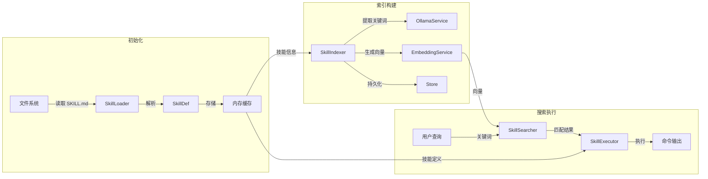

# Skills 技能管理模块

## 概述

Skills 模块是 MindX 系统的核心技能管理子系统，负责技能的加载、执行、搜索、索引和生命周期管理。该模块采用 Facade 设计模式，通过 `SkillMgr` 作为统一入口，协调各子组件完成复杂的技能管理任务。

## 架构

### 架构图

### 组件职责

| 组件               | 职责                     | 核心方法                                           |
| ------------------ | ------------------------ | -------------------------------------------------- |
| **SkillMgr**       | 门面模式入口，协调各组件 | `LoadSkills`, `Execute`, `SearchSkills`, `ReIndex` |
| **SkillLoader**    | 加载和解析技能定义文件   | `LoadAll`, `Load`, `GetSkill`, `ParseSkillDef`     |
| **SkillExecutor**  | 执行技能命令             | `Execute`, `ExecuteFunc`, `UpdateStats`            |
| **SkillSearcher**  | 技能搜索（向量/关键词）  | `Search`, `searchByVector`, `searchByKeywords`     |
| **SkillIndexer**   | 向量索引预计算           | `ReIndex`, `LoadFromStore`, `GetVectors`           |
| **SkillConverter** | 技能格式转换             | `Convert`, `BatchConvert`                          |
| **Installer**      | 依赖安装                 | `InstallDependency`                                |
| **EnvManager**     | 环境变量管理             | `LoadEnv`, `SaveEnv`, `PrepareExecutionEnv`        |

## 功能列表

### 1. 技能加载

从文件系统加载技能定义文件（SKILL.md），解析 YAML frontmatter，验证依赖项。

- **LoadSkills**: 加载指定目录下所有技能
- **ParseSkillDef**: 解析技能定义的 YAML 元数据
- **CheckDependencies**: 检查技能所需的二进制文件和环境变量

### 2. 技能执行

在隔离环境中执行技能命令，支持超时控制和统计记录。

- **Execute**: 执行指定技能，传入参数
- **ExecuteByName**: 通过技能名称执行
- **ExecuteFunc**: 执行工具调用函数（用于 LLM 工具调用）
- **UpdateStats**: 更新执行统计（成功次数、失败次数、平均耗时）

### 3. 技能搜索

支持两种搜索模式：基于向量相似度的语义搜索和基于关键词的精确匹配。

- **SearchSkills**: 根据关键词搜索相关技能
- **searchByVector**: 使用向量嵌入计算语义相似度
- **searchByKeywords**: 使用关键词匹配进行搜索

### 4. 向量索引

预计算技能关键词的向量表示，支持持久化存储。

- **ReIndex**: 重新计算所有技能的向量索引
- **StartReIndexInBackground**: 后台异步执行索引重建
- **LoadFromStore**: 从持久化存储加载索引
- **extractKeywords**: 使用 LLM 提取技能关键词

### 5. 技能转换

更新技能的元数据格式，标准化技能定义。

- **ConvertSkill**: 转换单个技能的格式
- **BatchConvert**: 批量转换多个技能

### 6. 依赖安装

支持多种包管理器安装技能运行时依赖。

- **InstallDependency**: 根据安装方法安装依赖
- **支持的包管理器**: brew, apt, yum, dnf, npm, pip, snap, choco

### 7. 环境管理

管理技能执行所需的环境变量。

- **LoadEnv**: 从配置文件加载环境变量
- **SaveEnv**: 保存环境变量到配置文件
- **PrepareExecutionEnv**: 准备技能执行时的环境变量

### 8. 状态管理

启用或禁用技能，查询技能状态。

- **Enable**: 启用指定技能
- **Disable**: 禁用指定技能
- **GetSkillInfo**: 获取技能详细信息
- **GetSkillInfos**: 获取所有技能信息

### 9. 批量操作

批量执行技能相关操作。

- **BatchConvert**: 批量转换技能格式
- **BatchInstall**: 批量安装技能依赖
- **GetMissingDependencies**: 获取技能缺失的依赖项

## 数据流

## 设计原则

1. **单一职责**: 每个组件只负责一个明确的功能领域
2. **依赖倒置**: 组件之间通过接口通信，降低耦合
3. **开闭原则**: 易于扩展新功能，无需修改现有代码
4. **Facade 模式**: SkillMgr 作为统一入口，简化外部调用
