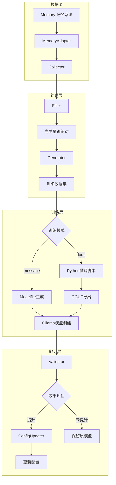
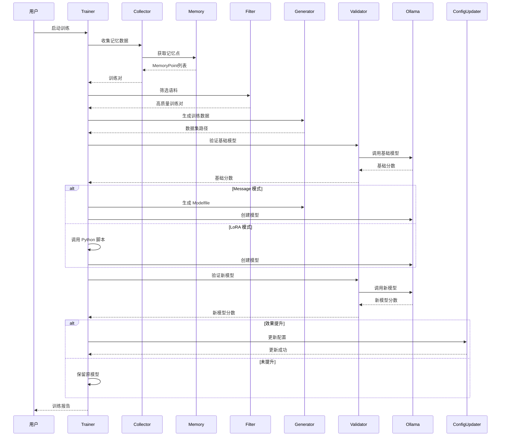
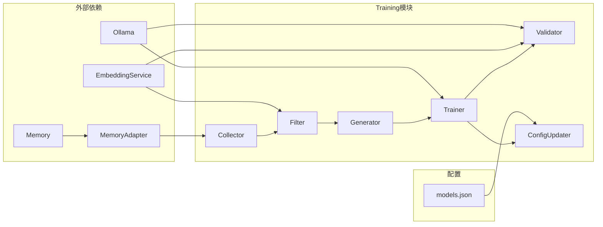
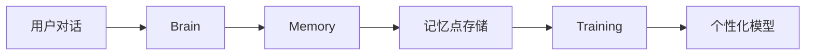
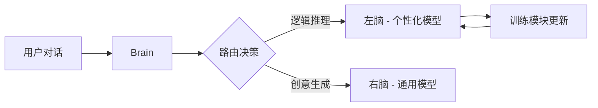

# Training 模块

基于 Memory 记忆系统的模型个性化训练模块，支持两种训练模式：消息注入（Message）和 LoRA 微调。

## 架构概览



## 组件说明

### TrainingDataSource（接口）

定义训练数据的来源接口，通过依赖注入解耦具体实现。

**方法**：
- `GetAllMemoryPoints()` - 获取所有记忆点
- `GetLastTrainTime()` - 获取上次训练时间
- `UpdateLastTrainTime(t)` - 更新训练时间

---

### MemoryAdapter

适配器，将 Memory 模块适配为 TrainingDataSource 接口。

**职责**：
- 包装 Memory 模块
- 管理训练时间记录文件
- 实现 TrainingDataSource 接口

---

### Collector

数据收集器，从 Memory 系统中提取训练数据。

**职责**：
- 通过 TrainingDataSource 接口获取记忆点
- 筛选上次训练后的新记忆点
- 从记忆点内容中提取用户-助手对话对
- 支持多种对话格式解析

**输入**：Memory 记忆点（通过依赖注入）

**输出**：`MemoryPoint` 列表、`TrainingPair` 列表

---

### Filter

语料过滤器，清洗和筛选训练数据。

**职责**：
- 清洗低价值对话（如"好的"、"嗯"等无意义回复）
- 过滤包含敏感信息的对话（密码、银行卡等）
- 内容去重（完全相同的对话）
- 向量相似度去重（语义相近的对话）

**处理流程**：
```
原始语料 → 低价值清洗 → 敏感信息过滤 → 内容去重 → 向量去重 → 高质量语料
```

---

### Generator

数据生成器，生成训练所需的各类文件。

**职责**：
- 生成 JSONL 格式训练数据集
- 生成 Ollama Modelfile（含 MESSAGE 指令）
- 生成训练报告

**输出文件**：
- `train_data_*.jsonl`：训练数据集
- `Modelfile_*`：Ollama 模型配置文件
- `report_*.json`：训练报告

---

### Validator

模型验证器，评估模型效果。

**职责**：
- 从训练数据中提取测试用例
- 调用 Ollama API 生成模型响应
- 计算响应与期望答案的相似度
- 对比基础模型与新模型的效果

**评估指标**：
- 余弦相似度（基于向量嵌入）
- 准确率（相似度超过阈值的比例）

---

### ConfigUpdater

配置更新器，管理模型配置的更新与回滚。

**职责**：
- 备份当前配置文件
- 更新左脑模型配置
- 支持配置回滚到历史版本
- 管理备份文件的清理

**安全机制**：
- 每次更新前自动备份
- 备份文件带时间戳
- 支持一键回滚

---

## 训练模式

### Message 模式（默认）

通过 Modelfile 的 MESSAGE 指令注入对话历史，让模型"记住"用户的说话风格。

**特点**：
- 速度快（秒级完成）
- 无需额外依赖
- 效果为上下文记忆，非永久改变

**适用场景**：个性化风格调整、快速迭代测试

### LoRA 模式

通过 Python 脚本进行真正的 LoRA 微调，更新模型权重。

**特点**：
- 效果持久，改变模型行为
- 需要 Python 环境
- CPU 训练速度较慢

**适用场景**：领域知识注入、深度个性化

---

## 训练流程



---

## 使用方式

### 命令行

```bash
# 消息注入模式（默认）
mindx train --run-once

# LoRA 微调模式
mindx train --run-once --mode lora

# 指定参数
mindx train --run-once \
    --model qwen3:0.6b \
    --min-corpus 50 \
    --data-dir data \
    --config config/models.json
```

### 参数说明

| 参数             | 默认值             | 说明                      |
| ---------------- | ------------------ | ------------------------- |
| `--run-once`     | false              | 执行一次训练后退出        |
| `--mode`         | message            | 训练模式：message 或 lora |
| `--model`        | qwen3:0.6b         | 基础模型名称              |
| `--min-corpus`   | 50                 | 最小训练语料量            |
| `--data-dir`     | data               | 数据目录                  |
| `--config`       | config/models.json | 模型配置文件路径          |
| `--training-dir` | training           | Python 微调脚本目录       |
| `--workspace`    | 当前目录           | 工作目录                  |

---

## 目录结构

```
data/
├── memory/                        # Memory 向量存储
│
├── training/                      # 训练数据目录
│   ├── train_data_*.jsonl         # 训练数据集
│   ├── Modelfile_*                # Ollama 模型配置
│   └── report_*.json              # 训练报告
│
└── config/
    └── models.json                # 模型配置文件
    └── models.json.backup.*       # 配置备份

~/.mindx/
└── training/
    └── last_training.json         # 上次训练时间记录

training/                          # Python 微调模块（独立）
├── .venv/                         # Python 虚拟环境
├── finetune.py                    # LoRA 微调脚本
├── requirements.txt               # Python 依赖
├── setup.sh                       # 环境设置脚本
├── run.sh                         # 运行脚本
├── export_ollama.sh               # 导出 Ollama 模型
└── output/                        # 微调输出目录
```

---

## 依赖关系



**依赖注入设计**：
- Collector 通过 `TrainingDataSource` 接口获取数据，不直接依赖 Memory
- MemoryAdapter 将 Memory 适配为接口实现
- 便于测试和替换数据源

---

## 注意事项

### 数据来源

- 训练数据来自 Memory 记忆系统，而非日志文件
- Memory 中的记忆点需要包含有效的对话内容
- 建议定期与 Memory 交互，积累足够的训练语料

### 训练时机

- 模块记录上次训练时间，支持增量收集
- 建议积累足够数据后再训练（如每周一次）
- 训练期间 Ollama 服务需要保持运行

### 效果评估

- Validator 通过相似度计算评估效果
- 只有新模型分数高于基础模型才会更新配置
- 配置更新前会自动备份，支持回滚

### LoRA 模式

- 需要先运行 `training/setup.sh` 设置 Python 环境
- CPU 训练速度较慢，建议在空闲时执行
- 首次运行需要下载基础模型权重

### 资源消耗

| 模式       | 内存  | 磁盘  | 时间      |
| ---------- | ----- | ----- | --------- |
| message    | 低    | <10MB | 秒级      |
| lora (CPU) | 4-8GB | 2-5GB | 分钟~小时 |

### 回滚操作

如果新模型效果不佳，可以手动回滚：

1. 查看 `config/` 目录下的备份文件
2. 将备份文件恢复为 `models.json`
3. 重启 MindX 服务

---

## 与其他模块的关系

### 与 Memory 模块

Training 模块从 Memory 获取训练数据：



- Memory 存储用户的对话记忆
- Training 从 Memory 提取高质量对话
- 训练后的模型更了解用户偏好

### 与 Brain 模块

Training 模块生成的个性化模型会被 Brain 模块使用：



- Training 模块更新的是左脑模型（个性化模型）
- 右脑模型保持不变，用于通用任务
- 两个模型协同工作，实现个性化与通用性的平衡
