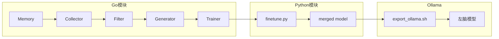

# Training - 模型微调模块

基于 LoRA 的 Qwen3 模型微调，支持 CPU 训练（Intel 芯片）。

## 目录结构

```
training/
├── finetune.py        # 微调脚本
├── requirements.txt   # Python 依赖
├── setup.sh           # 环境设置脚本
├── run.sh             # 运行微调脚本
├── export_ollama.sh   # 导出为 Ollama 模型
├── .venv/             # 虚拟环境（setup.sh 创建）
└── output/            # 输出目录
```

## 快速开始

### 1. 设置环境

```bash
cd training
chmod +x setup.sh run.sh export_ollama.sh
./setup.sh
```

### 2. 准备训练数据

训练数据为 JSONL 格式，每行一个 JSON 对象：

```json
{"prompt": "你好", "completion": "你好！有什么可以帮你的？"}
{"prompt": "今天天气怎么样", "completion": "抱歉，我无法获取实时天气信息。建议你查看天气应用。"}
```

**数据来源**：训练数据由 Go 模块从 Memory 记忆系统中提取，无需手动准备。

### 3. 运行微调

```bash
# 激活环境
source .venv/bin/activate

# 运行微调
./run.sh ./data/train.jsonl ./output Qwen/qwen3:0.6b-Instruct 3

# 或直接使用 Python
python finetune.py \
    --data ./data/train.jsonl \
    --output ./output \
    --model Qwen/qwen3:0.6b-Instruct \
    --epochs 3 \
    --batch-size 1 \
    --learning-rate 2e-4
```

### 4. 导出到 Ollama

```bash
./export_ollama.sh ./output/finetune_20260214_020000/merged my-personal-mindx

# 创建 Ollama 模型
ollama create my-personal-mindx -f Modelfile.my-personal-mindx

# 测试
ollama run my-personal-mindx
```

## 参数说明

| 参数              | 默认值                     | 说明                     |
| ----------------- | -------------------------- | ------------------------ |
| `--data`          | 必填                       | 训练数据文件路径 (JSONL) |
| `--output`        | `./output`                 | 输出目录                 |
| `--model`         | `Qwen/qwen3:0.6b-Instruct` | 基础模型                 |
| `--epochs`        | `3`                        | 训练轮数                 |
| `--batch-size`    | `1`                        | 批次大小 (CPU 建议 1)    |
| `--learning-rate` | `2e-4`                     | 学习率                   |
| `--max-length`    | `512`                      | 最大序列长度             |
| `--lora-r`        | `8`                        | LoRA 秩                  |

## CPU 训练注意事项

1. **速度较慢**：Intel CPU 训练速度比 GPU 慢 10-50 倍
2. **建议配置**：
   - 批次大小设为 1
   - 最大长度设为 512 或更小
   - LoRA 秩设为 8 或更小
3. **预计时间**：
   - 100 条数据，3 轮训练：约 30-60 分钟
   - 500 条数据，3 轮训练：约 2-4 小时

## 与 MindX 项目集成

Go 代码会自动调用 Python 脚本：

```go
// internal/usecase/training/trainer.go
func (t *Trainer) runLoRAFinetune(dataPath string) (string, error) {
    cmd := exec.Command(
        filepath.Join(t.trainingDir, "run.sh"),
        dataPath,
        filepath.Join(t.dataDir, "training", "output"),
        t.baseModel,
        "3",
    )
    // ...
}
```

## 工作流程

```
┌─────────────┐     ┌─────────────┐     ┌─────────────┐
│  Go: 收集   │ ──▶ │ Python:微调 │ ──▶ │ Go: 导入    │
│  Memory数据 │     │  LoRA训练   │     │  Ollama     │
└─────────────┘     └─────────────┘     └─────────────┘
       │                   │                   │
       ▼                   ▼                   ▼
  train.jsonl         merged model        GGUF + Modelfile
```

**数据流**：
1. **Go 模块**从 Memory 记忆系统收集训练数据
2. **Python 脚本**执行 LoRA 微调
3. **Go 模块**将微调后的模型导入 Ollama

## 使用方式

通过 MindX CLI 执行训练：

```bash
# 消息注入模式（默认，快速）
mindx train --run-once

# LoRA 微调模式（需要先设置 Python 环境）
mindx train --run-once --mode lora

# 指定参数
mindx train --run-once \
    --model qwen3:0.6b \
    --min-corpus 50 \
    --mode lora
```

## 依赖关系



## 相关文档

- [Training 模块文档](../internal/usecase/training/README.md) - Go 训练模块的详细文档
- [Memory 模块文档](../internal/usecase/memory/README.md) - 记忆系统文档
